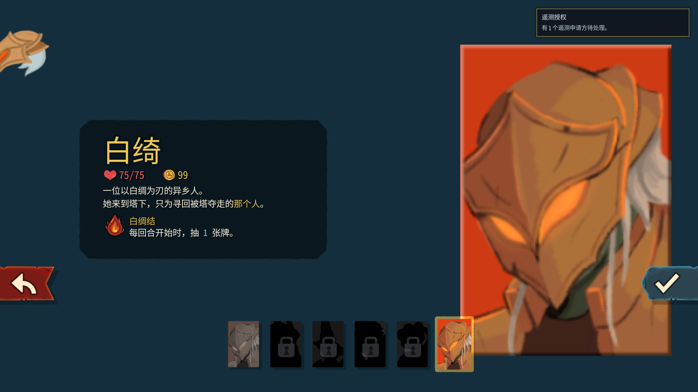
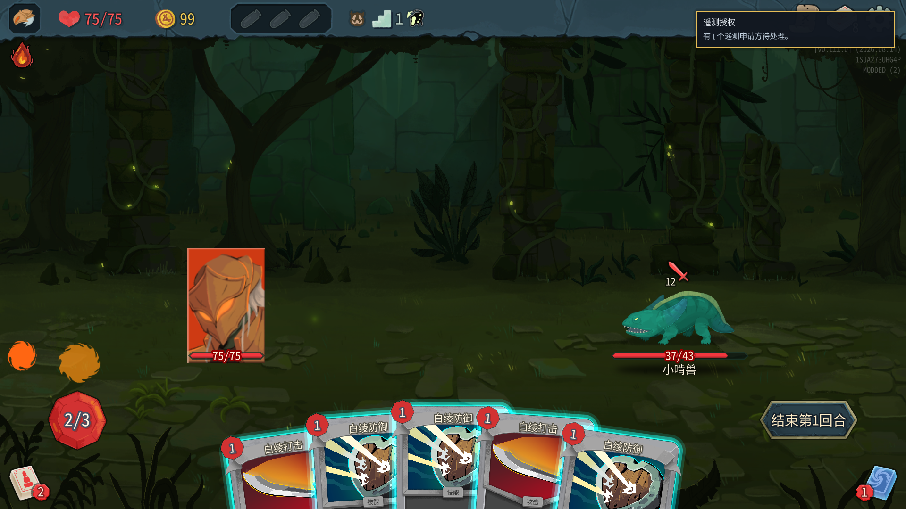

# 白绮 Vivhite · Slay the Spire 2 Mod

这是一个面向《Slay the Spire 2》（杀戮尖塔 2）的完整 Mod 工作区：

1. Vivhite/ 是用 C#、Godot 4.5.1 Mono 和 RitsuLib 编写的白绮角色 Mod；
2. sts2-ascend/ 是通过本地 HTTP API 自动游玩、记录对局并异步复盘的 Brain 训练栈；
3. assets/、tools/、docs/ 和 workshop/ 保存素材血缘、验收工具、证据和可重复发布物料。

白绮是银发、紫瞳、金色眼镜的魔法少女/魔法大师。她用生命支付魔法，再通过击杀和汲取回收生命，围绕无上限成长构筑卡组；她不使用剑、法杖或其他武器。

  

  <a href="https://steamcommunity.com/sharedfiles/filedetails/?id=3793741497">Steam 创意工坊条目</a>
  · <a href="Vivhite/README.md">Mod 开发与安装</a>
  · <a href="sts2-ascend/README.md">Brain 训练栈</a>

## 当前已验证基线

下表是 2026-09-01 的仓库与真机证据快照。它区分已验证组合和仅可作为排障尝试的配置，不把某个后端或运行中的临时 session 夸大成普遍兼容承诺。

| 项目 | 基线 |
| --- | --- |
| 游戏 | Slay the Spire 2 v0.111.0，Steam public-beta |
| 渲染 | Vulkan（%command% --rendering-driver vulkan；本机 launch_vulkan.bat） |
| 引擎 / SDK | Godot 4.5.1 Mono · .NET 9 (net9.0) |
| 基础库 | STS2-RitsuLib 0.5.14 |
| Mod | ID Vivhite · 版本 0.2.2 · has_dll=true · has_pck=true |
| 内容 | 61 张专属卡牌（3 基础、18 普通、24 罕见、16 稀有）；孤高冠冕初始遗物 |
| 运行时美术 | 92/92 位图清单；V3 五页角色皮肤与独立 VFX 已完成静态/PCK/实机门禁（见 [离线验收记录](docs/2026-08-28-白绮Hybrid-V3五页总装与离线验收.md) 与 [部署实机记录](docs/2026-08-31-白绮全量部署与实机恢复验证.md)） |
| Workshop | App 2868840 · 条目 3793741497 · public · 依赖 RitsuLib 条目 3747602295 |

OpenGL3/D3D12 是游戏级备用启动入口，当前不等于本 Mod 已完成对应后端验收；反馈问题时请附渲染后端与 %APPDATA%\SlayTheSpire2\logs\godot.log。

## 画廊与架构

下面三张图都是仓库中已经验收的成品/实机证据：Workshop 预览是单幅 JPEG，另外两张是 1920×1080 的单幅游戏截图；它们不是运行时 atlas，也不是可直接喂给素材生成模型的源图。

  
  

~~~mermaid
flowchart LR
    C[Vivhite C# / Godot] --> T[Release 三件套 Vivhite.dll + json + pck]
    T --> G[Slay the Spire 2]
    G <--> A[STS2AIAgent 本机 HTTP 8080–8084]
    A <--> B[sts2-ascend Brain]
    B --> K[Profile knowledge 统计 / 对局 / 复盘队列]
    B --> V[ASCEND-VISION 本地确定性遥测]
    S[tools/art + tools/test] --> T
    W[workshop 物料与 uploader] --> T
~~~

## 目录导航

| 目录 | 说明 |
| --- | --- |
| [Vivhite/](Vivhite/README.md) | C# 角色注册、卡牌/遗物/Power、本地化、Godot 场景、manifest 和 PCK 构建；另有 [English README](Vivhite/README.en.md)。 |
| [Vivhite/tools/candidates/](Vivhite/tools/candidates/README.md) | 17 个皮肤/Spine 候选输出的镜像索引；只用于离线比较，不自动进入 PCK。 |
| [Vivhite.Tests/](Vivhite.Tests/README.md) | 编译生产源的离线接受测试；不启动游戏或部署。 |
| [sts2-ascend/](sts2-ascend/README.md) | 自动游玩、双角色 Profile、生命周期、复盘、驾驶舱和部署总览。 |
| [sts2-ascend/brain/](sts2-ascend/brain/README.md) | API 客户端、策略、轮换、持久化、runner 和实时遥测实现。 |
| [sts2-ascend/scripts/](sts2-ascend/scripts/README.md) | Start/Stop/Deploy、SteamMode、诊断和直播桥接的统一入口。 |
| [sts2-ascend/tests/](sts2-ascend/tests/README.md) | Python unittest 离线回归集。 |
| [sts2-ascend/docs/](sts2-ascend/docs/README.md) | 18 份局部复盘/观测记录；与根 `docs/` 的架构和事故报告分层。 |
| [sts2-ascend/tts/](sts2-ascend/tts/README.md) | ASCEND-VOICE 的 Edge/IndexTTS/SAPI 及 owner epoch 协议。 |
| [sts2-ascend/tools/](sts2-ascend/tools/README.md) | 游戏知识快照、MOSS 基准及诊断工具；[Game Knowledge](sts2-ascend/tools/game-knowledge/README.md)。 |
| [sts2-ascend/third_party/](sts2-ascend/third_party/README.md) | STS2-Agent 上游/fork 关系、补丁和构建纪律。 |
| [assets/](assets/README.md) | 原版基线快照与白绮素材生命周期；[白绮素材仓](assets/vivhite-ironclad/README.md)。 |
| [tools/art/](tools/art/README.md) | 原版提取、透明素材、atlas/Spine 候选和离线视觉验收。 |
| [tools/test/](tools/test/README.md) | PCK 门禁、截屏、OCR 和输入自动化模块。 |
| [tools/workshop/](tools/workshop/README.md) | 预览图/描述合同和 Steam 发布；[上传器](tools/workshop/SteamWorkshopUploader/README.md)。 |
| [workshop/](workshop/README.md) | 可提交的 BBCode、预览图、版本元数据和预览历史。 |
| [docs/](docs/README.md) | 按主题和日期组织的设计、事故复盘、验收与运行证据。 |
| [prompts/](prompts/README.md) | 初始自动游玩/Mod 设计提示词；长期规则以 AGENTS.md 和专项手册为准。 |
| [src/](src/README.md) | 当前为空的预留目录；生产 Mod 源码在 Vivhite/VivhiteCode/。 |

bin/、obj/、.work/、.tmp/、.runtime/、Python __pycache__ 和 knowledge/ 中的内容属于构建或在线运行态；它们不是缺失的 README，也不应手工改后提交。

## 快速开始：构建并安装白绮 Mod

### 1. 准备本机路径

安装游戏、Godot 4.5.1 Mono、.NET 9 SDK，并准备与游戏版本匹配的 RitsuLib。复制被 Git 忽略的本机配置：

~~~powershell
Copy-Item .\Vivhite\local.props.template .\Vivhite\local.props
~~~

在 Vivhite/local.props 中填写：

~~~xml
<Sts2Dir>G:\SteamLibrary\steamapps\common\Slay the Spire 2</Sts2Dir>
<Sts2DataDir>$(Sts2Dir)\data_sts2_windows_x86_64</Sts2DataDir>
<GodotExe>C:\path\to\Godot_v4.5.1-stable_mono_win64.exe</GodotExe>
~~~

不要把本机路径、API Key、Steam 凭据或用户存档写进 Git。

### 2. 构建三件套

~~~powershell
cd .\Vivhite

# 完整构建：编译 DLL、导出 PCK、同步 manifest 并按事务复制到游戏 mods
dotnet build

# 仅修改 C# 时跳过 Godot PCK 导出
dotnet build /p:RunPckExport=false
~~~

游戏安装目录应同时拥有：

~~~text
<游戏目录>\mods\Vivhite\
├── Vivhite.dll
├── Vivhite.json
└── Vivhite.pck
~~~

三件套必须来自同一构建批次，并同时安装 STS2-RitsuLib。如果游戏正在运行，DLL 可能被锁定；先使用统一 Stop，或在确认已部署同批文件后使用训练脚本的 -SkipDeploy。

### 3. 启动游戏

本机验证入口：

~~~text
%command% --rendering-driver vulkan
~~~

首次加载 Mod 的原生同意提示必须由用户在有人工条件时完成；无人值守脚本不会点击 UAC 或游戏确认框。

## 快速开始：运行 Brain 训练栈

从仓库根目录只使用统一入口：

~~~powershell
# 默认后台运行；Source=auto 优先本地 fork，SteamMode=auto 保留原生 Steam 初始化
powershell -NoProfile -ExecutionPolicy Bypass -File .\sts2-ascend\scripts\Start-Agent.ps1

# 协作停止 Brain/runner/播报/复盘链并请求游戏退出
powershell -NoProfile -ExecutionPolicy Bypass -File .\sts2-ascend\scripts\Stop-Agent.ps1

# 只停止智能体和播报链，保留游戏
powershell -NoProfile -ExecutionPolicy Bypass -File .\sts2-ascend\scripts\Stop-Agent.ps1 -KeepGame
~~~

常用冷启动选择：

~~~powershell
# 强制指定本地 fork（先确认 checkout branch/HEAD）
powershell -NoProfile -ExecutionPolicy Bypass -File .\sts2-ascend\scripts\Start-Agent.ps1 -Source fork

# 只在已完成独立本地 profile 原生模组同意、且明确接受独立存档命名空间时使用
powershell -NoProfile -ExecutionPolicy Bypass -File .\sts2-ascend\scripts\Start-Agent.ps1 -SteamMode off
~~~

Start-Agent.ps1 在 Steam-on/auto 冷启动时会处理部署、Vulkan 游戏、runner/Brain、userdata 空间（默认至少 1 GiB）、session/PID 身份和就绪握手；复用已运行游戏时不会重新伪造一次冷启动空间检查，重复执行仍是幂等的。Stack ready 不是“正在游玩”的证明：训练和任何直播决策还要同时看到非 MAIN_MENU/run_unknown 的有效 run、递增 state_version、驾驶舱 connected、近期 applied 动作回执和连续状态进展。

本项目当前要求保持下播。训练和直播是两个独立状态：不要调用 Start-BilibiliLive.ps1、不要自动复播；如未来得到明确开播授权，应先证明真实对局，再按 sts2-ascend/scripts/README.md 的直播门禁执行。证据丢失时立即下播，不为了两分钟断流红线继续空播。

## 验收与回归

推荐在提交或发布前依次运行：

~~~powershell
# C# 接受测试（编译生产源，离线）
dotnet run --project .\Vivhite.Tests\Vivhite.Tests.csproj --no-restore

# PCK/manifest/Spine/资源只读门禁（先准备一个已完成的 PCK）
powershell -NoProfile -ExecutionPolicy Bypass -File .\tools\test\Verify-VivhitePck.ps1

# Brain 全量 Python 回归（-B 不写字节码缓存）
py -3 -B -m unittest discover -s .\sts2-ascend\tests -p "test_*.py"

# Workshop 物料合同测试（不上传 Steam）
py -3 -B -m unittest discover -s .\tools\workshop\tests -p "test_*.py"
~~~

专项检查入口：

- [Vivhite.Tests/README.md](Vivhite.Tests/README.md)：卡牌、生命支付、本地化、92 项位图和部署契约；
- [tools/art/README.md](tools/art/README.md)：素材布局、Alpha、Spine/atlas 与候选评估；
- [sts2-ascend/tools/game-knowledge/README.md](sts2-ascend/tools/game-knowledge/README.md)：原生快照 schema、PCK 提取和版本绑定；
- [workshop/README.md](workshop/README.md)：描述、预览、哈希、三件套和发布前置条件。

测试失败时保留完整命令、日志、Git diff 和版本信息；不要通过手改 knowledge/、替换运行态文件或跳过门禁来“修复”结果。

## 美术资产工作流

~~~text
原版 v0.111.0 只读模板
        ↓（读取 atlas/Spine/场景元数据与实际消费者）
干净参考 / EvoLink 原生透明生成
        ↓（逐项 Alpha + 黑/白/真实底色 SourceOver 检查）
候选研究 → evaluation → approved/custom 源
        ↓（确定性切片/打包，不改创意内容）
私有五页 Spine/PCK → 静态门禁 → Vulkan 真机
~~~

透明背景新素材唯一允许通过 EvoLink gpt-image-2 的 background: "transparent" 生成；提示词不写背景词，原图、逐字 Prompt 和去密请求参数必须追加保存。禁止传统抠图、色键、蒙版、代码修 Alpha、把 packed atlas 当整幅插画重绘，或把污染历史目录当参考。每个语义素材最多 8 次付费尝试，达到可用质量即停止。

开始前阅读：

- [白绮 AI 生成图 Prompt 工程手册](docs/白绮AI生成图Prompt工程手册.md)
- [白绮战斗 Sprite-Spine 方案](docs/白绮战斗Sprite-Spine方案演进与生产方案.md)
- [白绮素材仓](assets/vivhite-ironclad/README.md)
- [艺术工具链](tools/art/README.md)

## Workshop 发布闭环

当前发布物料集中在 [workshop/](workshop/README.md)，条目为 [3793741497](https://steamcommunity.com/sharedfiles/filedetails/?id=3793741497)。每次版本发布必须在同一变更中：

1. 提升 Vivhite/Vivhite.json 和 workshop/workshop-item.json 版本；
2. 更新 [description.bbcode](workshop/description.bbcode) 的中英文 Changelog；
3. 从已验收本地源图重建 workshop/preview.jpg，把旧图及 SHA-256 归档到 [preview-history/](workshop/preview-history/README.md)；
4. 构建并验证同批 Vivhite.dll/json/pck，确认依赖 STS2-RitsuLib 0.5.14；
5. 用登录中的 Steam 客户端运行发布脚本，核对 preflight.json、回执和远端只读元数据。

正式发布（不要用 -SkipBuild、-SkipPreview 或 -PrepareOnly 绕过门禁）：

~~~powershell
powershell -NoProfile -ExecutionPolicy Bypass -File .\tools\workshop\Publish-VivhiteWorkshop.ps1 -PublishedFileId 3793741497 -Visibility public
~~~

上传器只读取已登录 Steam 客户端，不读取或保存凭据，不启动需要人工 UAC 的 GUI。-PrepareOnly 仅用于本地 preflight，不会上传。

## 常见故障排查

| 现象 | 先做什么 | 不要做什么 |
| --- | --- | --- |
| API 显示 MAIN_MENU/run_unknown | 读取两次 /state、/actions/available、日志和原生 Continue/存档证据；保持动作关闭 | 不要把心跳当对局，不要强开新局或开播 |
| Stack ready 但没有新动作 | 检查 connected、最近 applied、state_version 和真实 run | 不要挂机等待或声称训练稳定 |
| 游戏已运行、部署失败 | 统一 Stop 后部署；或确认同批三件套后 Start-Agent -SkipDeploy | 不要复制单个 DLL 覆盖运行目录 |
| Steam userdata 卷空间不足 | 释放空间并确认本地/远端存档一致后重试；默认阈值 1 GiB | 不要删除 Steam 文件、云元数据或请求 UAC |
| SteamMode off 没有 API | 在该独立 profile 完成一次原生 Mod 同意；无人值守保持失败关闭 | 不要自动点击确认框或误报 Brain 故障 |
| PCK 门禁找不到路径 | 配置 Vivhite/local.props 的 Sts2Dir、Sts2DataDir、GodotExe | 不要把游戏安装目录当源码提交 |
| Workshop 预览 SHA/版本过期 | 重新生成预览并检查历史 sidecar 与两份 manifest | 不要使用 -SkipPreview 掩盖陈旧图片 |
| UAC/人工授权弹窗 | 停止当前无人值守步骤，保留证据，等待用户在场处理 | 不要代替用户点击或提升授权 |

## 文档与维护约定

- [Mod 子项目手册](Vivhite/README.md) · [Brain 手册](sts2-ascend/README.md) · [素材总览](assets/README.md) · [工具总览](tools/README.md)；
- [文档索引](docs/README.md) 收录事故复盘、设计决策、真机证据和发布记录；
- [AGENTS.md](AGENTS.md) 是生命周期、素材、复盘和无人值守边界的事实源；专项 README 不能与它冲突；
- 维护性提交使用 [agent:task] 前缀，Brain 自动存档/复盘使用 [brain:auto] 前缀；不要改写历史提交；
- 运行态 knowledge/、.runtime/ 和本地 fork 是证据来源，不是手工编辑区。

## 许可证与第三方

仓库代码按根目录 LICENSE 的 GNU GPL v3 条款提供。sts2-ascend/third_party/STS2-Agent/ 遵循其上游 AGPL-3.0-only，具体 fork/PR 关系见 [third_party README](sts2-ascend/third_party/README.md)。原版游戏 DLL、提取资源、Steam 预览和用户存档仍受各自版权/服务条款约束；assets/ironclad-v0.111.0/ 仅作本地研究基线，不代表可独立再分发。

## English quick summary

This repository contains the Vivhite custom character for Slay the Spire 2, the sts2-ascend autonomous training stack, and the audited art/build/Workshop toolchain. The verified baseline is STS2 v0.111.0 on Steam public-beta with Vulkan, Godot 4.5.1 Mono, .NET 9, RitsuLib 0.5.14, and Vivhite 0.2.2. Start or stop training only through sts2-ascend/scripts/Start-Agent.ps1 and Stop-Agent.ps1; streaming is a separate explicitly authorized operation and is currently kept offline. See [Vivhite/README.en.md](Vivhite/README.en.md) for the English project guide.
