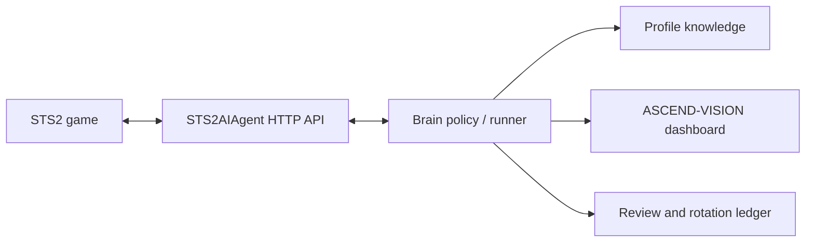

# Vivhite

Languages: [中文](README.md) | English

<p align="center">
  
</p>

<p align="center">
  <a href="../README.md">Repository README</a>
  · <a href="https://steamcommunity.com/sharedfiles/filedetails/?id=3793741497">Steam Workshop</a>
  · <a href="../docs/2026-08-30-白绮角色与轮换大脑实现.md">Full card and mechanics table</a>
</p>

`Vivhite` is a custom character mod for Slay the Spire 2. Vivhite is a magical girl and master magician with deep knowledge of mathematics, computing, and art. She treats health as material for magical calculation and fights through a “pay Cough to cast → heal through kills or Drain → keep casting” loop.

This README describes the current `0.2.1` implementation. See [Vivhite Character and Alternating Brain Implementation](../docs/2026-08-30-白绮角色与轮换大脑实现.md) for the complete 61-card catalog and exact values. The current runtime-bitmap gate passes `92/92`: it extends the earlier `89/89` content baseline with three standalone VFX and has passed same-build atomic deployment and Vulkan in-game verification.

> **Scope.** This file is the development and installation guide for the `Vivhite/` Godot/.NET
> mod subproject. Repository-wide training, review, lifecycle, and offline/live-stream safety
> rules are maintained in the [repository README](../README.md) and
> [`sts2-ascend/README.md`](../sts2-ascend/README.md). The local training stack is deliberately
> independent from the mod assembly and must be started only through its unified entry point.

## Quick navigation

- [Install and use](#install-and-use): install the triplet or build from source.
- [Build and acceptance checks](#build-and-acceptance-checks): compile, test, and verify the PCK.
- [Directory and code tour](#directory-and-code-tour): locate registration, cards, resources, and localization.
- [Content and mechanics](#vivhite-content): character values, builds, keywords, and invariants.
- [Art/runtime gate](#independent-vivhite-v3-skin-and-runtime-art-gate): understand the five-page skin contract.
- [Workshop release checklist](#workshop-release-checklist): keep metadata, BBCode, preview, and triplet in sync.

## Verified baseline and screenshots

| Item | Verified value | Scope |
|---|---|---|
| Mod implementation | `0.2.1` | Current `Vivhite.json` and Workshop material |
| Game | Slay the Spire 2 `v0.111.0` | Steam `public-beta` branch |
| Renderer | Vulkan | Same-build in-game acceptance only |
| Engine / SDK | Godot 4.5.1 Mono / `Godot.NET.Sdk` 4.5.1 | Build and PCK export |
| Target framework | `.NET 9` / `net9.0` | C# assembly and acceptance executable |
| RitsuLib | `0.5.14` | Compile-time and manifest dependency |

The images below are finished screenshots or Workshop artwork, not runtime atlas inputs. They are
kept as evidence/materials and do not replace the Source/PCK/in-game gates.

| Character select | Combat | Workshop preview |
|---|---|---|
|  |  |  |

**Character summary:**

- Starting stats: `78` max HP, `99` gold, `3` energy per turn, and `5` cards drawn per turn.
- Starter deck: 4 × Luminous Projection, 4 × Closed-Domain Mapping, and 1 × Vivhite's Transformation Formula.
- Starter relic: Solitary Crown — whenever any enemy dies, immediately heal `20%` of Max HP, rounded up; each death of one entity resolves only once.
- A dedicated `61`-card pool, including Vivhite's Crimson Transformation Ritual: 3 basic, 18 common, 24 uncommon, and 16 rare cards.
- Three primary builds: Conservation Geometry, Recursive Star Calculus, and Crimson Integral, plus cross-build cards.
- The runtime-bitmap gate passes `92/92`: 61 card scenes, 19 Power icons, 2 Solitary Crown assets, 7 energy-UI assets, and 3 standalone VFX.

## Learning Resources

- [STS2-RitsuLib](https://github.com/BAKAOLC/STS2-RitsuLib): the base library used for content registration, character integration, and Godot resources.
- [RitsuLib Documentation](https://github.com/GlitchedReme/SlayTheSpire2ModdingTutorials/tree/master/RitsuLib): tutorials and examples organized by file.
- [Slay the Spire 2 Modding Tutorials](https://glitchedreme.github.io/SlayTheSpire2ModdingTutorials/index.html): the full tutorial site.

## Install and Use

### Option A: build from source (recommended)

1. Install Slay the Spire 2 and prepare Godot 4.5.1 Mono, .NET 9, and RitsuLib.
2. Create `local.props` and configure the local paths described below.
3. Run `dotnet build .\Vivhite.csproj` from this directory. A full build creates, validates, and atomically deploys the DLL, manifest, and PCK as one triplet.
4. Confirm that the game's `mods` directory contains both `Vivhite` and its `STS2-RitsuLib` dependency.

A deployable build requires `Vivhite.dll`, `Vivhite.json`, and `Vivhite.pck` from one candidate batch. The project prepares and validates the triplet outside the live Mod directory before publishing it as a directory transaction. An explicit `/p:RunPckExport=false /p:CopyModOnBuild=true` request is rejected with `VIVH001`; it cannot perform a split deployment.

### Option B: install build artifacts

Place all three artifacts in `<game directory>\mods\Vivhite\`:

- `Vivhite.dll`
- `Vivhite.json`
- `Vivhite.pck`

Install the `STS2-RitsuLib` version declared by the manifest as well. The verified runtime
baseline is STS2 `v0.111.0` on Steam's `public-beta` branch with Vulkan; use this Steam launch option:

```text
%command% --rendering-driver vulkan
```

If the game directory already contains `launch_vulkan.bat`, that wrapper can be used instead.
The game also ships `launch_opengl.bat` (`--rendering-driver opengl3`) and `launch_d3d12.bat`,
but this Mod has not completed backend-specific in-game acceptance for either path. If Vulkan
does not start, OpenGL3 may be tried as a game-level troubleshooting fallback; that does not
constitute a Vivhite compatibility promise. When reporting a failure, include the actual
renderer and `%APPDATA%\SlayTheSpire2\logs\godot.log`.

## Local Path Configuration

```powershell
Copy-Item .\local.props.template .\local.props
```

Set these values in `local.props` (the file is ignored by Git and must not be committed):

| Field | Description |
|---|---|
| `Sts2Dir` | Slay the Spire 2 installation directory |
| `Sts2DataDir` | Game DLL directory, usually `$(Sts2Dir)/data_sts2_windows_x86_64` |
| `GodotExe` | Godot 4.5.1 Mono executable used to export the PCK |
| `RitsuLibDeployDir` | Local RitsuLib deployment directory, defaulting to `$(Sts2Dir)/mods/STS2-RitsuLib`; this is not this mod's output directory |

## RitsuLib Version Compatibility

> **Align the manifest and csproj before every release.**
>
> `dependencies[STS2-RitsuLib].version` in `Vivhite.json` must match the `STS2.RitsuLib` version actually used by the `.csproj`. The build synchronizes that dependency version, while `min_game_version` still requires manual review.

### Current version snapshot (2026-09-01)

| Item | Value |
|---|---|
| Target game | Slay the Spire 2 `0.111.0` |
| Engine / SDK | Godot 4.5.1 Mono / `Godot.NET.Sdk` 4.5.1 |
| Target framework | `.NET 9` / `net9.0` |
| RitsuLib | `0.5.14` |
| Vivhite implementation | `0.2.1` |

### Version mapping

| RitsuLib version | Target STS2 version | Project status |
|---|---|---|
| `0.5.14` | `0.111.0` | Current compile baseline |

Before selecting another version, consult the [STS2-RitsuLib releases](https://github.com/BAKAOLC/STS2-RitsuLib/releases) and the matching game branch. Do not assume that old APIs or compatibility packages remain drop-in replacements.

### Package selection

The project pins the current mainline package:

```xml
<PackageReference Include="STS2.RitsuLib" Version="0.5.14" GeneratePathProperty="true" />
```

Enable only one mainline or compatibility package at a time. When switching packages, recheck the game version, public APIs, manifest dependency, and in-game loading behavior.

### Pre-release checklist: version alignment

1. After building, confirm that `dependencies[STS2-RitsuLib].version` in `Vivhite.json` matches the resolved NuGet version.
2. Confirm that `min_game_version` matches the target game branch.
3. Confirm that the DLL, JSON, and PCK are deployed to the same `mods/Vivhite` directory.
4. Launch with the verified Vulkan path and use the actual game log to confirm that both the
   dependency and mod are recognized. Treat OpenGL3/D3D12 as unverified troubleshooting paths;
   a successful launch alone is not Mod compatibility evidence.

### Upgrade notes

- The current baseline is STS2 `0.111.0`, RitsuLib `0.5.14`, and Godot 4.5.1 Mono.
- After upgrading RitsuLib or the game, rebuild and inspect card commands, hooks, character resource profiles, and PCK export behavior.
- `Vivhite.json` controls runtime dependency checks, while `.csproj` controls compile-time dependencies; both paths must be updated.

## Build

| Command | Behavior |
|---|---|
| `dotnet build .\Vivhite.csproj` | Full build: compile -> `ExportPCK` candidate -> `CopyMod` transaction commit |
| `... /p:RunPckExport=false` | Skip PCK export; `CopyModOnBuild` then defaults to `false`, leaving the live Mod directory untouched |
| `... /p:CopyModOnBuild=false` | Disable PCK export and live publishing; compile output stays in `bin/` |
| `... /p:RunPckExport=false /p:CopyModOnBuild=false` | C# compile check only |

Only the default full-build path is deployable: it must produce and install the DLL, JSON, and PCK together. `/p:RunPckExport=false` safely defaults copying to off; explicitly turning copying back on fails with `VIVH001` before art validation or compilation. `STS2_SKIP_PCK_EXPORT=1` follows the same fail-closed rule.

A full build compiles first. The post-Build `CopyMod` target then triggers and depends on `ExportPCK`:

- **`ExportPCK`**: invokes the publisher to export the PCK outside the live Mod directory, collect the current DLL and dependency-synchronized manifest, and validate the complete candidate triplet.
- **`CopyMod`**: reports the commit only after the publisher's directory transaction succeeds. It contains no per-file copy and never overwrites the live DLL, PCK, or manifest independently.

> `RitsuLibDeployDir` controls only the deployment location of RitsuLib itself. This mod's DLL, manifest, and PCK are controlled by `ModOutputDir`, which defaults to `$(Sts2Dir)/mods/$(MSBuildProjectName)`.

## Build and acceptance checks

The acceptance executable compiles the production `VivhiteCode` source into an isolated test
assembly. It does not reference the full Mod project and fixes `CopyModOnBuild=false`, so the
checks do not overwrite an installed Mod or require the game to be stopped. Run these commands
from the repository root:

```powershell
# First run, or after package/lock-file changes
dotnet restore .\Vivhite.Tests\Vivhite.Tests.csproj

# Source, card catalog, localization, mechanics, art, and deployment-contract checks
dotnet run --project .\Vivhite.Tests\Vivhite.Tests.csproj --no-restore -c Release
```

The current acceptance list contains `66` checks. Treat the final `Result:` line as the result;
a successful compiler invocation alone is not acceptance evidence. For a C# compile-only check
without PCK export, run this from `Vivhite/`:

```powershell
dotnet build .\Vivhite.csproj -c Release `
  /p:RunPckExport=false /p:CopyModOnBuild=false
```

The complete build invokes the Source and PCK gates automatically. To run either gate explicitly
from the repository root, use read-only commands (replace the variables with real absolute paths):

```powershell
# V3 five-page Spine/source contract
powershell -NoProfile -ExecutionPolicy Bypass `
  -File .\Vivhite\tools\Validate-IroncladSkin.ps1 `
  -ProjectDir .\Vivhite -Phase Source `
  -GodotExe $GodotExe -Sts2Dir $Sts2Dir -RuntimeLayout v3-five-page

# Existing PCK content and 92-item runtime-art contract
powershell -NoProfile -ExecutionPolicy Bypass `
  -File .\tools\test\Verify-VivhitePck.ps1 `
  -PckPath $PckPath -GodotExe $GodotExe
```

The PCK verifier mounts the supplied package in an empty Godot project and checks localization,
resource ownership, V3 layout, and runtime bitmap imports without changing the PCK. A failed gate
preserves an evidence directory; do not delete it or replace a known-good package just to make a
check pass. After resource changes, rebuild and deploy the matching DLL, JSON, and PCK as one
candidate batch.

## Directory Layout

```text
Vivhite/
├── VivhiteCode/   # C# character, cards, relics, and combat rules
├── Vivhite/       # Godot resources and bilingual localization
├── Vivhite.csproj
├── Vivhite.json   # Mod manifest
├── project.godot
└── local.props.template
```

`res://Vivhite/...` is the Godot/PCK resource path mapped to the repository's `Vivhite/` resource directory; it is not a C# namespace.

### Directory and code tour

| Path | Responsibility | Check after editing |
|---|---|---|
| `VivhiteCode/Entry.cs` | Initializes RitsuLib, scans attributes, and registers this assembly | `ModId`, manifest `id`, and deployment directory remain `Vivhite` |
| `VivhiteCode/Characters/VivhiteCharacter.cs` | Starting values, resource profile, audio, and character-owned VFX | Never register an `IRONCLAD` replacement |
| `VivhiteCode/Characters/VivhiteCharacterAssets.cs` | Exact V3 five-page Spine, scene, UI, and multiplayer-gesture contract | Re-run Source/PCK/in-game gates |
| `VivhiteCode/*Pool.cs` | Card, relic, potion, and energy-icon pools | New content stays in Vivhite's pools |
| `VivhiteCode/Cards/Common` | Shared card bases, keywords, life payment, and common rules | Preserve native payment/recovery ordering |
| `VivhiteCode/Cards/Conservation` | Conservation Geometry cards | Keep IDs and both localizations in sync |
| `VivhiteCode/Cards/Recursion` | Recursive Star Calculus cards | Recheck rarity and upgrade values |
| `VivhiteCode/Cards/Hybrid` | Crimson Integral and cross-build cards | Drain is aggregated once; no artificial caps |
| `VivhiteCode/Powers`, `Relics` | Status effects and Solitary Crown | Dedicated icons, relic art, and localization |
| `Vivhite/images`, `scenes`, `localization` | Godot resources packed into the PCK | Verify `res://` paths, case, consumer, and PCK membership |

The sibling repository directories [`Vivhite.Tests`](../Vivhite.Tests/), [`tools/test`](../tools/test/),
and [`tools/art`](../tools/art/) provide acceptance, package, and art checks. The independent
training implementation lives under [`sts2-ascend`](../sts2-ascend/); do not create a second
launcher or copy its lifecycle logic into this project.

## Vivhite Content

### Character configuration

| Property | Value |
|---|---|
| Type | `VivhiteCharacter` |
| Character ID | `VIVHITE_CHARACTER_VIVHITE_CHARACTER` |
| Starting stats | 78 max HP, 99 gold, 3 energy, 5 cards drawn per turn |
| Starter deck | 4 × Luminous Projection, 4 × Closed-Domain Mapping, 1 × Vivhite's Transformation Formula |
| Starter relic | Solitary Crown: heal 20% of Max HP, rounded up, whenever an enemy dies |
| Card pool | 61 cards: 3 basic, 18 common, 24 uncommon, 16 rare |

### Card pool and three builds

| Build | Primary direction |
|---|---|
| Conservation Geometry | Use Margin to offset Cough, permanently grow max HP, and turn overhealing into resources |
| Recursive Star Calculus | Increase damage, on-kill healing, card draw, and energy chains |
| Crimson Integral | Combine multi-hit damage with Drain above 100% to create damage, healing, Block, and Strength loops |

Cross-build cards connect Margin, draw, kills, and Drain. The 61-card total includes Vivhite's Crimson Transformation Ritual, whose phase adds Cough and damage to all Attacks without a cap as turns advance. The [full implementation document](../docs/2026-08-30-白绮角色与轮换大脑实现.md) lists all 61 IDs, costs, effects, and upgrades. Only this current catalog is registered; it does not inherit mechanics from the discarded placeholder-card design.

### Core keywords

| Keyword | Semantics |
|---|---|
| `Cough N` | Before the card resolves, lose N unblocked HP unaffected by Strength; the card is unplayable if payment would leave the player below 1 HP |
| `Margin N` | Automatically offsets Cough one-for-one and is consumed |
| `Dimension Up N` | Permanently gain N max HP and gain the same amount of current HP |
| `Drain N%` | Aggregate the actual enemy HP lost across every hit and target of the complete Attack card, multiply that total by its total Drain rate, and round the single recovery request up once |
| `Lethal` | Triggers when that card's damage directly kills its target |

The total Drain rate is the sum of the Attack's printed rate, combat-global rate, and turn-temporary rate, all added as percentage points. Runtime performs one Drain calculation with that final rate and applies one ceiling operation to the complete Attack's final recovery request. Drain excludes blocked damage, overkill, self-damage, Thorns, and damage from non-Attack cards.

### No artificial caps

Vivhite has no custom hard cap on max-HP growth, Margin, kill healing, Drain percentage, Drain healing, Strength, draw growth, or any other scaling counter. Generated cards, copies, repeated resolutions, and cards recovered from discard or exhaust have the same rights as original cards and can trigger permanent Dimension Up. Drain may exceed `100%`.

Only natural engine invariants remain:

- Current HP cannot exceed max HP.
- Actual Cough cost has a minimum of 0.
- A card cannot be played if paying its cost would leave the player below 1 HP.
- Hand size and similar state continue to follow native game rules.
- The same death event for one enemy resolves once; this is event deduplication, not a healing cap.

## Automated Brain Profiles and Rotation

The Brain is a sibling project, not part of this Mod assembly. Start or stop the complete game +
Agent + Brain + runner + dashboard stack only through the unified scripts from the repository root:

```powershell
# Idempotent background start; defaults to the local fork/release selection and Vulkan
powershell -NoProfile -ExecutionPolicy Bypass -File .\sts2-ascend\scripts\Start-Agent.ps1

# Complete stop, or stop only automation/review while retaining the game
powershell -NoProfile -ExecutionPolicy Bypass -File .\sts2-ascend\scripts\Stop-Agent.ps1
powershell -NoProfile -ExecutionPolicy Bypass -File .\sts2-ascend\scripts\Stop-Agent.ps1 -KeepGame
```

Do not launch individual runners, kill processes by name/port, or hand-edit `sts2-ascend/knowledge`
and `.runtime`; those files are session evidence maintained by the lifecycle scripts. `Stack ready`
means the Brain and an Agent health endpoint are alive, not that a run is being played. A real run
must be proven by a non-menu `/state`, a valid `run`/`state_version`, connected dashboard heartbeat,
recent applied-action acknowledgements, and advancing state. If those proofs disappear, automation
and any broadcast must remain fail-closed. This README never starts a broadcast; streaming controls
are documented separately and must not be invoked when the requested mode is offline.

The data path is intentionally explicit:



Vivhite and Ironclad use shared decision-tree code but separate character profiles. Their floor history and averages, recent-20 samples, wins, and card-choice statistics are stored and reported independently. Historical logs without a profile field belong to Ironclad only when they are stored in the legacy root knowledge directory; untagged logs under a profile-specific directory remain assigned to that profile.

Only before the first catch-up, while Vivhite's completed-run count remains behind Ironclad's, the scheduler follows `Vivhite → Vivhite → Vivhite → Vivhite → Ironclad` (`VVVVI`). When a Vivhite terminal result first makes the counts equal—even partway through a five-run block—the next run is explicitly Ironclad and the scheduler permanently switches to strict `1:1` alternation. It does not re-enter catch-up when Vivhite is temporarily one run behind after that Ironclad run.

At native `GAME_OVER`, automation uses the real `continue_game_over` action to click Continue. It only waits during `summary_animating`; `summary_ready` means that the real Main Menu button is available, not that saving succeeded. At that point the Agent opens the active Profile's real `progress.save` read-only through its Godot `user://` path and recursively compares the disk JSON with the complete `SerializableProgress` JSON serialized from `saveManager.Progress.ToSerializable()` with the latest schema version. It then exposes `save_status`, `save_verified`, and `save_error`. Only the exact combination `save_status=verified`, `save_verified=true`, and an empty `save_error` allows Brain to idempotently persist the run log and profile statistics, commit the terminal rotation ledger, and click the real return button on the next poll. `pending` only waits; errors, missing fields, wrong types, and contradictory combinations fail closed without finalization, rotation, or leaving the screen. Every subsequent native `UNLOCK` screen is then confirmed individually with `confirm_unlock`.

`Ctrl+Alt+F9` pauses Brain action sending while leaving the game and runner available; `Ctrl+Alt+F10` resumes Brain control. These are external `sts2-ascend` controls, not Vivhite Mod hotkeys. Any run touched by manual takeover is marked human-assisted and excluded from automated profile totals, learning, LLM review, and rotation/catch-up quotas, but it still cannot bypass the native save barrier above.

## Independent Vivhite V3 Skin and Runtime Art Gate

No Vivhite asset replacement is registered for the base-game `IRONCLAD`, so Ironclad continues to use the game's native combat, merchant, rest-site, character-select, UI, Spine, audio, and multiplayer resources. Only the independent Vivhite character obtains the current five-page V3 profile from `VivhiteCharacterAssets`, then locally overrides Vivhite's energy counter and card trail. The profile retains the historical physical path `res://Vivhite/skins/ironclad/`; that directory name does not imply ownership and does not activate an Ironclad replacement.

`tools/art/audit_vivhite_runtime_art.gd` and the four-layer read-only PCK gate check the current `92/92` bitmap inventory: 61 dedicated opaque card scenes, 19 Power icons, 2 Solitary Crown assets, 7 energy-UI assets, plus the lens glint, Vivhite-only card trail, and character-select transition VFX. The earlier `89/89` count was the content-bitmap baseline before these three VFX entered the release contract; it is no longer the complete inventory. The skin source/published inventories also satisfy their exact `30/34` file contract, and static card-art QA passes `61/61`.

The same-build DLL, manifest, and PCK have been atomically deployed. On Steam `public-beta` / STS2
`v0.111.0`, Vulkan in-game evidence confirms Vivhite's combat skin, portrait, Solitary Crown,
Margin UI, Chinese card names, and card art without red `NOPE` fallbacks or raw localization keys.
That evidence covers only this branch and backend; it does not make future builds or alternate
renderers pass automatically. Later resource changes must rerun the static, PCK, and in-game gates.
Native source images, verbatim prompts, generation facts, and inspection artifacts remain archived
append-only under `assets/vivhite-ironclad/generated/` without overwriting existing creative assets.

### Art-change minimum loop

Before changing an image, classify it as a finished image, a single frame, an atlas/spritesheet,
or several independent regions in one PNG. Read adjacent `.atlas`, `.spatlas`, Spine JSON,
`.tres`/`.tscn`, manifest, and the actual consumer code to establish regions, slots, animations,
anchors, scale, blend mode, UVs, and size constraints. A packed atlas is never an illustration
prompt. If a consumer or metadata file cannot be found, record that evidence gap instead of
guessing.

For new or repaired transparent assets, follow the repository's single EvoLink `gpt-image-2`
path with `background: "transparent"`; do not create or clean Alpha with chroma keying, masks,
thresholds, flood fill, or other post-processing. Save the untouched result, verbatim prompt, and
secret-free request parameters append-only, and stop after a usable result (at most eight paid
attempts for one semantic asset). Verify RGBA channels and real SourceOver composites on black,
white, and representative game backgrounds before cutting or packing. Only after that check may
code perform lossless sizing, slicing, or atlas packaging. See the [art tooling guide](../tools/art/README.md),
[AI prompt handbook](../docs/白绮AI生成图Prompt工程手册.md), and
[combat Sprite/Spine production plan](../docs/白绮战斗Sprite-Spine方案演进与生产方案.md).

Do not feed legacy contaminated material into a new generation, binding master, atlas, or runtime
chain. The four explicitly documented multiplayer gesture files are the only historical recovery
exception; see [`AGENTS.md`](../AGENTS.md) for its exact paths and scope.

## Manifest Format

`Vivhite.json` is the mod manifest. The key fields for the `0.2.1` implementation are:

```json
{
  "id": "Vivhite",
  "name": "白绮 Vivhite",
  "pck_name": "Vivhite",
  "author": "VivhiteMod",
  "description": "Adds Vivhite, a magical-girl character with 61 cards, three builds, and uncapped health-magic loops.",
  "version": "0.2.1",
  "has_pck": true,
  "has_dll": true,
  "affects_gameplay": true,
  "min_game_version": "0.111.0",
  "dependencies": [
    { "id": "STS2-RitsuLib", "version": "0.5.14" }
  ]
}
```

### Field reference

| Field | Description |
|---|---|
| `id` | Must match `Entry.ModId` and the deployment directory |
| `pck_name` | Must match the exported `.pck` file name |
| `version` | SemVer version of the current Vivhite implementation |
| `has_pck` / `has_dll` | This mod distributes both resources and a code assembly |
| `affects_gameplay` | Must be `true` because Vivhite adds independent gameplay content |
| `min_game_version` | Minimum compatible STS2 version; keep it aligned with the compile target |
| `dependencies` | Runtime dependencies; the RitsuLib version must match the NuGet compile version |

## Development Tips

- Content IDs follow `{MODID}_{category}_{original name}`; full card IDs use `VIVHITE_CARD_<ID>`.
- New character content belongs to Vivhite's own pools and state. Do not write it into the Ironclad identity or register an Ironclad asset replacement.
- Vivhite visuals must use the current V3 five-page skin and must not fall back to the legacy single-page atlas or a separate static combat placeholder; base-game `IRONCLAD` always keeps native game resources.
- New card art must first follow the [card-art production specification](../docs/白绮卡牌图片生成技术规范.md): complete opaque scenes use Codex native generation, while only explicit alpha assets use EvoLink.
- Balance changes may adjust energy, HP cost, base values, scaling, rarity, and Exhaust, but must not reintroduce artificial caps.
- Resource paths must begin with `res://`; verify directory names and case inside the PCK.

## Troubleshooting

| Symptom | First checks | Safe response |
|---|---|---|
| `Could not find sts2.dll` | `Sts2Dir` / `Sts2DataDir` in `local.props` | Point to the real game directory containing `data_sts2_windows_x86_64\sts2.dll`; never substitute the repository path |
| `GodotExe is required for PCK export` | `GodotExe` exists and is Godot 4.5.1 Mono | Configure the executable, or explicitly run the compile-only command with both export/copy switches disabled |
| `VIVH001` split deployment | `RunPckExport=false` combined with `CopyModOnBuild=true` | Use the full build for deployment, or leave copying disabled; never copy one artifact by hand |
| Red `NOPE` or raw localization keys | DLL/PCK/JSON batch and PCK contents | Stop the game, rebuild the complete triplet, redeploy atomically, then inspect `godot.log` |
| V3 Spine gate failure | `ironclad-skin.contract.json` and [`Vivhite/tools/README.md`](tools/README.md) | Restore the private five-page contract; do not copy original Ironclad skeletons or serialize a `SpineMesh2D` |
| Cards show art but no text | `localization/eng` and `localization/zhs` keys/placeholders | Add both languages and rerun acceptance tests; do not hard-code player-facing text in card classes |
| Brain reports `MAIN_MENU` / `run_unknown` | `/state`, `actions/available`, session and native-save evidence | Keep action sending and any broadcast stopped; do not inject a new run or treat health/heartbeat as play evidence |

When reporting a defect, include the Mod version, STS2 branch/version, renderer, reproduction steps,
resource path, and the first relevant error in `%APPDATA%\SlayTheSpire2\logs\godot.log`. Never
include API keys, Steam credentials, or temporary signed URLs.

## Workshop release checklist

Workshop source materials are tracked under [`../workshop`](../workshop/). Every release must update
the version in `Vivhite.json` and `workshop/workshop-item.json`, add the same bilingual Changelog
entry to `workshop/description.bbcode`, and regenerate `workshop/preview.jpg` from approved local
sources. The previous preview and its SHA-256 sidecar belong in the append-only
`workshop/preview-history/` directory. Do not use `-SkipPreview` to bypass stale or mismatched
metadata, and do not manually edit hashes.

From the repository root, the complete release entry point is:

```powershell
powershell -NoProfile -ExecutionPolicy Bypass `
  -File .\tools\workshop\Publish-VivhiteWorkshop.ps1 `
  -PublishedFileId 3793741497 -Visibility public
```

Use `-PrepareOnly` for a local build/PCK/material preflight without contacting Steam. The normal
release path must build an isolated Release DLL/JSON/PCK triplet, run the mounted-PCK gate, verify
the preview dimensions/hash/history and UTF-8 bilingual BBCode, derive Steam's change note from the
current Changelog, and then reuse an already logged-in Steam client. It must not start a GUI/UAC
authorization flow or store passwords/Steam Guard data. A release is complete only after the
structured receipt reports publication and dependency completion and the remote item is read-only
verified. See the [Workshop operation guide](../workshop/README.md) for the full contract.

## Related documentation

- [Repository README](../README.md): workspace map, lifecycle, training, review, and offline/live-stream safety.
- [`sts2-ascend/README.md`](../sts2-ascend/README.md): Brain architecture, profiles, lifecycle, and tests.
- [Full card and mechanics implementation](../docs/2026-08-30-白绮角色与轮换大脑实现.md).
- [Art tooling and candidate indexes](../tools/art/README.md).
- [Workshop materials and publishing](../workshop/README.md).
- [0.2.1 Workshop receipt](../docs/2026-09-01-vivhite-0.2.1-workshop更新回执.md).

## License and asset provenance

Code is distributed under the repository [LICENSE](../LICENSE). The upstream STS2-Agent component
retains its own license and attribution in `sts2-ascend/third_party/`. Game binaries, extracted
reference material, and generated art may be subject to the game's terms and are not automatically
redistributable. Keep original references, generated candidates, prompts, request facts, and
inspection artifacts; never replace provenance records with a processed derivative.
