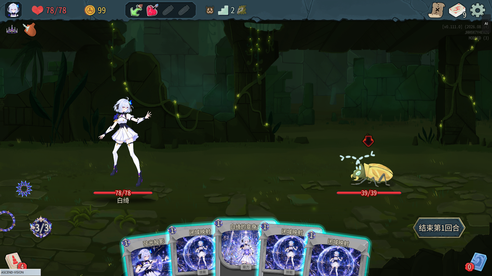

# Vivhite

语言 / Languages：中文 | [English](README.en.md)

<p align="center">
  
</p>

<p align="center">
  <a href="https://steamcommunity.com/sharedfiles/filedetails/?id=3793741497">Steam 创意工坊</a>
  · <a href="README.en.md">English README</a>
  · <a href="../docs/2026-08-30-白绮角色与轮换大脑实现.md">完整卡牌与机制表</a>
</p>

`Vivhite` 是《杀戮尖塔 2》的白绮角色 Mod。白绮是一位精通数学、计算机与艺术的魔法少女、魔法大师；她以生命作为魔法演算材料，通过“支付謦欬施法 → 击杀或汲取回血 → 继续施法”建立战斗循环。

本文描述当前 `0.2.2` 角色实现。完整 61 张卡牌目录与逐牌数值见[《白绮角色与轮换大脑实现》](../docs/2026-08-30-白绮角色与轮换大脑实现.md)。当前运行时位图门禁为 `92/92`：它在既有 `89/89` 内容位图基线上纳入了 3 张独立 VFX，并已完成同批三件套原子部署与 Vulkan 实机验证。

**角色概要：**

- 初始属性：`78` 最大生命、`99` 金币、每回合 `3` 能量、抽 `5` 张牌。
- 初始牌组：4 × 弦光投影、4 × 闭域映射、1 × 白绮的变身式。
- 初始遗物：孤高冠冕——每当任意敌人死亡，立即回复最大生命的 `20%`，向上取整；同一实体的同一次死亡只结算一次。
- 专属卡池共 `61` 张：3 基础、18 普通、24 罕见、16 稀有。
- 三套主要构筑：守恒几何、递归星算、绯彩积分，并有跨体系组合牌。
- 运行时位图门禁已达到 `92/92`：61 张卡图、19 个 Power 图标、2 张孤高冠冕资源、7 张能量 UI 资源和 3 张独立 VFX。

> **文档范围**：本文件是 `Vivhite/` Godot/.NET Mod 子项目的开发与安装说明；仓库根目录的自动游玩、复盘、直播和发布流程见根 [README](../README.md) 与 [`sts2-ascend/README.md`](../sts2-ascend/README.md)。

## 快速导航

- [安装与使用](#安装与使用)：玩家安装三件套，或开发者从源码构建。
- [配置本机路径](#配置本机路径)：创建被 Git 忽略的 `local.props`。
- [构建与验收](#构建与验收)：C# 编译、PCK/Spine 门禁和接受测试。
- [目录结构与代码导览](#目录结构与代码导览)：从入口定位角色、卡池、资源和本地化。
- [内容与机制](#白绮内容)：角色数值、构筑、关键词和不变量。
- [发布前检查](#发布前检查)：三件套一致性、素材门禁与 Workshop 物料。

## 学习资源

- [STS2-RitsuLib](https://github.com/BAKAOLC/STS2-RitsuLib)：本项目用于内容注册、角色接入与 Godot 资源集成的基础库。
- [RitsuLib 文档](https://github.com/GlitchedReme/SlayTheSpire2ModdingTutorials/tree/master/RitsuLib)：按文件组织的教程和示例。
- [Slay the Spire 2 Modding Tutorials](https://glitchedreme.github.io/SlayTheSpire2ModdingTutorials/index.html)：完整教程站点。

## 安装与使用

### 方式 A：从源码构建（推荐）

1. 安装《杀戮尖塔 2》并准备 Godot 4.5.1 Mono、.NET 9 和 RitsuLib。
2. 按下文创建 `local.props` 并填写本机路径。
3. 在本目录运行 `dotnet build .\Vivhite.csproj`。完整构建会生成、验证并原子部署 dll、manifest 和 pck 三件套。
4. 确认游戏的 `mods` 目录同时包含 `Vivhite` 与依赖 `STS2-RitsuLib`。

可部署构建必须让 `Vivhite.dll`、`Vivhite.json` 与 `Vivhite.pck` 来自同一批候选。项目会先在实时 Mod 目录之外准备并验证三件套，再以整目录事务发布；显式要求 `/p:RunPckExport=false /p:CopyModOnBuild=true` 会被 `VIVH001` 拒绝，不会形成拆分部署。

### 方式 B：安装构建产物

将以下三件套放入 `<游戏目录>\mods\Vivhite\`：

- `Vivhite.dll`
- `Vivhite.json`
- `Vivhite.pck`

同时安装 manifest 指定版本的 `STS2-RitsuLib`。当前已验证的运行基线是 Steam
`public-beta` 分支上的 STS2 `v0.111.0`，并使用 Vulkan；Steam 启动项为：

```text
%command% --rendering-driver vulkan
```

本机若已提供游戏根目录下的 `launch_vulkan.bat`，也可以通过该脚本启动。游戏还提供
`launch_opengl.bat`（`--rendering-driver opengl3`）和 `launch_d3d12.bat`，但本 Mod
尚未完成这两个后端的专项实机验收；遇到 Vulkan 启动问题时可以把 OpenGL3 作为游戏级
排障尝试，不能据此视为 Vivhite 的兼容承诺。反馈时请附实际渲染后端和
`%APPDATA%\SlayTheSpire2\logs\godot.log`。

## 配置本机路径

```powershell
Copy-Item .\local.props.template .\local.props
```

在 `local.props` 中设置以下值（文件已在 `.gitignore`，不要提交）：

| 字段 | 说明 |
|---|---|
| `Sts2Dir` | 《杀戮尖塔 2》安装目录 |
| `Sts2DataDir` | 游戏 dll 目录，通常为 `$(Sts2Dir)/data_sts2_windows_x86_64` |
| `GodotExe` | 用于导出 pck 的 Godot 4.5.1 Mono 可执行文件 |
| `RitsuLibDeployDir` | RitsuLib 的本机部署目录，默认 `$(Sts2Dir)/mods/STS2-RitsuLib`；它不是当前 Mod 的输出目录 |

## RitsuLib 版本兼容性

> **发布前必须校对 manifest 与 csproj 的版本。**
>
> `Vivhite.json` 中 `dependencies[STS2-RitsuLib].version` 必须与 `.csproj` 实际编译使用的 `STS2.RitsuLib` 版本一致。构建会同步该依赖版本；`min_game_version` 仍需人工确认。

### 当前版本快照（2026-09-01）

| 项 | 值 |
|---|---|
| 目标游戏版本 | Slay the Spire 2 `0.111.0` |
| 引擎 / SDK | Godot 4.5.1 Mono / `Godot.NET.Sdk` 4.5.1 |
| 目标框架 | `.NET 9` / `net9.0` |
| RitsuLib | `0.5.14` |
| 白绮实现版本 | `0.2.2` |

### 版本对应表

| RitsuLib 版本 | 目标 STS2 版本 | 本项目状态 |
|---|---|---|
| `0.5.14` | `0.111.0` | 当前编译基线 |

切换其他版本前请先核对 [STS2-RitsuLib Releases](https://github.com/BAKAOLC/STS2-RitsuLib/releases) 与对应游戏分支；不要假设旧 API 或旧兼容包仍可直接使用。

### 包选择

项目固定引用当前主线包：

```xml
<PackageReference Include="STS2.RitsuLib" Version="0.5.14" GeneratePathProperty="true" />
```

一次只能启用一个 RitsuLib 主线或兼容包。切换包时必须同时复核游戏版本、公开 API、manifest 依赖版本和真机加载结果。

### 发布前 checklist：版本对齐

1. 构建后确认 `Vivhite.json` 的 `dependencies[STS2-RitsuLib].version` 与实际解析的 NuGet 版本一致。
2. 确认 `min_game_version` 与目标游戏分支一致。
3. 确认 dll、json、pck 三件套被部署到同一 `mods/Vivhite` 目录。
4. 使用已验证的 Vulkan 启动，并以实际加载日志确认依赖和 Mod 均被识别；若改用
   OpenGL3/D3D12，须将其视为未验证的排障路径，不要把启动成功当作 Mod 兼容通过。

### 升级注意事项

- 本项目当前面向 STS2 `0.111.0`、RitsuLib `0.5.14` 与 Godot 4.5.1 Mono。
- 升级 RitsuLib 或游戏版本时，应重新编译并检查卡牌命令、Hook、角色资源配置与 PCK 导出。
- `Vivhite.json` 的运行时依赖校验和 `.csproj` 的编译时依赖是两条不同链路，二者都必须更新。

## 构建与验收

| 命令 | 行为 |
|---|---|
| `dotnet build .\Vivhite.csproj` | 完整构建：编译 → `ExportPCK` 候选 → `CopyMod` 事务提交 |
| `... /p:RunPckExport=false` | 跳过 PCK 导出；`CopyModOnBuild` 默认随之变为 `false`，不触碰实时 Mod 目录 |
| `... /p:CopyModOnBuild=false` | 禁用 PCK 导出与实时发布，编译产物只留在 `bin/` |
| `... /p:RunPckExport=false /p:CopyModOnBuild=false` | 仅进行 C# 编译检查 |

完整构建先编译，再由 Build 后的 `CopyMod` 目标触发并依赖 `ExportPCK`：

- **`ExportPCK`**：调用发布脚本，在实时 Mod 目录之外导出 PCK、收集当前 DLL 与同步依赖版本后的 manifest，并验证完整候选三件套。
- **`CopyMod`**：只在 `ExportPCK` 的整目录事务成功后报告提交完成；该目标没有逐文件复制，不会单独覆盖实时 DLL、PCK 或 manifest。

> `/p:RunPckExport=false` 单独使用时已安全地默认关闭复制；若显式重新打开 `CopyModOnBuild`，构建会在美术校验和编译前以 `VIVH001` 失败。`STS2_SKIP_PCK_EXPORT=1` 遵循同一 fail-closed 规则。

> `RitsuLibDeployDir` 只控制 RitsuLib 框架自身的部署位置；当前 Mod 的 dll、manifest 和 pck 由 `ModOutputDir` 控制，默认是 `$(Sts2Dir)/mods/$(MSBuildProjectName)`。

### 从仓库根目录运行的验收命令

下面的命令不会启动游戏，也不会请求 UAC。接受测试项目会编译当前
`Vivhite/VivhiteCode` 源码的副本，并将 `CopyModOnBuild` 固定为 `false`，因此不会
覆盖已安装的 Mod：

```powershell
# 还原测试依赖（首次或 packages.lock/assets 变化后执行）
dotnet restore .\Vivhite.Tests\Vivhite.Tests.csproj

# 运行生产源码、卡牌表、本地化、机制、资源和部署契约验收
dotnet run --project .\Vivhite.Tests\Vivhite.Tests.csproj --no-restore -c Release
```

当前接受测试入口包含 66 项检查；以命令最后的 `Result:` 行为准，不要只看编译成功。
若只想检查 C# 代码而不导出 PCK，请在 `Vivhite/` 目录运行：

```powershell
dotnet build .\Vivhite.csproj -c Release `
  /p:RunPckExport=false /p:CopyModOnBuild=false
```

### Spine 源码与 PCK 门禁

完整构建会自动执行 `Validate-IroncladSkin.ps1` 的 Source 阶段和 `Export-ModPck.ps1`
的 PCK 阶段。需要单独定位美术问题时，可从仓库根目录执行只读检查：

```powershell
# 源码阶段：检查 V3 五页 Spine、场景绑定和私有资源引用
powershell -NoProfile -ExecutionPolicy Bypass `
  -File .\Vivhite\tools\Validate-IroncladSkin.ps1 `
  -ProjectDir .\Vivhite -Phase Source `
  -GodotExe $GodotExe -Sts2Dir $Sts2Dir -RuntimeLayout v3-five-page

# 已导出的 PCK：检查包内布局、本地化和 92 项运行时位图
powershell -NoProfile -ExecutionPolicy Bypass `
  -File .\tools\test\Verify-VivhitePck.ps1 `
  -PckPath $PckPath -GodotExe $GodotExe
```

`$GodotExe`、`$Sts2Dir` 和 `$PckPath` 必须替换为真实的本机绝对路径。门禁失败时会保留
证据目录；不要直接修改或删除旧的可用 PCK 来“让检查通过”。资源变更后必须重新导出
并将同一批 `Vivhite.dll`、`Vivhite.json`、`Vivhite.pck` 一起部署。

## 目录结构与代码导览

```text
Vivhite/
├── VivhiteCode/   # C# 角色、卡牌、遗物与战斗规则
├── Vivhite/       # Godot 资源与中英文本地化
├── Vivhite.csproj
├── Vivhite.json   # Mod manifest
├── project.godot
└── local.props.template
```

`res://Vivhite/...` 是 Godot/PCK 内的资源路径，对应仓库中的 `Vivhite/` 资源目录，并非 C# namespace。

### C# 入口与内容注册

| 路径 | 职责 | 修改后应检查 |
|---|---|---|
| `VivhiteCode/Entry.cs` | 初始化 RitsuLib、扫描 attribute 并注册本程序集 | `ModId`、manifest `id` 与部署目录保持 `Vivhite` |
| `VivhiteCode/Characters/VivhiteCharacter.cs` | 角色初始属性、资源 profile、音效与角色专属 VFX | 不要注册 `IRONCLAD` 资源替换 |
| `VivhiteCode/Characters/VivhiteCharacterAssets.cs` | V3 五页 Spine、UI、场景、多人手势的精确资源契约 | 重新跑 Source/PCK/真机门禁 |
| `VivhiteCode/Characters/*Pool.cs` | 卡牌、遗物、药水池及能量图标 | 新内容必须进入白绮自己的池 |
| `VivhiteCode/Cards/Common` | 共享卡牌基类、关键词、生命支付和通用规则 | `謦欬`、`余裕`、`汲取` 的原生结算顺序 |
| `VivhiteCode/Cards/Conservation` | 守恒几何体系 | 卡牌 ID 与中英本地化同时新增 |
| `VivhiteCode/Cards/Recursion` | 递归星算体系 | 稀有度与升级值验收 |
| `VivhiteCode/Cards/Hybrid` | 绯彩积分及跨体系卡 | 无人为硬上限、Drain 只汇总一次 |
| `VivhiteCode/Powers`、`Relics` | 状态能力与孤高冠冕 | Power 图标、遗物图和本地化完整 |

### Godot 资源与本地化

`Vivhite/`（第二层同名目录）会被打入 PCK：

- `images/cards/`：61 张专属卡图；`images/powers/`：23 个已注册 Power 中的 19 个专属图标。
- `images/characters/`：能量计数器和文字/大图能量资源。
- `skins/ironclad/`：历史物理路径下的白绮 V3 私有 profile，包含 combat、merchant、rest-site、character-select 四组场景/Spine 资源；它不表示给原版战士换皮。
- `localization/eng` 与 `localization/zhs`：卡牌、Power、角色、关键词、遗物和古代文本；两种语言必须同步维护。
- `scenes/`：角色能量计数器与白绮专属卡牌轨迹等 Godot 场景。

资源路径必须写成 `res://Vivhite/...`，并区分大小写。新增资源不能只放在仓库里：必须被
场景或 C# 消费、进入 PCK、通过对应门禁，并在实际游戏中观察到正确结果。

## 白绮内容

### 角色配置

| 项 | 值 |
|---|---|
| 类型 | `VivhiteCharacter` |
| 角色 ID | `VIVHITE_CHARACTER_VIVHITE_CHARACTER` |
| 初始属性 | 78 最大生命、99 金币、3 能量、每回合抽 5 张牌 |
| 初始牌组 | 4 × 弦光投影、4 × 闭域映射、1 × 白绮的变身式 |
| 初始遗物 | 孤高冠冕：每个敌人死亡时回复最大生命的 20%，向上取整 |
| 卡池 | 61 张：3 基础、18 普通、24 罕见、16 稀有 |

### 卡池与三套构筑

| 构筑 | 主要方向 |
|---|---|
| 守恒几何 | 用余裕减免謦欬，永久增加最大生命，并把超量治疗转为资源 |
| 递归星算 | 强化伤害、击杀回复、抽牌与能量连锁 |
| 绯彩积分 | 通过多段伤害与可超过 100% 的汲取形成伤害、回复、格挡和力量循环 |

另有跨体系牌连接余裕、抽牌、击杀和汲取，包括按回合无限提高攻击謦欬与伤害的稀有能力牌“白绮的猩红转化仪式”。完整 61 张牌的 ID、费用、效果和升级数值见[完整实现文档](../docs/2026-08-30-白绮角色与轮换大脑实现.md)。早期 Demo 内容已从当前注册、初始牌组与内容池移除；具体历史保留在[早期 Demo 记录](../docs/2026-08-22-白绮角色mod-demo搭建与真机测试.md)中。

### 核心关键词

| 关键词 | 语义 |
|---|---|
| `謦欬 N` | 在牌面效果及该牌引发的任何回血前损失 N 点不可格挡、不会被力量修改的生命；支付后会低于 1 生命时不可打出 |
| `余裕 N` | 自动按 1:1 抵消謦欬并被消耗 |
| `增维 N` | 永久增加 N 点最大生命，并同时增加 N 点当前生命 |
| `汲取 N%` | 整张攻击牌结算后，将多段与群体实际造成的敌方生命损失汇总，乘以牌面、本场全局与本回合临时汲取率之和，形成一次回复请求并只向上取整一次 |
| `致命` | 该牌的伤害直接令目标死亡时触发对应效果 |

牌面汲取率、本场全局汲取率与本回合临时汲取率按百分点相加。运行时不会分项重复结算，而是只用完整攻击的实际敌方生命损失与最终总率计算一次回复请求并向上取整。汲取不计算格挡、过量伤害、自伤、荆棘或非攻击牌伤害。

### 无人为上限

白绮机制不设置最大生命成长、余裕、击杀回复、汲取百分点、汲取回复量、力量、抽牌成长或其他自定义硬上限。临时生成、复制、重复结算和从弃牌堆或消耗堆回收的牌与原牌同权，能够触发永久增维；汲取率可以超过 `100%`。

保留的只有游戏自然不变量：

- 当前生命不能超过最大生命。
- 謦欬的实际费用最低为 0。
- 支付后会低于 1 点生命的牌不可打出。
- 手牌数量等继续遵循游戏原生规则。
- 同一敌人的同一次死亡事件只结算一次；这是事件去重，不是回复上限。

### 独立白绮 V3 皮肤与美术门禁

原版 `IRONCLAD` 不再注册任何 Vivhite 资源替换，因此继续使用游戏原生的战斗、商店、休息、选人、UI、Spine、音频和多人资源。只有独立白绮角色从 `VivhiteCharacterAssets` 获取当前白绮 V3 五页资源 profile，并在其上局部覆盖白绮自己的能量计数器和卡牌轨迹。该 profile 沿用历史物理目录 `res://Vivhite/skins/ironclad/`，但目录名不表示资源所有权，也不会触发战士替换。

`../tools/art/audit_vivhite_runtime_art.gd` 与 PCK 四层只读门禁检查当前 `92/92` 位图：61 张独立不透明卡图、19 个 Power 语义图标、2 张孤高冠冕资源、7 张能量 UI，以及眼镜星光、白绮专属卡牌轨迹和角色选择转场 3 张 VFX。早期 `89/89` 只是加入这 3 张 VFX 前的内容位图基线，不能再代表当前发布清单。皮肤源码/发布清单也已达到精确 `30/34` 文件契约，全卡静态视觉 QA 为 `61/61`。

同批 DLL、manifest 与 PCK 已完成原子部署；在 Steam `public-beta` / STS2 `v0.111.0`
的 Vulkan 实机中确认白绮战斗皮肤、头像、孤高冠冕、余裕 UI、中文卡名和卡图正常，
未见红色 `NOPE` 或裸本地化 key。该次证据只覆盖上述分支和 Vulkan 后端，不应扩大成
未来每次构建或其他后端自动通过；后续资源变更仍须重跑静态、PCK 与真机门禁。生成原图、
逐字 Prompt、生成事实和检查图均追加式保存在 `assets/vivhite-ironclad/generated/`，
不会覆盖既有创意素材。

<details>
<summary>查看一次已验收的白绮战斗画面</summary>

<p align="center">
  
</p>

</details>

### 美术变更的最小闭环

1. 先判断素材是单幅成品、单帧、atlas/spritesheet 还是多区域 PNG；同时阅读相邻的
   `.spatlas`、`.spjson`、`.tres`、`.tscn` 和实际消费者代码，确认 region、slot、动画、
   锚点、缩放和尺寸契约。
2. 透明素材只能通过仓库规定的 EvoLink `gpt-image-2` 原生透明路径生成，且请求使用
   `background: "transparent"`；不得用抠图、色键、蒙版或后处理制造 Alpha。生成原图、
   完整 Prompt 和去秘密请求参数必须追加保存，单一语义素材最多八次付费尝试。
3. 通过真实 RGBA/SourceOver Alpha 检查后，才允许做不改变创意内容的尺寸适配、切片和
   atlas 打包；不能把 packed atlas 当成整幅插画交给模型重绘。
4. 最后依次跑静态资源、Spine Source、PCK 和真机门禁。失败的原图和中间结果必须保留，
   不能用旧占位图或原版战士骨骼掩盖缺口。

长期规则与修订记录见 [AGENTS.md](../AGENTS.md)、[白绮 AI 生成图 Prompt 工程手册](../docs/白绮AI生成图Prompt工程手册.md)
和[白绮战斗 Sprite/Spine 生产方案](../docs/白绮战斗Sprite-Spine方案演进与生产方案.md)。

## Brain 角色隔离、追及轮换与原生结算

Brain 共用同一套决策算法，但战士与白绮使用独立的 `CharacterProfile`。战士继续使用历史 `knowledge/` 根目录；白绮的统计、策略、进度、课程、运行日志和 LLM 复盘队列/报告写入 `knowledge/profiles/vivhite/`。只有位于历史 `knowledge/` 根目录且没有角色字段的旧日志才按战士处理；位于 `knowledge/profiles/vivhite/` 的无字段日志仍归属白绮。分角色卡牌统计、最高楼层、平均楼层、胜率和近 20 局数据彼此隔离。

仅在首次追平前且白绮已成功落盘的总局数少于战士时，轮换按 `VVVVI`（白绮四局、战士一局）的追赶序列推进；如果白绮在一个五局周期中途追平，下一局明确选择战士，并永久切换为严格 `1:1` 交替，不承诺跑完该周期，也不会因战士局后暂时再次少一局而重返追赶。只有唯一终局日志与对应角色统计均成功持久化后才消费轮换配额，重复终局通知不会重复推进。

GAME OVER 阶段由 MCP 暴露真实的 `continue_game_over` 动作。Brain 先点击游戏原生 Continue；`summary_animating` 期间只等待，进入 `summary_ready` 只表示真实返回主菜单按钮已经可用，并不证明存档成功。此时 Agent 通过当前 Profile 的 Godot `user://` 路径只读打开真实 `progress.save`，把磁盘 JSON 与当前 `saveManager.Progress.ToSerializable()`（补齐最新 schema version）序列化出的完整 `SerializableProgress` JSON 做递归等价比较，并暴露 `save_status`、`save_verified` 与 `save_error`。只有精确满足 `save_status=verified`、`save_verified=true` 且 `save_error` 为空，Brain 才幂等落盘本局日志与角色统计、提交轮换终局账本，并在下一次轮询点击真实返回按钮；`pending` 继续等待，错误、缺字段、错误类型或矛盾组合均 fail closed，不结算、不轮换、不离场。随后出现的每个原生 `UNLOCK` 界面再逐项通过 `confirm_unlock` 确认。

`Ctrl+Alt+F9` 只暂停 Brain 发送动作并保留游戏与 runner，`Ctrl+Alt+F10` 恢复自动控制；它们是 `sts2-ascend` 的外部控制，不是 Vivhite Mod 游戏热键。被人工接管触及的局会标记为 human-assisted，并从自动角色统计、学习、LLM 复盘和轮换配额中排除，但仍不能绕过上述原生存档屏障。

## Manifest 格式

`Vivhite.json` 是 Mod 清单。`0.2.2` 实现对应的关键字段为：

```json
{
  "id": "Vivhite",
  "name": "白绮 Vivhite",
  "pck_name": "Vivhite",
  "author": "VivhiteMod",
  "description": "新增魔法少女角色白绮：61 张专属卡牌、三套构筑与无上限生命魔法循环。",
  "version": "0.2.2",
  "has_pck": true,
  "has_dll": true,
  "affects_gameplay": true,
  "min_game_version": "0.111.0",
  "dependencies": [
    { "id": "STS2-RitsuLib", "version": "0.5.14" }
  ]
}
```

### 字段说明

| 字段 | 说明 |
|---|---|
| `id` | 必须与 `Entry.ModId` 和部署目录一致 |
| `pck_name` | 必须与实际导出的 `.pck` 文件名一致 |
| `version` | 当前白绮实现的 SemVer 版本 |
| `has_pck` / `has_dll` | 表示该 Mod 同时分发资源包和代码程序集 |
| `affects_gameplay` | 白绮拥有独立玩法内容，因此必须为 `true` |
| `min_game_version` | 最低兼容 STS2 版本，应与编译目标一致 |
| `dependencies` | 运行时依赖；RitsuLib 版本应与 NuGet 编译版本一致 |

## 开发提示

- 内容 ID 使用 `{MODID}_{类别}_{原名}`；卡牌完整 ID 为 `VIVHITE_CARD_<ID>`。
- 新角色内容应进入白绮自己的卡池、遗物池和状态；不得写入战士身份或注册战士资源替换。
- 白绮视觉资源统一指向当前 V3 五页白绮皮肤，不能回退旧单页 atlas 或独立静态战斗占位图；原版 `IRONCLAD` 始终使用游戏原生资源。
- 新卡图必须先核对消费者与[卡图生成技术规范](../docs/白绮卡牌图片生成技术规范.md)；完整不透明场景图走 Codex 原生生成，透明独立素材才走 EvoLink。
- 新机制的平衡只能调整费用、耗血、基础数值、成长系数、稀有度和消耗属性，不能重新加入人为封顶。
- 资源路径必须以 `res://` 开头，并确认 PCK 内目录名与大小写正确。

## 常见问题排查

| 现象 | 首先检查 | 正确处理 |
|---|---|---|
| `Could not find sts2.dll` | `local.props` 的 `Sts2Dir` / `Sts2DataDir` | 指向包含 `data_sts2_windows_x86_64\sts2.dll` 的实际游戏目录；不要把仓库路径当作游戏目录 |
| `GodotExe is required for PCK export` | `GodotExe` 是否存在且为 4.5.1 Mono | 配置可执行文件；只做 C# 编译时显式使用 `/p:RunPckExport=false /p:CopyModOnBuild=false` |
| `VIVH001` split deployment | 是否把 `RunPckExport=false` 与 `CopyModOnBuild=true` 组合 | 让完整构建同时导出并部署三件套，或保持复制关闭；不要逐文件拷贝 |
| 游戏出现红色 `NOPE` / 裸本地化 key | DLL、PCK、JSON 是否来自同一批；PCK 是否含新资源 | 停止游戏后重新执行完整构建和原子部署，再查看 `%APPDATA%\SlayTheSpire2\logs\godot.log` |
| V3 Spine 门禁失败 | `Vivhite/tools/README.md` 与 `ironclad-skin.contract.json` | 按契约补齐私有五页资源；不得复制原版 `.skel`/`.spskel` 或序列化 `SpineMesh2D` |
| 卡牌能看到但文字缺失 | `Vivhite/localization/eng` 与 `zhs` 是否同时有 key、占位符是否一致 | 同步两种语言文件并运行接受测试；不要在卡牌类里硬编码玩家文案 |

报告问题时请附：Mod 版本、STS2 分支/版本、渲染后端、复现步骤、相关资源路径和
`godot.log` 中的第一处错误。不要上传 API key、Steam 凭据或临时签名 URL。

## 发布前检查

一次可发布的版本必须满足以下闭环：

1. 更新 `Vivhite/Vivhite.json` 版本，并确认 `STS2-RitsuLib` 版本与
   `Vivhite.csproj` 的 `PackageReference` 一致；`min_game_version` 需人工复核。
2. 运行 66 项接受测试，以及完整 Release 构建；确认 Source/PCK 门禁、`92/92` 运行时
   位图和本地化契约均通过。
3. 停止占用文件的游戏进程后，将同一候选批次的 `Vivhite.dll`、`Vivhite.json`、
   `Vivhite.pck` 原子部署到 `<游戏目录>\mods\Vivhite\`；禁止只替换 DLL 或 PCK。
4. 从仓库根目录运行 Workshop 发布脚本时，不得使用 `-SkipPreview` 绕过物料门禁：

   ```powershell
   powershell -NoProfile -ExecutionPolicy Bypass `
     -File .\tools\workshop\Publish-VivhiteWorkshop.ps1 `
     -PublishedFileId 3793741497 -Visibility public
   ```

   发布脚本会检查并同步 `workshop/workshop-item.json`、
   `workshop/description.bbcode`、`workshop/preview.jpg` 和版本归档；Steam change note
   必须来自本次发布记录。上传只复用已登录客户端，不应启动需要人工 UAC 的 GUI。
5. 保存发布回执、远端只读元数据和本地预览 SHA-256；再在目标游戏版本/渲染后端做一次
   安装后验收。发布成功不等于未来版本或其他后端自动兼容。

相关的构建门禁实现位于 `Vivhite.csproj`、`Vivhite/tools/Export-ModPck.ps1`、
`Vivhite/tools/Validate-IroncladSkin.ps1` 和 `tools/test/Verify-VivhitePck.ps1`；需要修改
生命周期、自动游玩或直播时，请回到仓库根 README 和 `sts2-ascend/` 文档，不要在本子项目
README 中复制另一套启动入口。
