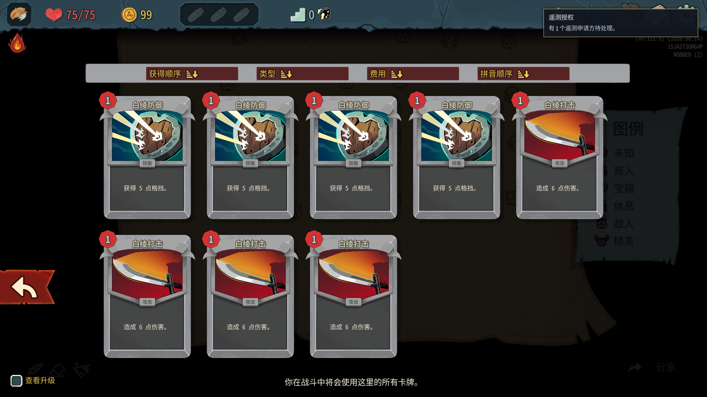

# sts2-ascend — 杀戮尖塔2 自主学习智能体

基于 [CharTyr/STS2-Agent](https://github.com/CharTyr/STS2-Agent)（游戏内 HTTP API mod，AGPL-3.0）构建的
**会自动玩、会思考、会进化的杀戮尖塔2智能体**。

- 分角色游玩白绮（Vivhite）与战士（Ironclad）：首次追平前按 VVVVI 推进；从落后状态由白绮追平后下一局为 Ironclad，此后永久 1:1
- 每个决策都产出中文局势分析与理由（见 `knowledge/brain.log`）
- **每局结束后自动复盘**：把结果归因到卡牌/遗物/敌人/事件选项，突变策略参数，写进 `knowledge/lessons.md`
- 以通关为目标，胜利后自动提升进阶（Ascension）继续挑战更高难度

> **文档定位**：这是 `sts2-ascend/` 的运行与维护手册。命令示例默认从仓库根目录
> `G:\workspace\slay-the-spire-vivhite-mod` 执行；如果你先进入 `sts2-ascend/`，请去掉命令中的
> `sts2-ascend/` 前缀。可执行脚本、测试和当前根目录 [`AGENTS.md`](../AGENTS.md) 是事实源；本页不把
> 某一次运行的进程、楼层或存档状态写成永久保证。

**导航**： [边界](#先看这三条运行边界) · [目录](#文档与目录导航) · [快速开始](#快速开始) ·
[运行验收](#运行验收与只读监控) · [开发/部署](#开发部署与验收) · [复盘](#大模型复盘异步追及队列游玩零等待) ·
[驾驶舱](#ascend-vision-直播驾驶舱) · [语音](#语音朗读ascend-voice) · [排障](#故障排查)

## 先看这三条运行边界

1. **只用统一入口管理全栈。** 用 `Start-Agent.ps1` 启动/复用游戏、runner、Brain、驾驶舱和按需语音，
   用 `Stop-Agent.ps1` 停止；不要分别拉起组件、按端口泛杀 Python，也不要手工删除 `.runtime/` 或
   `knowledge/`。脚本按 session、PID 创建身份、工作区和命令行校验目标。
2. **`Stack ready` 不等于正在游玩。** 开始训练后的验收必须看 `/state` 的有效 `run_id`/`run`、非菜单
   `screen`、数值 `state_version`、驾驶舱 `connected`/新鲜 heartbeat，以及最近的 `applied` 动作回执和
   连续状态推进。只看到进程存活、`/health=ready` 或悬浮窗心跳，不能当作真实对局证据。
3. **直播默认失败关闭。** 用户说“下播”时只确认 Livehime 为 `Idle`/`NotRunning`，继续运行训练但绝不
   调用开播入口或自动复播。只有用户明确要求开播、真实对局证据完整且两次采样都推进，才可调用
   `Start-BilibiliLive.ps1`；证据消失、主菜单/等待、动作停止或挂机提示出现时，立即
   `Stop-BilibiliLive.ps1` 并确认 `Idle`。两分钟断流预算只适用于已证明真实游玩的直播会话。

## 文档与目录导航

| 路径 | 用途 | 是否可手工编辑运行数据 |
| --- | --- | --- |
| [`README.md`](README.md) | 本子项目的架构、运行、验收和排障手册 | 是（文档） |
| [`AGENTS.md`](AGENTS.md) | 本目录附加工作规则；继承根目录规则 | 是（规则变更需审慎） |
| `brain/` | API 客户端、策略、在线学习、复盘宿主、驾驶舱与生命周期实现 | 只改源码/配置；不要改 `knowledge/` |
| `brain/config.json` | 端口、轮询、viewer、复盘模型链、TTS 参数 | 可改静态配置；运行时由复盘机制验收 |
| `scripts/Start-Agent.ps1` / `Stop-Agent.ps1` | 唯一的全栈启停入口 | 通过脚本使用，不手改 `.runtime` |
| `scripts/Deploy-Mod.ps1` | 构建/下载并部署上游 STS2-Agent 三件套 | 只在游戏停止或用 `-SkipDeploy` |
| `scripts/Start-BilibiliLive.ps1` / `Stop-BilibiliLive.ps1` | 直播前置证明、开播；或只下播 | 只在明确授权的直播流程使用 |
| `third_party/README.md` | 上游 fork/release、补丁和构建关系 | 只读参考 |
| [`docs/README.md`](docs/README.md) | Brain 局部复盘/观测记录索引（历史证据，不是运行配置） | 追加 Markdown；不改 `knowledge/` |
| `tools/game-knowledge/README.md` | 原生游戏知识快照生成、校验与版本隔离 | 只写显式输出目录 |
| `.runtime/` | 当前 session、PID、stop sentinel、日志、dashboard 快照 | **不要手工改/删** |
| `knowledge/` | 在线统计、局日志、复盘队列、归档和经验 | **不要手工改**；用脚本/Brain 事务 |

历史方案和事故复盘见 [`docs/2026-08-22-sts2-ascend自动游玩智能体.md`](../docs/2026-08-22-sts2-ascend自动游玩智能体.md)。
它是历史证据与背景，不覆盖当前脚本和根 `AGENTS.md` 的操作边界。

## 架构

```
┌─────────────────────────────┐       localhost HTTP        ┌──────────────────────────────┐
│ Slay the Spire 2             │  ┌──────────────────────► │ brain/ (Python 3 stdlib)      │
│ └ STS2AIAgent (上游 mod)     │  │ /state                 │ ├ client.py   API 客户端       │
│   暴露状态、数据与动作接口    │  │ /actions/available     │ ├ policy.py   逐屏决策引擎     │
└─────────────────────────────┘  │ /action (POST)         │ ├ agent.py    主循环/看门狗    │
                                 │ /data/*                 │ ├ knowledge.py 持久化知识库   │
                                 ◄──────────────────────── │ ├ reflect.py  赛后复盘/进化     │
                                                           │ └ viewer/TTS/复盘监督器       │
                                                           └──────────────┬───────────────┘
                                                                          │ 原子写入
                                                                          ▼
┌─────────────────────────────────────────────────────────────────────────────────────────┐
│ knowledge/（跨对局长期记忆；运行中由 Brain 事务维护，不手工编辑）                         │
│ stats.json · policy.json · progression.json · lessons.md · runs/*.json · review_queue.json │
└─────────────────────────────────────────────────────────────────────────────────────────┘
```

大脑**不依赖任何第三方包**（纯 Python 标准库），也**不修改上游 mod**——只是它的 HTTP 客户端。
MCP server（上游附带）对本项目不是必需的。

## 双角色 Profile 与追赶轮换

双角色共用同一套 `Policy` 决策算法；`Agent` 为每个角色创建相互独立的 `Knowledge` / `Policy`
运行实例，角色差异通过 `CharacterProfile`、角色目录和参数实例表达：

| `profile_id` | 实际 `character_id` | 学习数据根目录 |
| --- | --- | --- |
| `ironclad` | `IRONCLAD` | 历史 `knowledge/` 根目录，原位保留且不迁移 |
| `vivhite` | `VIVHITE_CHARACTER_VIVHITE_CHARACTER` | `knowledge/profiles/vivhite/` |

没有角色字段的历史日志继续归为 Ironclad。新运行日志写入 `profile_id`、API 返回的
`character_id` 和角色内递增的 `profile_run_number`；两套 `stats.json`、`policy.json`、
`progression.json`、`lessons.md` 与 `runs/` 不交叉读写。

卡牌数据同样以 Profile 为边界：奖励选牌写入各自的 `card_picks`，终局构筑写入各自的
`final_deck`，选牌体系分布与终局构筑分布分别统计、分别展示。`final_deck` 只接受有效
`GAME_OVER` 终局载荷中的 MCP `run.deck`；轮询期间的牌组快照、断线缓存和旧活动局状态都不能
被提升为终局证据。压缩归档保留 `profile_id` / `character_id`；旧 ZIP catalog 缺身份时先从校验后的
归档原始 JSON 恢复，只有 catalog 与原始 JSON 都无身份时才按历史兼容归入 Ironclad，不能因物理目录
位置把显式 Vivhite 记录改归战士。

楼层统计也以 Profile 为硬边界，不能把两人的样本合并后再按标签显示。Ironclad 的生涯平均/最高
优先来自历史根目录自己的 `floor_sum_raw / runs` 与 `best_floor_raw`；Vivhite 只读取
`knowledge/profiles/vivhite/` 下对应字段，聚合不可用时也只回退到同一 Profile 的有效完结局。两人的
“近 20 局平均”和“近 20 局最高”分别从各自最近 20 个有效完结局计算，某一方样本不足时只显示
该方现有样本或 `N/A`，绝不从另一方回填。旧库缺少
raw-floor 字段时的胜利加分反推兼容只属于 Ironclad 历史；没有角色字段的根目录逐局日志同样只归
Ironclad。进行中局、人工接管局和零决策幻影局都不进入这些生涯或近 20 局指标。

`CharacterRotation` 的持久状态位于 `knowledge/character_rotation.json`。没有活动对局和轮换历史时，
目标固定为 Vivhite；仅在首次追平前，且 Vivhite 在各自 `stats.global.runs` 中已成功保存的总局数少于 Ironclad 时，
正常计入轮换的自主局按 Vivhite → Vivhite → Vivhite → Vivhite → Ironclad（VVVVI）循环推进。每局终局
成功保存后都会重新比较双方总局数；从落后状态由白绮终局首次追平时，立即锁存为 1:1，下一局明确选择 Ironclad，
随后永久按 Ironclad → Vivhite → Ironclad 严格交替；即使 Ironclad 局后白绮暂时再少一局也不重返 4:1，
且不补齐当前五局序列。活动对局始终以 API 的实际 `run.character_id` 绑定 Profile，只有终局日志与角色统计
成功保存后才推进配额；重复终局按 `run_id` 幂等去重。目标角色缺失、锁定或载荷不完整时停在选角界面并记录原因，不回退到其他角色。

Vivhite 的 `CharacterProfile` 绑定独立的 61 卡静态目录和评分参数。余裕先按 `1:1` 抵扣謦欬；
抵扣后真正损失的生命每点计 `-1.25`，当前生命严格低于最大生命 35% 时该风险权重变为两倍，支付后
会低于 1 点生命的牌判定为不可打出。实际获得余裕每点计 `+1.25`，消耗余裕按同一资源价值扣回；
余裕数量及收益不做自定义封顶。

61 卡目录直接保存现行最终整数：固定牌面謦欬已翻倍，猩红转化仪式的 `0,1,2,3...` 阶段謦欬是
不翻倍的明确特例；同时带謦欬和抽牌的牌，其抽牌数已经翻倍，若有弃牌则弃牌数同步翻倍。汲取目录与
API `DynamicVar` 均按现行最终整数消费；Brain 运行时只把牌面、全局、本回合与已触发派生效果的百分点
相加，不再次执行旧值换算或翻倍。多段与群攻先汇总整张攻击造成的实际敌方生命损失，再按最终总率
计算并只向上取整一次。评分只对实际回复生命按每点 `+0.85` 计收益，不按牌面理论回复伪造满血收益；
汲取率可超过 100%，也不对比例或回复量做自定义裁剪。永久最大生命每点 `+3.0`，击杀实际回血每点
`+1.0`；孤高冠冕按最大生命 20% 向上取整，归纳法阵按 50%/75% 放大即时死亡回复。战士继续使用自己的
参数实例，不消费白绮目录或这些白绮专属估值。

## 原生终局分数与解锁落盘

Brain 不再在 `GAME_OVER` 直接调用返回主菜单。Agent HTTP API 暴露动作 `continue_game_over`，
Brain 通过通用动作端点调用它；MCP 的 full profile 额外暴露同名独立工具，guided/layered profile
则通过通用 `act` 提交该动作。三条入口推进的是同一原生流程，协议分为：

1. `game_over.phase=intro` 时只允许 `continue_game_over`，真实点击原生 Continue。
2. `summary_animating` 期间等待游戏执行分数条、角色解锁计算与原生结算协程。
3. `GameOverPayload` 在三个 phase 都携带 `save_status`、`save_verified` 与 `save_error`。原生
   MainMenuButton 真实可见且可用时才进入 `summary_ready`；该 phase 只证明总结 UI 已就绪，不等于
   存档成功。此前校验结果为 `pending/false/null`；进入 `summary_ready` 后立即执行只读校验，得到
   `verified/true/null` 或 `error/false/<错误码>`。
4. Brain 对合法的 `pending/false/null` 只等待；`error`、字段缺失、类型错误或字段矛盾全部
   fail closed。只有 `verified/true/null` 才幂等保存终局日志、角色统计与轮换记录，并在后续轮询执行
   `return_to_main_menu`。

原生验证在 `summary_ready` 后，通过当前 Profile 的 Godot `user://` 路径只读打开真实
`progress.save`，把磁盘 JSON 与当前 `saveManager.Progress.ToSerializable()`（补齐最新 schema
version）序列化出的完整 `SerializableProgress` JSON 做递归等价比较。它不主动补写存档；读取失败、
JSON 损坏或内容不一致时，Brain 不得结算、推进轮换或离开终局屏。`human_assisted` 也不能绕过该屏障。

`continue_game_over` 真实点击 `NGameOverContinueButton`；返回动作也只真实点击
`NReturnToMainMenuButton`，禁止直接调用会绕过总结协程的 `ReturnToMainMenu` 私有路径。其后出现的每个
`UNLOCK` 屏只通过 `confirm_unlock` 顺序确认；按钮未就绪时等待，不盲点屏幕、不提前开始下一局。
HTTP 回执丢失或重连依赖真实按钮、phase 和存档验证状态恢复，既不会重复 Continue，也不会重复写终局统计。

MCP `Sts2Client` 对单次动作调用不做 transport-level 自动重放：原 POST 只发送一次；若响应读取结果
不确定，则直接且仅执行一次不重试的 `GET /state`，返回 `outcome_unknown`，并在
`reconciliation` 中附带状态或结构化错误。这里保证的是同一次 MCP 调用不会自动重发 POST。
Brain 自身的直连客户端也不会在断线后透明重放动作；它会继续读取新状态，并按动作特定后置条件
对账。确认生效后恰好一次补账；有限轮询仍无证据时，释放为策略重新评估，之后可能重新提交当时
仍合法的精确动作目标。普通非动作 GET/HEAD 保留读取重试语义。

分角色楼层统计只使用 `floor_sum_raw` / `best_floor_raw`；驾驶舱楼层卡与趋势只显示当前活动角色，双方均满近 20 局有效样本时另显示 Vivhite÷Ironclad 滚动平均楼层比。
LLM 复盘的目标契约是队列项携带 `profile_id`、单批只含一个
Profile，且 prompt、runs、stats、lessons、policy、报告和队列均按角色隔离；该链路仍处于最终
集成验证阶段，在相关提交与回归完成前不得视为已生产验证。

平衡结论尚未产生：必须重新采集 Vivhite 与 Ironclad 各至少 20 局，以真实楼层同窗口计算比值；
目标仍为 `1.35～1.65`（中心 `1.50`）。当前没有足够的 `20+20` 真机样本，因此不声称已经达标。

## 快速开始

```powershell
# 在仓库根目录：生产训练基线（默认 auto，保留 Steam 初始化）
powershell -NoProfile -ExecutionPolicy Bypass -File .\sts2-ascend\scripts\Start-Agent.ps1

# 生产训练也可以显式记录 Steam-on（与 auto 一样不追加 --force-steam on）
powershell -NoProfile -ExecutionPolicy Bypass -File .\sts2-ascend\scripts\Start-Agent.ps1 -SteamMode on

# 仅诊断/隔离实验：前提是独立本地 profile 已完成原生模组同意（见下文）
# 冷启动才会把 --force-steam off 传给 launch_vulkan.bat；这不是生产默认
powershell -NoProfile -ExecutionPolicy Bypass -File .\sts2-ascend\scripts\Start-Agent.ps1 -SteamMode off

# 完整停止 brain/runner、播报/复盘链和游戏
powershell -NoProfile -ExecutionPolicy Bypass -File .\sts2-ascend\scripts\Stop-Agent.ps1

# 只停智能体与播报链，保留游戏
powershell -NoProfile -ExecutionPolicy Bypass -File .\sts2-ascend\scripts\Stop-Agent.ps1 -KeepGame
```

上述入口是幂等的：已有当前工作区的 runner 时会复用，不会再启动第二套；启动中的 session 被
`Stop-Agent.ps1` 取消时不要立刻强行再开一套，先等哨兵协作退出或再次运行 Stop。冷启动顺序是
“预检 Python/.NET/Steam 空间 →（可选）部署 → 启动游戏 → 写入 session → 启动 runner/Brain →
等待 API/Brain ready”。`-ReadyTimeoutSeconds` 到期只表示等待窗口结束，runner 仍可能在后台自愈，
不能据此宣称训练已开始；应按[运行验收](#运行验收与只读监控)确认真实对局。

### 首次准备与命令约定

- 在仓库根目录执行 `git status` 前先确认没有要保留的用户 staged 内容；Brain 的在线存档会自己提交，
  不要把 `knowledge/` 或 `.runtime/` 加入人工 commit。
- `Start-Agent.ps1` 会探测一个完整的 Python 3.10+ 标准库运行时，并清掉进程级 `PYTHONPATH`，
  避免残留 shim 误导导入；通常不需要手工设置环境变量。fork 部署还需要 Godot 4.5.1 Mono 和
  `.NET SDK`，可通过 `-GodotExe` 指定编辑器路径。
- 生产训练优先 `-Source auto`：本地 `third_party/STS2-Agent/.git` 存在时构建该 checkout，否则
  下载官方 release。想复用已经部署且游戏正在运行的 DLL，必须显式加 `-SkipDeploy`；脚本不会在
  DLL 可能被锁定时覆盖它。
- `py -3` 只是示例别名；若系统没有该 launcher，使用启动脚本日志中通过预检的同一 `python.exe`。
  直接运行 Brain 模块时，从 `sts2-ascend/` 目录执行 `py -3 -m brain`，或从根目录使用下面的
  `.\sts2-ascend\brain\*.py` 路径，避免相对导入和 `knowledge` 根目录歧义。
- 只有显式的 `-SteamMode off` 才会把 `--force-steam off` 传给冷启动的 `launch_vulkan.bat`；
  `auto/on` 保留游戏默认 Steam 初始化。`auto/on` 冷启动前只读检查 Steam `userdata` 所在卷，默认
  至少保留 `1 GiB`；空间不足、路径无法解析或 Steam 云存档异常时 fail-closed，不删除/移动 Steam
  文件、不改云元数据、不请求 UAC。

### 一次性直播桥安装（可选，需人工授权）

日常训练和下播不需要安装直播桥。只有要使用 `Start-BilibiliLive.ps1` 或受保护下播 worker 时，
才由已登录用户在**交互式、明确授权的管理员 PowerShell**中运行：

```powershell
powershell -NoProfile -ExecutionPolicy Bypass -File .\sts2-ascend\scripts\Install-BilibiliLiveBridge.ps1
```

安装器会把当前脚本按 SHA-256 复制到 `Program Files\VivhiteBilibiliLiveBridge`，并注册
`\Vivhite\BilibiliLive-Start`、`\Vivhite\BilibiliLive-Stop`、`\Vivhite\BilibiliLive-DailyStopWatch`
三个最高权限、交互式任务。**无人值守时不执行安装器、不点击 UAC、不自动确认游戏或直播姬弹窗。**
安装后普通运行只触发已经注册的 worker；任务不存在时开/下播应失败关闭并等待人工处理，而不是
自行提权。`-WhatIf` 可预览安装器/Stop 的目标，但不会替代真实安装。

`Test-BilibiliLive.ps1` 是会真实短暂开播再下播的 smoke test，只能在明确允许触碰直播且桥已安装时
运行；用户要求下播期间不要运行它。

要求：

- 杀戮尖塔2 v0.111.0（`scripts\Deploy-Mod.ps1 -GameDir` 可改路径）
- `py -3`（Python 3.11+；本机 3.14 验证通过）
- 游戏根目录有 `launch_vulkan.bat`；冷启动由脚本自动调用。当前实机验证范围是
  Steam `public-beta` 分支的 STS2 `v0.111.0`。
- 游戏也提供 `launch_opengl.bat`（`--rendering-driver opengl3`）和
  `launch_d3d12.bat`，但本栈尚未完成替代后端的 Mod/API/Spine/VFX 专项验收。遇到
  Vulkan 启动问题可手动将 OpenGL3 作为游戏级排障尝试；Start-Agent 不会自动切换，
  启动成功也不等于训练栈或 Mod 已兼容。

兼容性基线如下；任何一项变化都要重新跑测试并留下真机证据：

| 组件 | 当前基线 | 状态 |
| --- | --- | --- |
| Slay the Spire 2 | `v0.111.0`，Steam `public-beta` | 已验收 |
| 渲染器 | Vulkan（`launch_vulkan.bat`） | 默认、已验收 |
| 其他渲染器 | OpenGL3 / D3D12 | 仅游戏级排障，未作本栈兼容承诺 |
| 上游 STS2-Agent | `v0.9.1`（默认 release；`auto` 可用本地 fork） | 协议/API 基线 |
| Brain | Python 3.10+ 标准库（本机已用 3.14 验证） | 无第三方 Python 依赖 |
| fork 构建工具链 | .NET 9 + Godot 4.5.1 Mono | 仅部署 fork 时需要 |

启动默认在后台运行，不占住当前终端。常用参数：

- `-Version <版本>`：`Deploy-Mod.ps1` 使用的上游 release 版本，默认 `0.9.1`；`-Source fork` 时仅作
  审计记录，不替代 fork 当前 checkout。
- `-SkipDeploy`：复用当前已部署 DLL；附着到已经运行的游戏时必须使用
- `-Source auto|fork|release`：默认 `auto`，本地 fork clone 存在时优先构建 fork，否则用官方 release
- `-SteamMode auto|on|off`：生产训练默认 `auto`（保留游戏默认的 Steam 初始化；可显式写
  `on`，但不会人为追加 `--force-steam on`）。只有显式 `off` 才在冷启动时向
  `launch_vulkan.bat` 传 `--force-steam off`。这不会改写游戏目录、Steam 客户端或云同步文件；
  会话元数据会记录请求模式、实际参数和是否应用到新进程。
- `-GameDir <目录>`：自定义游戏安装目录；fork 构建可另传 `-GodotExe`
- `-GodotExe <文件>`：显式指定 fork 构建所用的 Godot 4.5.1 Mono 编辑器；未指定时按脚本配置查找
- `-Foreground`：只用于 runner 调试；此时 `Ctrl+C` 会协作停止 Python 栈，但不会代替完整 Stop 关闭游戏
- `-ReadyTimeoutSeconds 120`：等待 brain + API 就绪；超时只警告，后台 runner 仍继续自愈
- `-SteamMinFreeBytes`：Steam-on/auto 冷启动前检查 Steam `userdata` 所在卷的可用空间，默认 `1 GiB`，仅可在脚本规定的 `1 MiB`–`1 TiB` 范围内显式调整；空间不足或路径无法解析会在部署/启动前 fail-closed，不会删除或修改 Steam 文件，也不会请求 UAC。该检查不把游戏安装盘当作云存档盘；`SteamMode off` 的独立本地 profile和复用已运行游戏不走新的 Steam 冷启动空间检查。

`-SteamMode off` 仅用于显式诊断/隔离实验：必须先完成独立本地 `user://default/1` profile 的
原生模组同意，并明确接受独立存档命名空间；它不是生产训练 fallback，也不是 Steam Cloud 修复。
在此前提下冷启动整套可让本次进程绕过 Steam Cloud 对
`profile*/saves/current_run.save` 的跨进程覆盖/删除路径。若游戏已经运行，参数不会
改变现有进程（启动日志和 `.runtime/session.json` 会标记 `steam_mode_applied=false`），请先用统一
`Stop-Agent.ps1` 停止后再以 `-SteamMode off` 启动。该开关只改变本次游戏进程的启动参数，不执行
UAC、人工 GUI 或 Steam 文件修改；它也不替代原生存档/Continue 证据门禁。首次 off profile 若尚未
完成原生模组同意，必须保持 fail-closed，不得自动点击确认框或把空 API 当作 Stack ready。

注意：`off` 会使用独立的本地 `user://default/1` profile，不会继承 Steam profile 的
`ModSettings`/“已同意加载模组”标记。首次运行若日志出现 `user has not yet seen the mods warning`
并跳过 `STS2AIAgent`、RitsuLib、Vivhite，API 不会启动；无人值守时不得自动点击原生确认框，也不得
把这种情况当成 Brain 故障。应保持训练/直播 fail-closed，待该本地 profile 已完成原生同意后再验收
`-SteamMode off`。

停止脚本默认给 Python 组件 40 秒保存/退出，再做身份校验后的精确兜底；游戏先关窗，20 秒后才强停。可用 `-WhatIf` 预览目标。不要直接结束某个 Python——runner 会重拉 brain，也会遗留播报/复盘子进程。

`Stack ready` 只表示当前 session 的 brain 与游戏 API 已就绪，**不等于真实对局、正在操作或具备开播资格**。ASCEND-VISION 驾驶舱随 brain 启动并由监督器持续检查心跳、异常退出后自动重拉；碎碎念在语音环境可用时启动，复盘 OpenCode 与复盘 speaker 仍只在有任务时按需出现。

真实游玩和直播资格是独立的失败关闭门禁：开播入口在触碰 Livehime 前必须只读确认 `/state` 为非 `MAIN_MENU`/`run_unknown`/等待界面的有效 `run`，`state_version` 为合法数值且在推进，驾驶舱为 `connected`，并有近期 Brain 决策及动作回执 `outcome.status=applied`。随后还必须看到两次不同的状态/素材签名和递增的 `state_version`；刷新心跳、重复提案或只更换 `decision_id` 都不算进展。若任一证据缺失，禁止调用 `Start-BilibiliLive.ps1` 或自动复播；已经在 `Streaming` 时立即调用 `Stop-BilibiliLive.ps1` 并确认 `Idle`，不得为了两分钟断流预算继续空播。

用户明确要求保持下播时，先核验 Livehime 为 `Idle`，只调用或复用统一 `Start-Agent.ps1` 运行游戏＋Brain；绝不调用 `Start-BilibiliLive.ps1`、自动复播入口或任何人工 GUI/UAC。下播训练也必须以真实 `/state`、有效 `run`、近期 `applied` 回执和连续状态进展证明实际游玩；若出现 `MAIN_MENU`、`run_unknown`、终局/孤儿账本阻塞、连续无新动作或证据过期，Brain 保持 fail-closed 并进入诊断/修复，不伪造动作或把健康检查当训练成功。直播中若这些证据丢失，或出现挂机提示/处罚弹窗，同样立即下播确认 `Idle`，修复并重新取得证据前不得复播。

全栈运行时可随时把游戏交还给玩家：`Ctrl+Alt+F9` 全局停止 Brain 发送操作，
`Ctrl+Alt+F10` 恢复自主操作。暂停采用 runner 驻留的控制权切换，游戏、runner 与驾驶舱都不会关闭。
F9 一旦触及当前局，该局便永久标记为 `human_assisted` / `excluded_from_learning`；所属 Profile 的
在线 `stats` 立即回滚到该局开始前已经持久化的基线。F10 在同一局只恢复 Brain 发送操作，不会重新
开启本局学习；排除标记与回滚事务会持久化，Brain 或整套重启后仍保持。已有 Brain 轨迹继续以
`in_progress=true` 的部分审计记录保留；暂停期间不跟踪玩家的每一步，也不伪装为自动完结局。该局
不增加自动总局数，不更新生涯或近 20 局楼层指标，也不进入终局 `stats`、`policy`、`progression`、
`lessons`、选牌/构筑统计、LLM 复盘或角色轮换配额。若完整栈已经退出，快捷键监听也不存在，仍需用
`Start-Agent.ps1` 冷启动。

## 运行验收与只读监控

### 什么算“正在训练”

启动脚本输出 `Stack ready` 后，先在当前 session 的 `.runtime/session.json` 找到 `session_id`，再做
一次只读验收。合格样本至少同时满足：

| 证据 | 合格条件 | 不合格例子 |
| --- | --- | --- |
| session | `state=running`，`session_id` 与 PID 记录一致 | 旧 session、正在 stop、只剩孤儿进程 |
| API `/health` | 端口 `8080`–`8084` 之一返回 `status=ready` | 只看到端口监听、HTTP 缓存或旧日志 |
| API `/state` | `screen` 不在菜单/等待/终局屏，`run_id` 与结构化 `run` 有效，`state_version` 为数值 | `MAIN_MENU`、`run_unknown`、`run=null`、`state_version` 缺失 |
| Brain dashboard | `.runtime/live_dashboard.<SESSION_ID>.json` 的 schema 为 `sts2.ascend-live/v1`，session/run 与 API 一致，`connection.status=connected` 且 heartbeat 新鲜 | 另一个 session 的 dashboard、只有 viewer 进程心跳 |
| 动作 | 最近决策的 `decision.status=applied` 且 `decision.outcome.status=applied`，有可执行 action | `proposed`/`pending`/`reconciling`、只换 `decision_id` |
| 连续性 | 至少两次不同状态/素材签名，`state_version` 严格递增 | 重复快照、仅时间戳变化、重复提案 |

可以用下面的**只读**片段快速查看（端口被占用时把 `8080` 换成实际发现的 `8081`–`8084`）：

```powershell
$session = Get-Content -Raw -Encoding utf8 .\sts2-ascend\.runtime\session.json | ConvertFrom-Json
$sid = [string]$session.session_id
$api = Invoke-RestMethod http://127.0.0.1:8080/state -TimeoutSec 5
$dash = Get-Content -Raw -Encoding utf8 (Join-Path .\sts2-ascend\.runtime "live_dashboard.$sid.json") | ConvertFrom-Json
[pscustomobject]@{
  session = $sid
  session_state = $session.state
  screen = $api.data.screen
  run_id = $api.data.run_id
  state_version = $api.data.state_version
  dashboard_connection = $dash.connection.status
  decision = $dash.decision.status
  action_receipt = $dash.decision.outcome.status
  dashboard_heartbeat = $dash.heartbeat
}
```

直播状态也只读检查，不要用它代替真实游玩证明：

```powershell
Import-Module .\sts2-ascend\scripts\BilibiliLive.psm1 -Force
Get-LivehimeStreamingState       # Idle / NotRunning / Starting / Streaming / Stopping / Unknown
```

训练看护应持续观察 `state_version`、`run_id`、楼层/屏幕、dashboard 的最近 `applied` 时间和进程
身份。状态无进展、API 回到菜单、dashboard 过期或 Brain/runner 退出时，先记录 `.runtime` 证据，
再按[故障排查](#故障排查)修复；不要通过 POST `/action`、控制台注入动作或伪造 dashboard 来“证明”
训练。当前 session 的运行文件以 `sts2-ascend/.runtime/` 为准，仓库根目录其他同名目录不是证据。

### API 最小契约

Brain 使用本机回环地址，不对外开放：

| 方法 | 路径 | 用途 | 谁可以调用 |
| --- | --- | --- | --- |
| `GET` | `/health` | mod/API 就绪与版本 | 只读诊断、Brain |
| `GET` | `/state` | 当前屏幕、run、楼层、`state_version` | Brain、只读诊断 |
| `GET` | `/actions/available` | 当前可执行动作 | Brain、只读诊断 |
| `GET` | `/data/{collection}` | 卡牌/遗物/敌人等静态数据 | Brain/知识提取器 |
| `POST` | `/action` | 提交一次游戏动作 | **仅 Brain；不要手工重放** |

单次动作的 POST 不做 transport-level 自动重放。响应不确定时 Brain 只读取新状态并按动作特定后置
条件对账；手工重复 POST 可能重复出牌、选项或终局按钮，属于高风险操作。

### 直播操作（仅在用户明确授权时）

开播入口会先复用/启动完整 sts2-ascend 栈，再读取真实 `/state` 和当前 session dashboard；它要求
连续两次新鲜、递增的游戏状态及最近 `applied` 动作，任何一步失败都不会点击 Livehime。通过后才
调用受保护的 Livehime worker，并将游戏和驾驶舱置顶：

```powershell
# 会实际开播；不要在用户要求下播、无人值守或没有真实对局证据时运行
powershell -NoProfile -ExecutionPolicy Bypass -File .\sts2-ascend\scripts\Start-BilibiliLive.ps1 `
  -ReadyTimeoutSeconds 120 -GameplayReadyTimeoutSeconds 30 -LiveTimeoutSeconds 30

# 只下播，不停止游戏、Brain、runner、TTS 或驾驶舱
powershell -NoProfile -ExecutionPolicy Bypass -File .\sts2-ascend\scripts\Stop-BilibiliLive.ps1
```

`Start-BilibiliLive.ps1` 的失败路径若发现已有不安全的 `Streaming`，会优先停止并确认 `Idle`，
然后报告原因；它不会为了达到“两分钟”而继续空播或自动重播。已经直播时若 `/state` 回到菜单、
动作/状态无进展、dashboard 过期或出现平台挂机/处罚提示，应立即执行只下播入口并确认
`Get-LivehimeStreamingState` 为 `Idle`。两分钟是恢复预算，不是允许空播的宽限期。

每日下播 watcher 只在安装器注册成功后存在；它按北京时间 `16:20`–`16:39` 每分钟检查一次，
只对精确 `Streaming` 状态执行下播，其他状态或读取异常均不点击。它不会启动训练、访问 Web API、
调用 LLM 或停止游戏。安装/更新 watcher 的管理员授权必须由用户在场完成，不能由无人值守流程代办。

## 它如何"进化"

1. **在线统计**：每场战斗结束记录敌方组合与掉血量（敌人危险度模型）；每个事件选项结算
   生命/金币变化；每次成功拿牌/拿遗物打上归因标签。动作必须收到最终成功回执，或由后续
   同局状态满足动作特定后置条件后才入账；`pending`/断线本身不算成功。
2. **赛后归因**：一局结束时按"到达层数+胜利率"给本局所有选择记账（incremental mean +
   shrinkage 收缩估计，样本少时不过拟合）。
3. **策略突变**（有界）：被精英打死→提高精英回避血量线；被小怪打死→上调防御权重；
   事件致死→收敛探索率；胜利→放宽进攻性并提升目标进阶。全部钳制在安全区间内。
4. **自我总结**：以上全部变化以中文写入 `lessons.md`，形成可读的"成长日记"。

卡牌奖励的可靠曝光口径是 v2 `offered`：只统计真实 offer，同屏轮询和重复 ID 去重；旧
`seen` 保留兼容但不再当曝光率。零/低样本新牌在安全近优集合中使用有界 UCB 探索，战斗中
对当前可出且即时边际为正的新牌提供每场一次受控试用，不会因“从没试过”永久自锁。

事件、遗物和药水也使用确定性、限额的受控探索：事件只在高血、近优且通过致死/历史重尾
闸门时轮转欠采样选项；宝箱与商店只在近优、无明确负面的遗物间打破固定首槽偏置；商店
未知药只在有空位、健康、低价且保留金币时试购。所有配额均以最终成功回执或动作特定状态
效果确认为准，`pending`、失败或断线请求不伪造样本。`UNKNOWN` 屏不盲探任意动作，仍只使用
已声明的确认/继续和延迟界面兜底。

## 开发、部署与验收

### Brain/协议代码

Brain 是纯 Python 标准库实现，不需要 `pip install`。修改 `brain/` 后，可在不启动游戏的情况下先
做语法检查和单元测试：

```powershell
# 从仓库根目录执行；会生成可删除的 __pycache__，不应加入 commit
py -3 -m compileall -q .\sts2-ascend\brain
py -3 -m unittest discover -s .\sts2-ascend\tests -p 'test_*.py' -v
```

测试夹具会隔离临时 `knowledge`/`.runtime`；不要为了让测试通过而修改线上统计或删除当前 session。
涉及生命周期、直播或 Steam 预检时，优先运行对应的 `test_start_agent_*`、
`test_bilibili_live_scripts.py`、`test_runner_handshake.py`、`test_window_layers.py`，再运行完整套件。
需要真实游戏状态的验收必须使用当前安装版本和统一启停脚本，不能拿 demo viewer 或旧日志冒充真机通过。

### 上游 mod 部署

`Deploy-Mod.ps1` 的输出是上游 mod 的完整三件套：`STS2AIAgent.dll`、`STS2AIAgent.pck`、
`mod_id.json`，复制到游戏目录的 `mods/` 根，而不是 `mods/sts2-ascend/`。默认 `-Source auto` 在
本地 fork checkout 存在时从 fork 构建，否则下载 `third_party/dist/` 中的官方 release；
`-Source release` 只用于明确的官方基线对照。游戏运行时 DLL 可能被锁定，部署前必须先停止游戏：

```powershell
# 游戏已停止时，构建/部署并显示完整输出
powershell -NoProfile -ExecutionPolicy Bypass -File .\sts2-ascend\scripts\Deploy-Mod.ps1 `
  -Source auto -GameDir 'G:\SteamLibrary\steamapps\common\Slay the Spire 2'

# 部署后启动；若游戏已经在运行，只能复用已部署文件并加 -SkipDeploy
powershell -NoProfile -ExecutionPolicy Bypass -File .\sts2-ascend\scripts\Start-Agent.ps1 `
  -SkipDeploy -SteamMode auto
```

fork 构建需要 Godot 4.5.1 Mono、.NET SDK 和 `STS2_DATA_DIR`；用 `-GodotExe` 显式指定 Godot。
具体 fork/upstream 分支纪律和已合入修复见 [`third_party/README.md`](third_party/README.md)。
游戏知识提取器是独立的只读流程，命令、输出 schema 和版本哈希见
[`tools/game-knowledge/README.md`](tools/game-knowledge/README.md)，不要把快照目录当作在线学习记忆。

### 发布前最小清单

1. 确认游戏版本、渲染器和 `GameDir` 与当前 session 记录一致（本机验证范围：Steam `public-beta`、
   STS2 `v0.111.0`、Vulkan）。OpenGL3/D3D12 只能作为游戏级排障尝试，尚无本栈等价专项验收。
2. 游戏停止时部署三件套；启动后记录 `session.json`、`/health`、`/state`、dashboard 和最近
   `applied` 回执，完成两次递增状态采样。
3. 运行与本次改动相关的 Python/C# 测试；检查 `brain.log`、runner stdout/stderr 和游戏日志中无新
   的启动/存档错误。测试或日志读取失败时保留现场，不直接清空 `.runtime`。
4. 若改动了 Workshop 内容，另按根 `AGENTS.md` 的物料门禁更新 manifest、版本、双语 BBCode、
   预览图及旧图 SHA-256 归档；`sts2-ascend` 本身不代替 Workshop 发布脚本。

## 知识库压缩（compact）

`runs/*.json` 是逐决策原始证据，局数增长后不应让全部历史永远占据活跃工作集。
压缩工具默认只做只读预览：

```powershell
# 可在运行中执行：只统计，不写 knowledge
py -3 sts2-ascend/brain/compact_knowledge.py

# 必须先用 Stop-Agent.ps1 停止整套，再显式 apply
py -3 sts2-ascend/brain/compact_knowledge.py --apply
```

默认保留最近 96 份原始日志、所有胜局/进行中局、F33+ 深层局，以及最长轨迹、
最大文件、各终局层数和各进阶的代表样本。其他日志不会丢弃：工具先用
`ZIP_DEFLATED` 写入 `knowledge/archive/batch-*.zip`，逐文件重读校验 SHA256，
再原子发布 `knowledge/archive/manifest.json`，最后才移走 active 副本。
`knowledge/archive/run_catalog.jsonl` 保留所有 active/archived 对局的可检索摘要；需要深读
某一份归档原文时可运行 `py -3 sts2-ascend/brain/compact_knowledge.py --show-run <文件名>`，
工具会先按 manifest 校验 SHA256 再输出。二次执行在没有新历史时
是严格 no-op；损坏 JSON 会作为异常证据留在 active 目录。

`lessons.md` 保留全部 `🧠` 长期经验与最近 96 节，`meta_review.md` 保留最近 32 节；
被裁出的原文同批完整备份。`stats.json`、`policy.json`、`progression.json` 不裁剪，
并随归档保存只读快照，因此在线学习所需的充分统计不受影响。runtime `*.log` 只在
dry-run 报告体积，不写入二进制知识归档。

compact 只减少当前 checkout、文件扫描和后续提示词成本；普通提交无法缩小 Git 历史中
已经存在的对象。若将来确需重写历史，必须作为单独的破坏性维护操作评估和执行。

## 原生游戏知识快照

`knowledge/game/v0.111.0/` 保存与游戏版本绑定的只读事实层：runtime ModelDb、英中本地化、
PCK 目录、`sts2.dll` 结构化 mechanics 和跨层 ID join。当前基础集合是 596 卡、299 遗物、
107 怪物、66 药水，另含事件、Power、遭遇、池、地图、商店、奖励、篝火、升阶、怪物招式
状态机以及战斗命令/行动、伤害与格挡属性、随机数、卡费和 run 流程等规则。manifest 记录游戏
commit、程序集/PCK SHA256 和每个 artifact hash；validation 报告绑定 manifest 与实际 artifact set，
报告过期、快照被改写或验证失败时都不会静默加载。

mechanics v4 还用规范化的嵌套语句树保留 if/else 与 switch case 到具体效果的映射；在线摘要
只在分支相关时输出该字段，并设置节点、深度、同级数量和文本长度上限，避免复盘提示无限膨胀。

在线 Policy 会用该快照补齐 API 省略的卡牌类型、费用、规则文本和动态值；复盘 prompt 只
内嵌本批相关的有界事实，并提供完整 JSONL 路径供按需深读。复现、schema 和校验命令见
`tools/game-knowledge/README.md`。

## 大模型复盘（异步追及队列：游玩零等待）

**每局结束后**，大脑只做一件事：把复盘请求写入 `knowledge/review_queue.json`，然后**立即开下一局**。
复盘由独立工作线程在后台串行消化——若一局结束时上一场复盘还没完，请求在队列里累积，
下一场复盘**一次性分析多局**。`review_queue_max` 与 `max_runs_in_packet` 当前都为 100，
只限制单次取批/提示词覆盖的局数，不截断持久队列；
复盘失败会把整批放回队尾，并以 60 秒起、15 分钟封顶的条目级持久化退避继续追及，
退避中的旧批次不会拦住后来产生的新直播证据。

复盘使用宿主强制的“证据 → 实验 → 观测/撤回”闭环。当前 0 胜追赶期内，**每个成功批次**
都必须修改至少一个运行时行为/配置路径，或在生产代码中增加能进入后续 run 的观测；只改
`meta_review.md`/短评，或者只改 `selfcheck.py`，会在真实提交前被拒绝，完整隔离成果进入
`review_salvage`，原批次退避重试；只碰生产文件的注释/空白同样过不了实质变更检查。提示词同时按
“同一问题 3 个独立对局或连续 2 个复盘批次”
判定证据成熟，并携带最近零代码报告作为历史实现债务；模型必须优先补做未落地问题。
要求是相对安全、有界、可观测、可记录、可继续调整或撤回，不要求证明绝对安全；拿不准行为
改法时先落地运行时观测，也不能用“参数顶格/耦合较宽/再看几局”代替交付。

模型按 runner-aware **三级优先链**逐条检查；OpenCode 使用 `opencode models`，Codex 使用
本机登录状态与 bundled model catalog 做不产生付费轮次的可用性探测：

1. `opencode-go/glm-5.3-flash@max` — GLM-5.3-Flash (2x usage) · OpenCode Go · max
2. `gpt-5.6-luna@max` — Codex CLI · 隔离 clone custom profile · `approval=never`
3. 兜底 `kimi-for-coding/k3`，常规新任务每 5 局一次（同样走异步队列）

Windows 上 Luna 固定使用用户缓存中的 Codex CLI `0.148.0`；`Start-Agent.ps1` 冷启动时通过
`.\sts2-ascend\scripts\Install-CodexCompat.ps1` 非全局安装并校验固定 SHA256。每次启动 Luna provider 前还会
用本地 `exec-server fs/readFile` 对普通盘符文件执行无模型、零 token 的读取兼容能力预检；
预检失败时不启动 provider、不冷却 Luna，并保留原批次亲和性重试。

前两级均按每局优先复盘；Kimi 的 5 局门槛只控制常规新任务，已有失败包的逐包重审不会因此
永久等不到第 5 局。模型已经开始产生语义输出/工具事件后，失败事务固定原 runner、模型、推理强度
和审批模式重试；若 CLI 在模型工作开始前就不可用，才允许按优先链顺位交给下一层。
**429 限流是例外的可恢复运输层中断**：无论发生在模型工作开始前还是之后，都必须保留原
runner/model、`retry_group`、transcript 和失败包 lineage；读取并尊重 `Retry-After`（缺失时用
有上限的指数退避），将同一批次以 `deferred` 方式排回原队列，不能跳级、不能进入普通硬失败
冷却，也不能并行启动同一任务的第二个子进程。重复 429 只延后同一事务并持续保全证据。
每个条目**独立失败冷却**：当前超时与硬失败（exit≠0/异常）都冷却 5 分钟，
由 `preferred_*_cooldown_min` 配置。优先与兜底复盘超时统一为 8 小时（480 分钟）；
复盘正常换行事件持续写直播流，病态超大单事件会有界截断；宿主内存只保留有界尾部。
总预算之外还有独立的无进展 watchdog：连续 15 分钟没有任何 stdout 字节时告警，30 分钟时
只终止该场复盘并完整保全现场、原模型退避重试。stall 属于本地 CLI/工具链故障，不会错误冷却 GLM；
这里以同一 provider 子进程 stdout 的原始字节进展为主计时，有新字节即清零；队列仍有 backlog 或
宿主正在翻译刚读到的事件时不算模型静默。整场 8 小时总预算不变，15/30 分钟为推理、工具执行及
可能的子进程输出缓冲预留余量。

隔离、提交与成果保全设计：

- 复盘模型在无 remote、无 hardlink 的独立 clone 内工作；宿主盘点该 clone 的全部改动，
  再用 deny-only 分类器导出自检通过的精确二进制 patch。`sts2-ascend/` 下安全的静态
  项目文件均可接收，包括新建或 ignored 的源码、`brain/config.json`、其他配置、脚本、
  测试、文档和静态知识。cache 产物从 patch 排除但不阻断已验证源码；在线运行状态、
  Git 元数据与越界/不安全路径会拒绝自动合入整批，并先保全完整现场
- 不使用“全仓指纹变化”、全仓脏状态或 refs 变化作为复盘门禁；真实仓的正常提交、推送、
  用户文件与运行日志变化不会让隔离成果作废
- autogit 以进程内锁 + 跨进程锁包围完整事务，并在私有 index 构造提交；分支 CAS 成功后，
  真实 index 只对本次精确 pathspec 同步到新提交，不改工作树，也不全量重置用户 index
- 真实 index 同步遇到短暂的 `index.lock` 会有界重试，并在每次重试前复核提交关系和目标
  index 身份；重试仍失败时写入耐久 pending-sync 回执。下次存档事务会先做 preflight 自愈：
  只有目标 paths 仍精确等于已记录的机器父提交快照时，才把这些 paths 的 index 前移到机器
  存档提交。HEAD 后来已有无关 commit 也不妨碍恢复；若检测到真正的用户 staged 内容，则保留
  用户内容并拒绝覆盖
- 普通存档使用既定的在线进度 pathspec；复盘提交使用 deny-only 验证后的实际改动路径，
  不使用固定文件名单。排除上述可证明的机器遗留 index 后，目标路径已有 staged 内容时整笔拒绝
- 复盘 active 时在线存档照常提交并立即推送；复盘结束也会补推此前网络失败的积压，
  不依赖优先模型必须产出有效 patch 才能上库
- 分支固定 symbolic-ref 身份并通过 `update-ref` compare-and-swap 前进；并发提交发生时从新 HEAD
  重建，分支切换则拒绝事务
- 超时、进程失败、自检失败、deny-only 边界拒绝和提交冲突都会先把**全部工作树改动**（包括越界、
  ignored 和被规则拒绝的文件）原子保存到 `knowledge/code_backups/review_salvage/<批次>/`；
  `files/`、`wip.patch`、完整 `raw_sandbox/`、provider 原始 JSONL、报告与 manifest 供人工分析和模型逐包重审；
  宿主永不自动套用其中的旧 patch
- 每次新失败包发布后都会更新受 Git 跟踪的 [`REVIEW_REJECTIONS.md`](REVIEW_REJECTIONS.md)，并为
  该条拒合记录单独建立 commit；正常运行立即 push，停止临界区先本地 commit、下次启动补推，
  以免远端清单失踪又不牺牲两分钟热停死线。GLM 补合或确认无有效改动后，
  宿主只负责耐久闭环：确认代码 commit 已在远端，先将精确失败包原子移入
  `.glm-closed-*`，再为该包一次性提交最终清单行并确认远端，最后才可中断地精确清理隔离目录。
  重试产生的 evidence attempt 先闭环，唯一 target 作为 lineage 日志最后删除；任何一步失败或 Stop
  都保留可恢复现场，新 Brain 续做清单/隔离清理，不会让 GLM 重做已推送的策略成果
- 路径任一层名称含 `cache`（大小写不敏感）或为 Python 字节码缓存后缀的再生成产物会完整留档并
  记录到 `transient_artifact_paths`，但不会混入源码 patch，也不会误杀已经通过自检的源码改动；
  clone/快照从创建起位于项目 ignored 的 `knowledge/code_backups/review_work/`，热停时先发布项目内
  指针再由新 Brain 异步补齐，不依赖可能被系统清理的外部 TEMP
- 隔离失败现场保存后才删除 clone；起不来时 runner 仅对校验过的复盘 commit 创建正向 revert commit，
  不使用 `reset --hard` 或全目录清理
- 重启 marker 在真实工作树/ref 变化前以 `prepared` 原子发布；两者均成功后才确认为 `committed`。
  若旧 marker 尚在观察，新复盘会把它内嵌后接管，Git CAS 中止则自动恢复旧 marker，绝不再把健康
  观察延迟变成全局拒合锁；新代码回滚后 runner 也会恢复前任 marker，并写独立 tombstone 防止
  Windows 文件锁导致重复回滚。Runner 创建每代 Brain 前只读 Git ref 与 marker 文件冻结启动 epoch，
  不启动可能被杀软卡住的 Git 子进程；只有从局间屏后开始并完整跑完的两局才清除观察链。健康记账
  拿不到仓库锁会在 0.1 秒内放弃本局而不阻塞直播；崩溃重试间隔为 10 秒
- Runner 在仓库锁内创建每代 Brain，并要求 session PID 文件回显本代唯一 `boot_id`、冻结 HEAD、
  marker epoch 和 `stage=imported` 后放锁，再在锁外等待 `stage=ready`；模块/config 不会混载，
  Agent/Knowledge 初始化又可以安全重入仓库锁。15 秒未 ready 会精确终止本代。罕见
  `prepared` 残留会在启动前按精确 provisional patch 判定：HEAD 已发布则补确认为 committed，
  HEAD 仍在 parent 则证明工作树未应用或精确反向撤回；重叠到无法证明时，先完整保存目标文件、
  当前/provisional patch 和 marker 到 salvage，再恢复当前已知 Git 树，绝不无限断流
- 一次连续启动断流共用单一 115 秒绝对 deadline；复盘代码两次握手失败即在剩余预算内本地创建
  安全反向 commit 并立即拉起旧代码。push 交给后续正常 checkpoint，恢复热路径不等待网络
- GLM 可用时，积压/长期未成功只扩大追及批次，不再强制交替到 K3；K3 仅在 preferred 模型被
  实际判定 unavailable/cooldown 时作为 fallback
- 提交验收与 Brain 热重启分开判定：通过验收的源码、脚本、测试、文档和静态知识都按实际
  patch 提交；只有 `brain/` 内 Brain 长驻进程会加载的 Python 源码或运行配置出现实质变更，
  才发布事务 marker，并在局间以退出码 42 热重启。其他已验收文件不因此被丢弃，也不制造
  无意义的 Brain 断流

复盘以 **OpenCode 或 Codex 无头会话**执行，复用本机已有授权且无需项目 API key；
模型可修改 `sts2-ascend/` 下 deny-only 边界内的任意静态项目文件，不设固定提交名单；在线
`stats`、`policy`、`progression`、`lessons`、`runs` 在复盘期间只读。复盘报告追加到
`knowledge/meta_review.md`。

每份新 run 携带稳定 `run_number`，追及队列按局号读取 active 或已 compact 的原证据。旧日志
没有局号映射时会显式标记 `recent_fallback_unmapped`，不会把“最近 N 局”冒充目标批次。
每批复盘还会把**最新死亡局的全部持久决策记录**原样内嵌到
`decision_chain_evidence.full_failure_run`，模型必须逐条检查；其余局继续使用有界摘要，避免
100 局完整链超过模型上下文。新生成的战斗记录会为每个成功动作补记回合和能量；`end_turn`
额外保存当时的手牌、可用动作、来伤和有界 `SCAN/GATE/RANK/LOCK` 轨迹，地图、休息、事件、
选牌、商店和药水等高信息选择也保存有界轨迹。旧 run 没有这些新增字段时仍完全兼容。

手动立即触发一次（同步）复盘：`py -3 .\sts2-ascend\brain\llm_review.py --now`。若故障报告证明旧批次曾完成但
未成功合入，可在大脑停止后的切换窗口用 `py -3 .\sts2-ascend\brain\llm_review.py --requeue 562,566,567`
把指定局追加到队尾；已在 pending/reviewing 的局会自动去重，不会抢占最新直播证据。
配置项见 `brain/config.json` 的 `llm` 节（间隔/模型/冷却/队列上限/禁用）。

### 失败包逐包交回 GLM

失败包不是可由宿主盲套的补丁。机制修好后，每个指定包会以稳定、独立的
`replay_target=<package-id>` / `retry_group=<package-id>` 进入持久队列。同一 target 的后续失败
不会变成新目标，而是另存完整失败包并标记为 `replay_role=attempt_evidence`，追加到该 target 的
`salvage_attempts` lineage。工作线程的一个取批只包含该 target，不与直播新局或另一 target
混合；它的运行记录即使与正常队列局号重叠也保留独立身份。单批上限仍由
`review_queue_max` / `max_runs_in_packet` 约束。失败时的 `model` / `source` / `every`
会跟随每个队列条目持久化和重试，不会因退避或 Brain 重启被默默改成另一模型。

失败包与 manifest 一起原子发布 `replay_enqueue_pending`、target/role 和当时的 `replay_queue_ids`。
如果进程在“包已保存、队列尚未收尾”之间中断，新 Brain 会用 queue id、target 和 manifest intent
对齐 pending/reviewing，缺失时创建且仅创建一个 target job，并把后续 attempt 全部挂回该 lineage。

没有真实 run id 的历史失败包会标记为 `evidence_only`；为满足持久队列 schema 而分配的正整数
synthetic run 只写入 `queue_identity_runs`，绝不是对局证据。该任务的 prompt 不加载当前或近期的
同号 run，`requested` / `exact` / `missing` 与 `runs_summary` 均为空，
`decision_chain_evidence.full_failure_run` 也为 `null`，因此不会把后来恰好同号的死亡局思维链错接到旧包。
启动时的 replay intent、ledger、pending/reviewing 和 host-only closure 维护都在同一个 worker supervisor
中执行；启动或运行阶段异常时保留持久状态，30 秒后重跑整套幂等恢复。线程真正退出时一定释放
`_worker_started` latch，使监督器能够重新拉起，而不是留下“标记为已启动、实际没有 worker”的死状态。

`evidence schema v3` 在 Brain 恢复后懒物化证据。沙箱验收、失败 WIP 捕获和重审物化都使用一次性
私有 Git index 与私有 object directory，raw objects 只作为 alternate 读取；force-stage、`read-tree`
和候选对象都不会写回 raw HEAD、index 或 object database。物化器还会用独立的只读 index 环境直接读取
raw `.git/index`，将 raw worktree 与模型原 index 分成两个证据源，而不是让私有 index 覆盖后者。
它从 manifest 的 `pre_head` 分源导出 raw worktree、raw index、raw HEAD commit、local refs 与 stash
相对基线的改动；只有 `refs/heads/*` 中的 commit 能形成代码候选，`refs/notes/*` 等其他 refs 只进入
inventory provenance，不被解释成待合入代码。每个来源分别记录路径分类和 accepted-only 候选片段。
Windows 下 Git loose objects 带只读属性；private-index 清理会先解除只读并短重试。worker 启动时只按
`capture-index` / `validation-index` / `retry-index` 三个固定前缀回收超过 5 分钟的直属临时目录，
不会扫描或删除 `sandbox`、`snapshot` 与 `review_salvage` 取证现场。
所有隔离/取证 Git 子进程仅通过进程环境启用 `core.longpaths=true`，因此深层 generated/cache/rejected
文件即使完整 Windows 路径超过 260 字符仍会被 force-stage 到全量 inventory；不会通过跳过长路径来
伪造“现场完整”，也不会改写原仓库或用户的 Git 配置。
整个过程也不写原 clone 的 local refs、stash 或 worktree；早期 schema 的物化摘要保存在 history，不清除
取证 clone 中已有的不可达 objects。没有 raw clone 时，如果失败链已保存验收过的
`validated_candidate.patch`，v3 会将它提升为 accepted-only 候选，不会把含 cache/运行现场的全量
`wip.patch` 冒充已验证补丁。`retry_candidate_inventory.json` 同时保留全量路径和分源记录；
cache、在线现场与被拒文件的原始字节仍全部留在失败包。所有候选只是有界证据：GLM 必须
对照当前 HEAD 重新审核，选择性重实现仍有效的改动、解决冲突并运行 selfcheck；宿主绝不自动应用它。

GLM 在报告中为当前包写软回执：

```text
retry_resolution: <package-id> integrated|no_valid_change|still_pending
```

也接受语义完全相同的 Markdown 表格行（`retry_resolution` 必须独占首列，包 id 必须精确匹配）；
合法状态后可紧跟括号、冒号或破折号引出的简短说明。解释性正文、包名子串和把自由文本直接续在
状态词后的模糊内容不会被当作回执。若旧版解析器漏认了已经推送的回执，
唯一复盘 worker 会在启动及周期维护中只检查上游提交新增的报告行：`integrated` 还必须与同一提交里的
生产实质改动相互印证。确认后仍沿用 manifest → queue → ledger → quarantine 的宿主耐久事务恢复，
不会直接套用失败补丁或越过取证清单删除目录。

`integrated` 表示已在当前 HEAD 重新实现并验证，`no_valid_change` 表示复审确认无仍应合入的改动。
该回执不是代码验收门禁：遗漏或 `still_pending` 不会撤回本轮已验收的独立改动，但失败包会
保持 pending；新失败包只追加为 attempt evidence，target 与原模型计划一起退到队尾继续交给 GLM。
只有 `integrated` / `no_valid_change` 对应 commit 已确认在远端后，宿主才会按 attempt-first/target-last
顺序闭环 lineage。回执先落 manifest，持久 `reviewing` 事务成功消费后才允许隔离包；
每个包只提交一次最终清单行并确认远端。删除逐文件检查 Stop，可由下次启动续做；隔离包的根
`manifest.json` 始终最后删除，随后才删除目录。若进程恰在这个有界尾部崩溃而留下空的
`.glm-closed-*`，恢复逻辑不会因“目录已经空”自行放行，只有精确确认 upstream 中该 package 的
最终 `并闭环` 清单行后才删除这个空尾目录。

显式重投是离线队列操作：先使用统一入口停 Brain（可保留游戏），指定包名，再恢复整套。
该命令只发布小 manifest/queue intent，对失败包体积是 O(1)；不在停机窗口扫 raw clone、hash 大文件或物化 patch。

```powershell
powershell -NoProfile -ExecutionPolicy Bypass -File .\sts2-ascend\scripts\Stop-Agent.ps1 -KeepGame
py -3 -B .\sts2-ascend\brain\llm_review.py --replay-salvage PACKAGE_A,PACKAGE_B
powershell -NoProfile -ExecutionPolicy Bypass -File .\sts2-ascend\scripts\Start-Agent.ps1 -SkipDeploy
```

入口不会扫描并自动重投所有历史包；只为显式命名的直接子目录发布 intent 并入队。
若指定的目录本身是 attempt，入口会回溯并唤醒它已有的 target，绝不擅自提升出第二 target。
Brain 仍在活 session 时会拒绝改写队列，避免与在线 worker 竞争；恢复后 worker 才懒物化 v3 证据。

### 复盘代码的局间重载

异步复盘提交 `brain/*.py` 等运行时代码后，会同时留下 committed `pending_restart.json`。
Brain 只在无 active run 的 `MAIN_MENU` / `CHARACTER_SELECT` 以退出码 42 交给 runner 重载；
`GAME_OVER` 仍由旧进程完成归档和返回菜单，避免新进程重复结算同一个终局帧。若用户中途放弃，
旧 run 会先按既有规则归档，再在新 run 的任何动作发生前完成进程交接。判定只比较 runner 冻结的
`boot_review_commit` 与耐久 marker，不根据全仓 HEAD 或普通存档提交触发。

## ASCEND-VISION 直播驾驶舱

赛博青蓝悬浮窗（`brain/review_viewer.py`）现在是常驻直播驾驶舱，而不再依赖复盘任务才出现。
brain 启动时会启动独立 viewer，`dashboard_launcher.py` 监督其心跳并在异常退出后自动恢复；brain 热重启、
复盘开始或结束都不会改变驾驶舱生命周期。窗口继续无边框半透明置顶、点击穿透且不抢游戏焦点。

窗口层级分成两条明确独立的本地看门狗：`ASCEND-VISION` 自身约每 500ms 无激活恢复一次置顶，
无论是否开播都持续有效；游戏窗口只在本机直播姬实际状态为 `Streaming` 时每 60 秒巡检一次。
游戏巡检从当前 session 读取精确 `game_exe`，按完整可执行文件路径定位窗口，先无激活恢复游戏
`TOPMOST`，再把驾驶舱排到游戏上方。空闲、启动中、停止中、直播姬未运行、状态未知或读取失败时
绝不触碰游戏窗口。这条巡检只使用 Python 标准库、Livehime 本地日志和 Win32，LLM/token 消耗为 0。

驾驶舱固定提供四类信息：

- **楼层统计**：UI 只显示当前活动角色的一套四指标（历史平均、近 20 局平均、历史最高、近 20 局
  最高），并绘制该角色最近 40 个有效完结局的原始楼层线与 20 局滚动均线。底层 `profiles` 分别保存
  白绮与战士数据，样本不共享、互不回填；UI 不并排显示两套指标卡片。只有双方都满 20 个有效样本
  时才显示白绮÷战士的同窗口滚动平均楼层比。当前局独立显示，不混入历史均值；归档 catalog 与活动
  run 按 `run_id` 去重，活动证据优先，进行中局、人工接管局、零决策幻影局和坏 JSON 不会被伪装成 0 楼。
- **选牌与终局构筑**：终局 TREND 面板分角色联合展示奖励选牌与有效终局牌组证据。Ironclad 当前
  只显示选牌证据总量，并明确标示未定义选牌/构筑体系；Vivhite 展示六类选牌 taxonomy 与七类终局
  构筑 taxonomy。选牌只消费成功的 `card_pick` 记录，构筑只消费有效终局 MCP `run.deck` 写成的
  `final_deck`；进行中牌组、人工接管局和被排除局不能进入任一分布。
- **机械决策链**：以 `SCAN → GATE → RANK → LOCK → ACK` 展示当前观察、规则闸门、前三候选、
  最终动作、说明文本及 `proposed/pending/reconciling/applied/retrying/rejected/failed` 等执行结果。
  规则直达型动作只画真实经过的线性节点，不编造候选、概率或“思维链”。
- **实时复盘流**：`knowledge/review_live.stream` 在同一窗口提供多行流式复盘正文；复盘 OpenCode 和
  speaker 仍按需启动，复盘流中断不会影响实时统计、决策图或游戏控制，也不会进入决策遥测。

窗口采用状态驱动的稳定布局，而不是按秒把整页切回另一种模式：

- 对局中以决策链为主，同时保留多行实时复盘流；
- `GAME_OVER` 时以楼层趋势为主，同时继续显示复盘流；
- 主菜单、等待状态或没有新鲜决策时切换为完整 REVIEW 视图；
- `--interactive` 下可手动固定 LIVE、TREND 或 REVIEW，自动模式不会覆盖手动选择。

真实楼层与学习分严格隔离：`stats.json` 的 `floor_sum_raw` / `best_floor_raw` 用于驾驶舱；原有
`floors_total` / `best_floor` 继续保留“真实楼层 + 胜利 50 分”的学习评分，既有策略估值语义不变。
旧库会用胜场数、进阶最佳层及逐局/归档证据迁移，不会把胜利奖励显示成楼层。

实时决策遥测是**纯本地、确定性的 Python 标准库代码**，只复用 Policy 本次已经算出的状态、闸门、
候选分数与结果，不重新决策或再次随机探索。发布器通过有界队列异步原子替换
`.runtime/live_dashboard.<SESSION_ID>.json`；这条路径不调用 LLM、OpenCode、Minimax、OpenRouter 或
任何网络服务，token 消耗为 **0**。大模型只属于独立异步复盘链，复盘链本身仍可能消耗模型 token；
“遥测零 token”不代表实时复盘免费。

手动与配置用法：

- `py -3 .\sts2-ascend\brain\review_viewer.py --demo`：用模拟统计与决策演示驾驶舱。
- `py -3 .\sts2-ascend\brain\review_viewer.py --attach-current`：只读轮询 `opencode.db`，回放最近一场复盘。
- `--interactive`：允许拖拽/ESC 关闭、手动选择 LIVE/TREND/REVIEW，并关闭点击穿透。
- 首选开关为 `config.json` 的 `viewer.enabled`；旧 `llm.viewer_enabled` 继续兼容。
- viewer 的根目录和单实例锁以当前 stack session 的 `.runtime` 为准；复盘隔离 clone 继承
  `STS2_ASCEND_DISABLE_VIEWER=1`，即使自检执行入口脚本也不能创建第二个直播悬浮窗。
- Windows 另用 `Local\STS2_ASCEND_ASCEND_VISION` 命名互斥体建立跨目录单实例：主树、
  `review_work` 和 `review_salvage/raw_sandbox` 即使有不同的文件锁，也不能同时打开两个窗口。
- detached viewer 使用关闭继承句柄的方式启动，不能再持有 OpenCode/selfcheck 的 stdout 捕获管道；
  viewer 存活不会阻止工具调用收到 EOF。
- 活动局日志持续写入只更新文件签名，不会在统计内容未变化时触发统计卡重绘。

该升级不改变直播控制边界：开播仍启动完整 sts2-ascend 栈、将杀戮尖塔2置顶后通过本地直播姬开播；
下播仍只让哔哩哔哩直播姬下播，不停止驾驶舱、智能体、语音服务或游戏。

运行 `.\sts2-ascend\scripts\Install-BilibiliLiveBridge.ps1` 安装受保护直播桥后，会注册每日下播巡检任务
`\Vivhite\BilibiliLive-DailyStopWatch`。它按北京时间每天 16:20 启动，在半开窗口
`[16:20, 16:40)` 内按分钟槽检查 20 次（16:20–16:39）；只有本地直播姬
进程与日志精确报告 `Streaming` 时才复用同一 GUI 下播流程。其余状态及读取异常全部不点击，成功
下播后仍巡检到 16:40，以便阻止窗口期内重新开播。该任务不访问 Web API、不调用 LLM、不消耗
token，也不会停止游戏、Agent、TTS、驾驶舱或其他服务。20 个槽分别启动短 worker，避免腾讯电脑
管家拦截某一分钟的 PowerShell 后连带丢失当天剩余巡检；人工 Start/Stop 与自动下播通过命名 mutex
串行化，避免同时点击直播姬。

## 语音朗读（ASCEND-VOICE）

默认是两种声音并行：**Edge TTS 读实时复盘正文**，白绮的 **IndexTTS-2.5 GPU** 继续读碎碎念和
最终结论。两套引擎按用户要求允许同时出声；`quipper.py` 是唯一 IndexTTS 模型 owner，不会为结论
再加载第二份模型：

- 默认配置：`llm.tts_mode=edge`、`tts.clone_engine=indextts`、`device=cuda:0`
- `edge_speaker.py` 用 `zh-CN-XiaoxiaoNeural` 三路预合成实时正文；Edge 网络失败只让该句回退 SAPI，
  不会把实时正文塞给慢速 IndexTTS
- 隔离复盘通过 deny-only 路径分类、自检并导出精确 patch 后，把本场短结论直接放进
  `LIVE-END` 哨兵；Edge 收到后
  立即以 `source=conclusion` 提交给共享 GPU owner，因此不依赖稍后才合入的全局结论文件，也不会读到上一场
- 共享 owner 会把整段结论保留为一个不可插队的逻辑任务，并按自然停顿细分：目标约 10 字、硬上限 20 字；
  它先依次预合成本批全部短句，确认每个 WAV 都准备完成后，才按原顺序连续播放，播放阶段不再等待下一句推理。
  任一句预合成失败则整批不开始播放并记录失败段，避免半段结论出声或乱序；标点留在短句内提供自然语气停顿
- 所有空白规范化后不超过 20 个字符的输入限制为最多 320 个语义 token，缩小随机解码未及时产生 EOS 时的
  单句阻塞上界
- `LIVE-START/END` 带唯一 `review_id`；同一 Edge 跨连续复盘时按 id 去重，并由单一 FIFO 保证多场结论顺序
- Edge 正文队列和白绮结论并行工作；白绮碎碎念也不因 Edge 直播暂停。Index 内部仍严格串行，结论优先于
  等待中的碎碎念，但不会强行打断已经开始的那一句
- GTX 1060 低显存路径：GPT 使用 FP16，codec / S2Mel / BigVGAN 保持 FP32；禁用 BF16、
  FlashAttention、CUDA 自定义 kernel 和 torch.compile
- 固定参考音色 `tts/reference_voice_15s.wav` 由 `.\sts2-ascend\scripts\prepare_reference_voice.py` 从原始 WAV 的前 15 秒生成：
  只把超过 400ms 的低能量静段缩到 200ms，保留自然停顿并在替换前备份 WAV 和条件缓存；可先运行
  `py -3 .\sts2-ascend\scripts/prepare_reference_voice.py --dry-run` 预览，再去掉 `--dry-run` 原子更新；首次生成条件缓存后，
  只在参考阶段使用的 Wav2Vec/CAMPPlus 随后从显卡卸载，不参与每句合成
- Edge 朗读内容 = 直播窗可见内容（代码/JSON/路径/tokens 行不读）
- GPU owner 和 Edge 朗读器各有 session-scoped 单实例锁；CUDA 不可用时只跳过白绮结论/碎碎念，
  绝不静默回退 CPU 或加载第二份模型
- Brain 热重载后不会把一次 `Popen` 当作 owner 已上线：`/health` 必须回显同 session、定向 TTS 代码
  epoch、协议/feature 与精确 PID 创建身份才算成功。owner 代码变化时，旧代先停止接单并完整播完已接语音，
  队列空闲后协作退出；候选确认旧 PID 已消失才加载 CUDA 模型。首次从旧协议升级需要统一 Stop/Start 一次，
  不会为迁移强杀旧语音进程
- 兼容模式仍可选：`llm.tts_mode` = `indextts` / `hybrid` / `sapi` / `nano` / `off`
- **音量控制**：`Ctrl+Shift+Alt+↑` 调大 / `Ctrl+Shift+Alt+↓` 调小（±10%）/ `Ctrl+Shift+Alt+M` 静音切换；
  悬浮窗 HUD 实时显示；状态存 `knowledge/voice_volume.json`（SAPI 每句现读、克隆合成按比例缩放）
- 手动一次性朗读：先启动整套，再运行 `py -3 .\sts2-ascend\tts\speak_once.py <UTF-8文本文件>`；它只提交给现有 owner，不会另载模型

TTS 环境在 `third_party/index-tts/`（uv 旁路，gitignore）。GPU 改造与实测见
`docs/2026-08-26-IndexTTS-GPU双路共享.md`；最终结论的 10～20 字强制分段与短句生成上限见
`docs/2026-08-27-IndexTTS复盘结论细粒度分句与生成上限.md`。

## 进程结构

```
Start-Agent.ps1（session + PID 身份记录，默认后台）
  ├─ SlayTheSpire2.exe（默认 Vulkan；当前已验证：Steam public-beta / v0.111.0）
  └─ runner.py（拉起大脑 / 退出码42重启 / 崩溃自动回滚）
        └─ py -m brain（决策主循环）
              ├─ 驾驶舱监督器 → review_viewer.py（常驻、自愈、点击穿透）
              ├─ 本地决策遥测 → .runtime/live_dashboard.<SESSION_ID>.json（原子快照）
              ├─ quipper.py（唯一 IndexTTS GPU owner + 白绮碎碎念）
              ├─ 每局结束 → review_queue.json
              └─ 复盘线程 → opencode/codex / edge_speaker（按需；多行复盘流进入同一驾驶舱）

Stop-Agent.ps1：session 哨兵协作退出 → 精确进程树兜底 → 游戏关窗
```

进程协议在 `.runtime/`，共享实现为 `brain/lifecycle.py`。GUID stop 文件在停止后保留，用来阻止旧进程跨新 session 复活；不要手工清理。

每局结束自动 `git commit+push` 存档（`brain/autogit.py`），进化历史全程可追溯。

## 与上游 mod 的关系

- `third_party/dist/`：上游 release 包（默认 v0.9.1，由 Deploy-Mod.ps1 自动下载，不入库）
- 上游 mod 文件（`STS2AIAgent.dll/.pck/mod_id.json`）被复制到游戏 `mods/` 根目录（上游官方布局）
- 上游协议为 AGPL-3.0-only；本项目仅以网络客户端方式使用，未修改其代码

## 常见问题

- **游戏窗口就是智能体正在玩的实例**：大脑通过 HTTP 直接驱动当前运行的游戏进程，
  你看到画面上的每一步操作都是它做的。想验证可以随时截图对比 `brain.log` 的决策记录。
- 日志中文乱码：`brain.log` 是 UTF-8，用 VS Code / 新版记事本打开正常；PowerShell
  `Get-Content` 默认 GBK 会显示乱码。
- 端口：mod 默认 8080，被占用自动 8081+；大脑会探测 8080-8084。

## 故障排查

| 症状 | 先确认 | 安全处理 |
| --- | --- | --- |
| 输出 `Stack ready`，但画面停在 `MAIN_MENU`/`run_unknown` | `/state`、dashboard 的 run/屏幕和最近 `applied` 回执 | 这不是训练成功；保持直播 `Idle`，保留现场，等待 Brain 产生可验证对局或按需用 `Stop-Agent.ps1 -KeepGame` 重启智能体 |
| `Runner is active but readiness timed out` | `.runtime/runner.<session>.err.log`、Brain PID 的 `stage`、API 8080–8084 | 不要启动第二套；先读日志，runner 会继续自愈。确认旧 session 已停后才重试 |
| 提示 residual runner/brain/process | `session.json`、对应 `*.pid` 的 session、创建时间、命令行 | 只运行统一 `Stop-Agent.ps1`（可先 `-WhatIf`）；不要 `taskkill /IM python.exe`、不要按端口泛杀 |
| Steam 空间预检失败 | 错误中的 `userdata` 路径/卷和 `free_bytes`，不是游戏安装盘 | 释放 Steam userdata 卷空间后重试；脚本不会删 Steam 文件、改云元数据或请求 UAC |
| `SteamMode off refused` 或出现 `user has not yet seen the mods warning` | `APPDATA\SlayTheSpire2\default\1\settings.save` 的 `mod_settings` 是否存在 | 无人值守保持 fail-closed；需用户在本地 profile 手工完成一次原生模组确认后退出，再冷启动 `-SteamMode off` |
| Vulkan 启动失败或 API 不可达 | 游戏日志、`launch_vulkan.bat`、mod 三件套哈希和游戏版本 | 先停止整套并重新部署；OpenGL3 只能作为人工游戏级排障，不代表 Mod/API 已通过；不要让 Brain 对着空 API 运行 |
| viewer 不见、重复或锁冲突 | 当前 session 的 `live_dashboard.<SESSION_ID>.json`、`knowledge/viewer.lock`、`Local\\STS2_ASCEND_ASCEND_VISION` | 不手删锁；按 session 统一 Stop/Start。复盘 clone 必须继承 `STS2_ASCEND_DISABLE_VIEWER=1` |
| 复盘 backlog、模型超时或 15/30 分钟无输出告警 | `knowledge/review_queue.json`、`review_salvage/`、runner/复盘日志 | 不暂停在线游玩或手工套失败补丁；失败现场由宿主保全，必要时停止 Brain 后用显式 `--replay-salvage` 重投 |
| `Start-BilibiliLive.ps1` 拒绝开播 | `Reason`、`/state`、dashboard 和 Livehime 状态 | 这是预期的失败关闭：修复并重新取得两次推进样本；已有 `Streaming` 且证据失效时只执行 `Stop-BilibiliLive.ps1`，确认 `Idle` |
| 直播桥任务不存在/启动失败 | 任务路径 `\\Vivhite\\BilibiliLive-*` 与安装器 SHA-256 | 不自动提权；由用户明确授权时一次性运行安装器，否则保持下播。不要直接点击 Livehime 或 UAC |

### 诊断日志位置

- 当前 session 元数据：`sts2-ascend/.runtime/session.json`
- runner：`.runtime/runner.<SESSION_ID>.out.log` 与 `.err.log`
- Brain：`sts2-ascend/knowledge/brain.log`（UTF-8）
- 决策驾驶舱：`.runtime/live_dashboard.<SESSION_ID>.json`
- 原始局证据：`knowledge/runs/` 或角色子目录 `knowledge/profiles/<profile>/runs/`
- 复盘失败现场：`knowledge/code_backups/review_salvage/`；拒合索引：[`REVIEW_REJECTIONS.md`](REVIEW_REJECTIONS.md)
- 游戏：`%APPDATA%\SlayTheSpire2\logs\godot.log`
- Livehime：由 `BilibiliLive.psm1` 从本地日志读取；未知/读取异常按不安全处理，不猜测当前状态

保存现场时保留对应 `session_id`、PID 创建身份、时间戳和错误原文。不要为了“清理干净”删除
stop sentinel、PID、锁或在线知识；这些文件用于防止旧进程跨 session 复活及恢复未闭合事务。

## 运行画面与证据示例

仓库已经保存了几张可复核的游戏画面；它们只是 UI/素材验收样例，不是当前实时状态，也不能替代
上面的 API + dashboard 证据。相对路径在 GitHub 与本地 Markdown 查看器中均可用：

| 战斗 | 牌组/角色选择 |
| --- | --- |
|  |  |

若需要替换截图，保留原始文件与来源，不要把截图或图集当作运行时贴图输入；白绮素材的生成、Alpha
和 Spine 规则仍以根 `AGENTS.md` 及其两份美术手册为准。

## 许可证与责任边界

- `sts2-ascend/brain/` 的新增代码按仓库许可证与贡献约定维护；上游 `CharTyr/STS2-Agent` 为
  AGPL-3.0-only，本项目以 HTTP 客户端方式使用，不把上游源码当作本项目代码重新发布。
- 训练会写入本地 `knowledge/` 并可能自动 `git commit+push`；开始长时间训练前确认远端、凭据和
  磁盘空间符合预期。不要把 API token、Codex/OpenCode 凭据或 Steam 登录数据写进配置、日志或提交。
- 这是自动化实验工具，不保证游戏胜率、云存档无故障或跨版本兼容。升级游戏、渲染器、上游 mod 或
  Python 后，必须重新执行预检、相关测试和真实对局验收，再把结果记录到对应文档。
