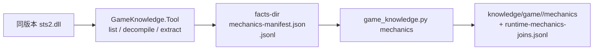

# GameKnowledge.Tool

`GameKnowledge.Tool` 是 STS2 原生游戏知识管线的 **.NET 9 静态 mechanics 抽取器**。它读取本机安装的 `sts2.dll`，通过 `ICSharpCode.Decompiler` 的 AST 生成可审计的结构化事实，再由上一级 [`game_knowledge.py`](../game_knowledge.py) 校验、导入并与 runtime ModelDb ID 关联。

它不是游戏 Mod，不加载 Godot，不启动游戏，也不提供一个可重编译的反编译源码副本。输入程序集只读；输出应放在临时 facts 目录，导入后再由 Python 快照清单管理。

## 在整条管线中的位置



静态层用于补足 `/data` 不会提供的行为信息：属性表达式、构造器、getter/setter/init accessor、调用、对象创建、赋值、条件、switch、返回值、循环、throw/yield/await、`++`/`--` 状态变异，以及保留分支父子关系的递归 `control_flow`。v0.111.0 还覆盖怪物移动状态机和决策相关的命令/行动、Combat、卡牌引擎、Runs、Creatures、Players、ValueProps、Random、Events、Factories 等类型。

## 项目和依赖

```text
GameKnowledge.Tool/
├── GameKnowledge.Tool.csproj   # net9.0 executable
├── Program.cs                   # 单文件 CLI 和结构化 extractor
├── bin/                         # 本地构建产物（被 .gitignore 忽略）
└── obj/                         # NuGet/MSBuild 中间产物（被 .gitignore 忽略）
```

`GameKnowledge.Tool.csproj` 当前契约：

| 项 | 值 |
| --- | --- |
| Target framework | `net9.0` |
| Output type | `Exe` |
| Nullable/implicit usings | enabled |
| Decompiler | `ICSharpCode.Decompiler` `9.1.0.7988` |

只需要 .NET 9 SDK 和 NuGet 还原；不需要 Godot SDK、游戏编辑器或运行中的 Steam。应针对目标快照实际使用的 `sts2.dll` 构建/抽取，不能拿其他版本的 facts 混合导入。

## CLI

所有命令都从 `GameKnowledge.Tool` 项目目录的上一级 `game-knowledge` 目录执行。通用形式为：

```text
GameKnowledge.Tool <assembly> list [filter]
GameKnowledge.Tool <assembly> decompile <full-type-name>
GameKnowledge.Tool <assembly> extract <output-dir>
```

程序集路径会先转换为绝对路径。参数不足、未知命令或缺少 type name 时返回 **2**；`extract` 发现任一类型失败时仍写出可用记录和 manifest，但返回 **1**。

### `list`：查找顶层类型

```powershell
$tool = '.\GameKnowledge.Tool\bin\Release\net9.0\GameKnowledge.Tool.dll'
$assembly = 'G:\SteamLibrary\steamapps\common\Slay the Spire 2\data_sts2_windows_x86_64\sts2.dll'

& $dotnet $tool $assembly list 'MegaCrit.Sts2.Core.Models.Monsters'
```

`filter` 是不区分大小写的字符串包含匹配；省略时列出全部顶层类型。该命令只列顶层定义，不单独列嵌套类/委托。

### `decompile`：一次性本地检查类型

```powershell
& $dotnet $tool $assembly decompile 'MegaCrit.Sts2.Core.Models.Monsters.TestSubject'
```

结果写到 stdout，适合临时检查某个类型的声明和行为。泛型定义使用 metadata/reflection 拼写（例如 ``TypeName`1``）；嵌套类型用 `Outer+Inner`。输出可能包含游戏实现细节，**不要把整段输出提交到仓库或发布**；正式知识链只接受 `extract` 生成的结构化摘要。

### `extract`：生成静态 facts

```powershell
$facts = Join-Path ([System.IO.Path]::GetTempPath()) 'sts2-mechanics-v0.111.0'
New-Item -ItemType Directory -Force $facts | Out-Null

& $dotnet $tool $assembly extract $facts
if ($LASTEXITCODE -ne 0) {
    Write-Warning "Extractor returned $LASTEXITCODE; inspect mechanics-manifest.json failures"
}
```

建议每个游戏版本使用一个新的、空的 facts 目录。命令会：

1. 枚举程序集顶层定义，只处理 `ModelCategory` 能识别的原生类别；
2. 用 ILSpy AST 读取声明，提取字段、属性、构造器、方法和嵌套类型/委托；
3. 将行为归一化为 v4 事实（包含递归 `control_flow`）；
4. 按 category 写 `<category>.jsonl`，并用临时文件替换目标；
5. 计算每个输出文件的 SHA-256，写 `mechanics-manifest.json`。

已存在的同名 category 文件会被覆盖；本次未再出现的旧文件不会自动清扫，因此使用新目录可避免残留文件被误读。Python 导入只信 manifest 的 `output_sha256` 列表，不信目录里未列出的残留文件。

## 识别的类别

### Model 命名空间

`MegaCrit.Sts2.Core.Models.<Namespace>.*` 会按下表输出；未列出的 namespace 使用 `models_<snake_case_namespace>`，没有子命名空间的基础类型输出到 `model_bases`：

| namespace | category |
| --- | --- |
| Cards / Relics / Potions / Monsters | `cards` / `relics` / `potions` / `monsters` |
| Encounters / Events / Powers / Characters | `encounters` / `events` / `powers` / `characters` |
| Acts / Orbs / Enchantments / Afflictions | `acts` / `orbs` / `enchantments` / `afflictions` |
| Modifiers / CardPools / RelicPools / PotionPools | `modifiers` / `card_pools` / `relic_pools` / `potion_pools` |
| 无子命名空间 | `model_bases` |

### 非 Model 规则类别

除 Model 外，工具只纳入决策所需的已声明命名空间：

| category | 来源命名空间/类型 |
| --- | --- |
| `rules_autoslay` / `rules_ascension` | `Core.AutoSlay.*`；`Entities.Ascension.*`；`Helpers.AscensionHelper` |
| `rules_map` / `rules_odds` / `rules_rewards` | `Core.Map.*` / `Core.Odds.*` / `Core.Rewards.*` |
| `rules_merchant` / `rules_rest_site` / `rules_rooms` | `Entities.Merchant.*` / `Entities.RestSite.*` / `Core.Rooms.*` |
| `rules_monster_moves` / `rules_commands` / `rules_game_actions` | `Core.MonsterMoves.*` / `Core.Commands.*` / `Core.GameActions.*` |
| `rules_combat` / `rules_card_engine` | `Core.Combat.*` / `Entities.Cards.*` |
| `rules_run` / `rules_creatures` / `rules_players` | `Core.Runs.*` / `Entities.Creatures.*` / `Entities.Players.*` |
| `rules_value_props` / `rules_random` / `rules_events` | `Core.ValueProps.*` / `Core.Random.*` / `Core.Events.*` |
| `rules_helpers` | `CardCostHelper`、`EggRelicHelper`、`GrabBag`、`SeedHelper` |
| `rules_unlocks` | `Core.Unlocks.*`、`Core.Timeline.*` |
| `rules_factories` / `rules_game_info` | `Core.Factories.*` / `GameInfo.Objects.*` |

未被上述规则命中的程序集类型不会进入 facts；这不是抽取失败，而是类别边界。若新增需要消费的原生命名空间，应先在代码中增加明确分类并补测试，再更新本 README。

## v4 记录格式

每行都是一个 JSON object，外层 envelope 包含：

```json
{
  "schema": "sts2.game-knowledge-mechanics-record/v4",
  "category": "monsters",
  "type_name": "MegaCrit.Sts2.Core.Models.Monsters.TestSubject",
  "name": "TestSubject",
  "entry_id": "TEST_SUBJECT",
  "provenance": {
    "source": "locally installed sts2.dll",
    "assembly_sha256": "…64 hex…",
    "extractor_schema_version": 4
  },
  "data": { "…same identity plus fields/properties/constructors/methods…" }
}
```

`data` 中的每个类型包含 `type_name`、`name`、`category`、`entry_id`、`type_kind`、`is_abstract`、`is_nested`、`declaring_type_name`、`base_types`、`fields`、`properties`、`constructors` 和 `methods`。行为成员的数组字段为：

```text
calls, creates, assignments, conditions, switches, returns,
loops, throws, yields, awaits, mutations, control_flow
```

`control_flow` 是递归节点树，而不是扁平文本：节点 `kind` 可表示 `if`、`then`、`else`、`switch`、`case`、`for`、`foreach`、`while`、`try_catch` 等，`children` 保留效果所属分支。lambda、匿名 delegate、局部函数、`using`、`lock`、`break`、`continue`、`yield` 等也会留下结构化节点。表达式主体方法由 decompiler AST 规范化为 `Body`，顶层 return/call 不会丢失。

嵌套类、结构、枚举和委托作为 `is_nested=true` 的记录保存，名称遵循 CLR metadata 形式 `Outer+Inner`（泛型带反引号 arity），`entry_id=null`；只有非嵌套 Model 类型才计算 runtime ID。

字段和属性值是归一化后的表达式文本，不保证可重新编译；这是行为证据摘要，不是源代码许可证或源码备份。

## `mechanics-manifest.json`

`extract` 生成的 manifest 结构核心字段如下：

| 字段 | 含义 |
| --- | --- |
| `schema_version` | 当前为 `4`，Python 导入严格检查 |
| `source.assembly` / `source.assembly_sha256` | 输入文件名与完整 SHA-256 |
| `generated_at_utc` | 抽取时间 |
| `extraction` | 事实抽取范围说明 |
| `counts` | 各 category 记录数 |
| `output_sha256` | 每个 JSONL 文件的 SHA-256；Python 导入的权威文件集 |
| `failures` | 每个无法解析的类型及错误信息 |

如果 `failures` 非空，工具会返回 1。不要删除失败项或手工把返回码改成成功；先确认程序集版本、依赖和具体类型，再重新抽取。Python 导入还会检查输入文件哈希、JSONL schema、重复类型/ID，并要求 assembly hash 与目标快照完全相同。

## 与 Python 快照管线集成

从本目录的上一级执行：

```powershell
$dotnet = 'C:\Users\xenoa\AppData\Local\Microsoft\dotnet\dotnet.exe'
$game = 'G:\SteamLibrary\steamapps\common\Slay the Spire 2'
$facts = Join-Path ([System.IO.Path]::GetTempPath()) 'sts2-mechanics-v0.111.0'
$tool = '.\GameKnowledge.Tool\bin\Release\net9.0\GameKnowledge.Tool.dll'

& $dotnet build .\GameKnowledge.Tool\GameKnowledge.Tool.csproj -c Release --nologo
& $dotnet $tool "$game\data_sts2_windows_x86_64\sts2.dll" extract $facts

py -3 .\game_knowledge.py mechanics `
  --output-dir '..\..\knowledge\game\v0.111.0' `
  --mechanics-dir $facts
```

更方便的一次性流程是把 `--mechanics-dir $facts` 直接传给 `game_knowledge.py extract`；该命令会先从 PCK 建立版本目录，再导入 facts，最后执行 validator。完整参数、runtime 采集和输出目录见上一级 [`README.md`](../README.md)。

导入成功后，目标快照会新增：

```text
mechanics/<category>.jsonl
catalog/runtime-mechanics-joins.jsonl
```

`mechanics.py` 会把每个静态 Model ID 与 runtime ID 精确 join。它拒绝不同 assembly SHA、输入 manifest 不完整、路径穿越、哈希不符和重复 ID；不要复制别的版本的 JSONL 来“补齐”数量。

## 构建、检查与测试

```powershell
Set-Location G:\workspace\slay-the-spire-vivhite-mod\sts2-ascend\tools\game-knowledge
$dotnet = 'C:\Users\xenoa\AppData\Local\Microsoft\dotnet\dotnet.exe'

& $dotnet build .\GameKnowledge.Tool\GameKnowledge.Tool.csproj -c Release --nologo
if ($LASTEXITCODE -ne 0) { throw 'build failed' }
py -3 -m unittest discover -s tests -v
```

该项目目前没有独立 C# 测试程序集；行为和输入边界由 Python 管线测试、schema 测试及真实 facts 导入 validator 覆盖。程序本身没有单独的 `--help` 选项；省略参数会打印 usage 并返回 2。若 NuGet 已还原且需要离线构建，可使用 `--no-restore`，但首次构建不要假设缓存存在。

## 常见问题

| 现象 | 处理 |
| --- | --- |
| `Could not load file` / 程序集无法打开 | 确认路径是实际 `data_sts2_windows_x86_64\sts2.dll`，且文件来自目标游戏版本；不要指向 Mod DLL。 |
| `extract` 返回 1 | 打开 facts 目录的 `mechanics-manifest.json` 查看 `failures`；保留整个目录作为审计证据，修复根因后在新目录重跑。 |
| Python 导入提示 assembly SHA 不匹配 | 静态 facts 和 PCK/runtime 快照不是同一安装版本；重新使用 manifest 指定的 `sts2.dll` 抽取。 |
| `Unsupported mechanics schema_version` | extractor 与 Python 管线版本不一致；使用仓库当前构建的工具，不要手改 manifest 数字。 |
| 输出目录里有旧 category 文件 | 工具不会清理未列入本次 manifest 的旧文件；新建空 facts 目录，再重新导入。 |
| 想查看完整反编译代码 | 仅在本地使用 `decompile` stdout；不要将输出保存进仓库、快照或 Workshop 素材。 |

## 安全、版权和保全边界

- `sts2.dll` 只读；工具不启动游戏、不改 Steam/云存档、不请求 UAC，也不需要人工 GUI 操作。
- facts 只保留结构化声明和行为摘要，不保存完整反编译源码、贴图、音频或 PCK；`decompile` 输出不得进入 Git 或发布包。
- `bin/`、`obj/`、临时 facts 目录属于构建/中间产物；只有经过 Python 导入、manifest/validation 校验的快照 artifact 才能作为知识输入。
- 任意新版本都要绑定 `release_info`、assembly SHA-256 和 PCK 来源；禁止跨版本拼接或覆盖旧快照。
