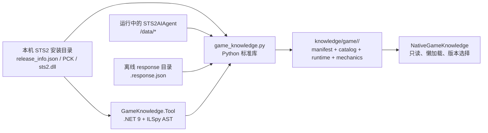

# STS2 原生游戏知识提取器

这个目录把本机安装的 Slay the Spire 2（STS2）转换为**按游戏版本隔离、可校验、只读消费**的原生知识快照。快照供 `sts2-ascend/brain/native_knowledge.py`、在线 Policy 和异步复盘按需查询；它不是 Brain 的学习记忆，也不是可重新编译的反编译源码。

当前验收目标是 **v0.111.0**（Godot 4.5.1 Mono）。游戏升级后必须新建对应版本目录，不要把新数据覆盖到旧版本并继续沿用旧结论。

## 数据流



三层事实各自解决不同问题：

| 层 | 来源 | 能回答什么 | 不能替代什么 |
| --- | --- | --- | --- |
| `runtime/` | 本地 `STS2AIAgent /data/{collection}` 或离线响应 | ModelDb 实例化后的数值、升级、池、角色初始内容和引用 | 卡牌执行逻辑、遗物 hook、怪物移动状态机的完整行为 |
| `mechanics/` | 与快照同一份 `sts2.dll` 的结构化静态分析 | 字段/属性表达式、构造器、accessor、方法调用/创建/赋值/分支/循环/状态变异，以及怪物招式状态机 | 完整可编译源码、运行时随机结果 |
| `localization/`、`catalog/` | 官方 PCK 原始资源与目录 | 英文/简体中文文本、完整资源目录、原生 Model 类型基集和跨层 ID join | Mod 自己的动态学习结论 |

## 目录结构

```text
game-knowledge/
├── game_knowledge.py                 # Python CLI：extract/runtime/mechanics/validate
├── game_knowledge/                    # 纯标准库实现
│   ├── extract.py                     # PCK、localization、manifest
│   ├── runtime.py                     # /data 捕获与离线导入
│   ├── mechanics.py                   # 静态 facts 导入和 ID join
│   ├── validate.py                    # schema、hash、引用和闭包校验
│   ├── pck.py                         # Godot PCK format 2/3 读取器
│   └── ids.py                         # 游戏一致的 Model ID 规则
├── GameKnowledge.Tool/                # .NET 9 静态抽取器（见其 README）
├── schemas/                           # manifest/runtime/mechanics/localization schema
├── tests/                             # 不依赖安装游戏的单元/管线测试
└── README.md
```

`knowledge/game/<version>/` 是输出目录，不应手工编辑 `manifest.json`、`validation.json` 或任何 JSONL。若需要更新，重新从同一版本的源生成；生成前先保留旧版本目录和来源哈希。

## 前置条件

- Windows PowerShell；以下命令均假定从本 README 所在目录执行：

  ```powershell
  Set-Location G:\workspace\slay-the-spire-vivhite-mod\sts2-ascend\tools\game-knowledge
  ```

- Python **3.10+**（代码只使用标准库；本机已验证 Python 3.14）。Windows 可用 `py -3`，也可替换为明确的 `python.exe`。
- .NET SDK **9.0**。本机统一 SDK 路径为 `C:\Users\xenoa\AppData\Local\Microsoft\dotnet\dotnet.exe`；`GameKnowledge.Tool` 只依赖 NuGet 包 `ICSharpCode.Decompiler` 9.1.0.7988，不需要 Godot 编辑器或游戏构建 SDK。
- 与目标版本一致的游戏文件：

  ```text
  <game-dir>\release_info.json
  <game-dir>\SlayTheSpire2.pck
  <game-dir>\data_sts2_windows_x86_64\sts2.dll
  ```

- 只有在采集 runtime 时才需要正在运行且已加载 `STS2AIAgent` 的游戏；离线导入不需要启动游戏。

提取器以只读方式打开游戏目录，所有写入都限制在显式 `--output-root` 或 `--output-dir`。它不会修改游戏、Steam、云存档，也不会请求 UAC；`--runtime-url` 只应指向你明确允许的本地/受信 HTTP endpoint。

## 快速开始：完整快照

### 1. 抽取同版本的静态 mechanics

```powershell
$dotnet = 'C:\Users\xenoa\AppData\Local\Microsoft\dotnet\dotnet.exe'
$game = 'G:\SteamLibrary\steamapps\common\Slay the Spire 2'
$facts = Join-Path ([System.IO.Path]::GetTempPath()) 'sts2-mechanics-v0.111.0'

& $dotnet build .\GameKnowledge.Tool\GameKnowledge.Tool.csproj -c Release --nologo
if ($LASTEXITCODE -ne 0) { throw 'GameKnowledge.Tool build failed' }

& $dotnet .\GameKnowledge.Tool\bin\Release\net9.0\GameKnowledge.Tool.dll `
  "$game\data_sts2_windows_x86_64\sts2.dll" extract $facts
if ($LASTEXITCODE -ne 0) { throw 'Static mechanics extraction failed' }
```

`$facts` 必须包含 `mechanics-manifest.json` 以及 manifest `output_sha256` 中列出的 category JSONL；不要手工改写或从另一版本复制其中的文件。

### 2. 合并 PCK、本地化、runtime 和 mechanics

当游戏与 Agent 正在运行时，`--discover-runtime` 会并行探测 `127.0.0.1:8080`–`8084` 的 `/health`，选择健康实例并读取默认的核心及扩展集合：

```powershell
py -3 .\game_knowledge.py extract `
  --game-dir $game `
  --mechanics-dir $facts `
  --discover-runtime
```

默认输出为 `..\..\knowledge\game\<release_info.version>\`。命令输出 JSON 摘要；退出码为 `0` 表示没有失败检查（允许 warning），`1` 表示生成完成但校验有 fail，`2` 表示输入、解析或 I/O 错误。

`--full-pck-sha256` 可额外计算约 2 GB PCK 的完整 SHA-256；默认只计算 PCK directory SHA-256，足以快速检测资源目录变化。首次建立或发布前建议计算完整哈希，日常增量检查可省略。

### 3. 没有正在运行的 Agent：离线导入

将每个 `/data/<collection>` 响应保存为严格命名的文件：

```text
captured-responses/
  cards.response.json
  relics.response.json
  monsters.response.json
  potions.response.json
  events.response.json
  powers.response.json
  characters.response.json
  # 可选扩展：encounters、acts、ancients、orbs、afflictions、
  # enchantments、modifiers、card_pools、relic_pools、potion_pools
```

文件内容可以是 `/data` 返回的数组，也可以是 `{ "data": [...] }` 包装对象：

```powershell
py -3 .\game_knowledge.py extract `
  --game-dir $game `
  --runtime-response-dir 'C:\path\to\captured-responses' `
  --mechanics-dir $facts
```

如果暂时没有 runtime，省略两个 runtime 参数也可以先生成 PCK/localization 快照；此时 `validation.json` 会明确记录 `runtime.capture` warning。待响应准备好后，用下面的增量命令导入，不能直接编辑快照 JSONL。

## CLI 参考

运行 `py -3 .\game_knowledge.py --help` 可获得当前实现的帮助。四个子命令的职责如下：

### `extract`：从安装目录建立版本目录

```text
extract [--game-dir DIR] [--output-root DIR] [--locales CSV]
        [--full-pck-sha256] [--skip-validation]
        [--mechanics-dir DIR]
        [--runtime-response-dir DIR | --runtime-url URL | --discover-runtime]
        [--runtime-collections CSV]
```

- `--game-dir`：游戏安装目录；未传时读取 `STS2_GAME_DIR`。
- `--output-root`：版本目录的父目录，默认是 `sts2-ascend/knowledge/game`。
- `--locales`：PCK 本地化文件集合，默认 `eng,zhs`。要通过完整性校验，至少保留这两个 locale。
- `--runtime-response-dir`、`--runtime-url`、`--discover-runtime`：三者互斥；后者只探测 `127.0.0.1:8080–8084`。
- `--runtime-collections`：逗号分隔的安全小写名称；默认核心 7 类加扩展 10 类。未知或含路径字符的名称会被拒绝。
- `--mechanics-dir`：接收 `GameKnowledge.Tool extract` 的目录，并校验 assembly SHA-256 后导入。
- `--skip-validation`：仅在中间生成阶段使用；发布/交付前不要跳过校验。

### `runtime`：向既有版本目录追加 runtime

```text
runtime --output-dir knowledge/game/v0.111.0
        [--runtime-response-dir DIR | --runtime-url URL]
        [--runtime-collections CSV]
```

该命令不接受 `--discover-runtime`，必须明确给出 URL 或离线目录。它会更新 manifest、runtime JSONL 并立即运行完整 validator；核心集合（`cards`、`relics`、`monsters`、`potions`、`events`、`powers`、`characters`）缺失时返回失败。

### `mechanics`：向既有版本目录追加静态 facts

```text
mechanics --output-dir knowledge/game/v0.111.0 --mechanics-dir <facts-dir>
```

导入前会检查输入 manifest 的 `schema_version=4`、每个文件的 SHA-256、同一 `sts2.dll` SHA-256 和 JSONL 结构；随后以游戏 ID 规则精确生成 `catalog/runtime-mechanics-joins.jsonl`，不做模糊名称猜测。

### `validate`：只校验，不重新抽取

```text
validate --output-dir knowledge/game/v0.111.0 --game-dir $game
validate --output-dir knowledge/game/v0.111.0 --no-write-report
```

`--game-dir` 会重新读取安装中的 `release_info.json`、`sts2.dll` 和 PCK，核对 manifest 来源哈希；`--no-write-report` 只输出报告、不覆盖 `validation.json`。validator 的退出码同上：`0=pass/warning`、`1=fail`、`2=无法解析或读取`。

## 输出契约

一次完整快照通常如下（category 数量以 manifest 为准，不要把示例数字当作固定协议）：

```text
knowledge/game/v0.111.0/
├── manifest.json                       # 权威来源/版本/artifact 清单
├── validation.json                    # 绑定 manifest 与 artifact-set 的校验报告
├── catalog/
│   ├── pck-index.jsonl                 # 全部 PCK 条目：路径、长度、flags、Godot MD5
│   ├── model-source-types.jsonl        # PCK 中原生 Model 类型路径基集
│   ├── localization-bilingual.jsonl   # 英中逐 key 并集与显式回退
│   └── runtime-mechanics-joins.jsonl  # runtime ID ↔ 静态类型精确关联
├── localization/{eng,zhs}/*.json       # 官方 PCK 原始文本
├── runtime/*.jsonl                     # ModelDb 运行时记录
└── mechanics/*.jsonl                   # sts2.dll 结构化行为事实
```

当前 schema 标识：

| 文件/记录 | schema |
| --- | --- |
| `manifest.json` | `sts2.game-knowledge-manifest/v1` |
| `validation.json` | `sts2.game-knowledge-validation/v2` |
| `runtime/*.jsonl` envelope | `sts2.game-knowledge-runtime-record/v1` |
| `mechanics/*.jsonl` envelope | `sts2.game-knowledge-mechanics-record/v4` |
| `localization-bilingual.jsonl` | `sts2.game-knowledge-localization-record/v1` |

`manifest.json` 对每个 artifact 记录相对路径、字节数、SHA-256 和记录数，同时记录：

- `game.version`、`game.commit`、release 日期和 release_info 哈希；
- `sources.assembly.sha256`、PCK header、directory/full SHA-256 和资源扩展统计；
- runtime 捕获来源、集合状态、核心集合过滤结果和离线响应哈希；
- mechanics 输入程序集哈希、抽取器 schema、失败列表和 join 摘要。

`validation.json` 绑定最终 manifest SHA-256 及实际 artifact-set SHA-256。任何 artifact 被改写、漏删、路径穿越或报告来自另一快照，读取层都会拒绝或明确标记失败。

### Runtime 记录和原生过滤

runtime envelope 至少有 `schema`、`category`、`id`、`type_name`、`source_assembly`、`provenance` 和 `data`。`data` 保留 API 原始字段（例如卡牌费用/升级、怪物 HP、角色初始牌组），不把 Mod 记录冒充基础游戏：

1. 优先使用 endpoint 的 `source_assembly`，只接受程序集 simple name 为 `sts2` 的记录；
2. 旧 endpoint 没有该字段时，使用 PCK `src/Core/Models/**/*.cs` 路径作为原生 ID 基集；
3. 两者都不可用时才退到 localization ID，并把 `base_game_filter` 标为 `unavailable`。

静态程序集可能包含 mock、deprecated、剧情专用或未注册类型，因此 mechanics 数量大于 runtime 不代表漏数。真正需要修复的是 `runtime_without_mechanics` 非空；静态独有项会标为 `complete_with_static_only`。

### Mechanics 记录

`GameKnowledge.Tool` 输出的字段、属性、构造器和方法会被包进 v4 envelope。每个行为成员包含 `calls`、`creates`、`assignments`、`conditions`、`switches`、`returns`、`loops`、`throws`、`yields`、`awaits`、`mutations` 和递归 `control_flow`。嵌套类型使用 `Outer+Inner` 元数据名，不产生独立 runtime ID。详见 [`GameKnowledge.Tool/README.md`](GameKnowledge.Tool/README.md)。

### Localization 双语目录

`localization/{eng,zhs}` 保存 PCK 原始 JSON，不做翻译或改写。`catalog/localization-bilingual.jsonl` 按文件和 key 做并集：缺少简体中文时保留 `zhs: null`、`status: missing_zhs`、`zhs_or_eng` 和 `fallback_locale: eng`；不能把英文静默标成中文。

## ID 关联规则

关联必须复刻游戏的 `StringHelper.Slugify(type.Name)`，而不是调用通用 snake-case 库：

1. 在每个非首位大写字母前插入 `_`；
2. 转为大写并折叠空白为 `_`；
3. 删除非 `[A-Z0-9_]` 字符；
4. 与 runtime `id` 做精确、大小写不敏感匹配。

例如缩写连续大写也会逐字母切分；模糊名称匹配会造成静默错连，因此被禁止。

## 校验结果如何解读

validator 会检查：

- manifest/schema、artifact 路径安全、字节数、哈希和记录数；
- eng/zhs 文件集合和逐 key 覆盖；
- runtime 核心字段、原生过滤、ID 唯一性和角色初始牌组/遗物/药水引用闭包；
- mechanics v4 深层 schema、成员行为数组、递归 `control_flow` 映射、1,724 个 PCK Model 顶层类型闭包；
- runtime→mechanics join、runtime 怪物是否有实质静态移动状态机；
- 可选的安装目录实时来源哈希。

`warning` 不是可以忽略的“成功证明”：例如没有 runtime、扩展集合 404 或部分 join 时仍可生成报告，但在线 Brain 应明确看到不完整状态。发布或把快照作为权威输入前，至少要求 `overall=pass`，并检查 warnings 是否符合预期。

## 测试与验收

测试用内存构造的最小 Godot PCK、runtime 响应和 mechanics 响应，不需要安装游戏或运行 Steam：

```powershell
Set-Location G:\workspace\slay-the-spire-vivhite-mod\sts2-ascend\tools\game-knowledge
py -3 -m unittest discover -s tests -v
```

建议在提交前同时执行：

```powershell
& $dotnet build .\GameKnowledge.Tool\GameKnowledge.Tool.csproj -c Release --nologo
py -3 .\game_knowledge.py validate `
  --output-dir '..\..\knowledge\game\v0.111.0' `
  --game-dir $game
```

测试不会证明当前安装游戏与快照一致；只有带 `--game-dir` 的 validate 才会重新核对来源文件哈希。

## 常见故障

| 现象 | 原因/处理 |
| --- | --- |
| `Required game file is missing` | `--game-dir` 指向错误或安装不完整；确认三个必需文件，不要在游戏目录写入生成物。也可设置 `STS2_GAME_DIR`。 |
| `No healthy STS2AIAgent endpoint` | 游戏尚未进入可用状态、Agent 未加载或端口不在 8080–8084；改用离线 response 导入，或明确传 `--runtime-url`。不要盲目启动第二个栈。 |
| runtime 核心集合缺失 | 采集到了 404/错误响应；重新捕获同一版本的七个核心集合。扩展集合缺失只能在确认需要时补齐。 |
| mechanics assembly SHA256 mismatch | facts 用了另一份 `sts2.dll`；停止混用，针对 manifest 中的 assembly 重新 build/extract。 |
| `runtime_without_mechanics` | 静态抽取不完整或版本错配；先检查 mechanics-manifest 的失败列表和 assembly hash，不能手工补 JSONL。 |
| artifact/hash/schema fail | 输出被改写、复制不完整或来自旧 validator；删除/移动前先留存现场，再从同版本源重新生成新版本目录。 |
| full PCK hash 很慢 | 这是预期的约 2 GB 顺序读取；日常检查可省略 `--full-pck-sha256`，发布验收再开启。 |
| Python 启动器提示找不到 platform libraries | 选择明确的 Python 3.10+ 可执行文件运行同一命令，并确认 `python -c "import sys; print(sys.executable)"`；不修改快照来绕过环境问题。 |

## 版本、版权与保全边界

- 每个快照只能用于 manifest 声明的游戏版本、commit、程序集 SHA-256 和 PCK 哈希；Early Access 更新后生成新目录。
- PCK 中的 `.cs` 是一字节导出占位，不能当作源码；本工具只保存结构化 facts，不保存整段反编译源码。
- 不提交完整 PCK、贴图、音频或可重新编译的反编译源码。提交/发布前只保留 manifest 列出的结构化 artifact、短本地化文本和来源哈希。
- 原始游戏目录、Steam 文件和云存档始终是只读输入；不删除、移动、覆盖或请求人工/UAC 授权。
- `knowledge/game/` 是跨角色共享的**原生事实层**，不应写入任何角色的胜率、策略偏好或训练结论；这些属于各自 Profile 的学习目录。

## 相关文档

- [GameKnowledge.Tool 静态抽取器](GameKnowledge.Tool/README.md)
- [`sts2-ascend` 总览](../../README.md)
- [原生游戏知识提取经验与边界](../../../docs/2026-08-26-sts2原生游戏知识提取.md)
- [JSON Schema 目录](schemas/)
- [Brain 的只读消费边界](../../brain/native_knowledge.py)
