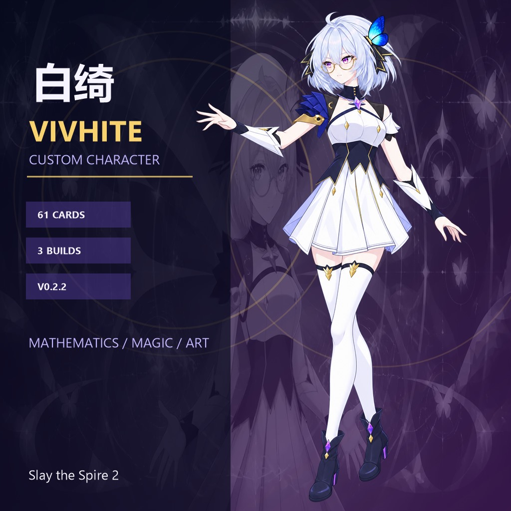

# 候选与离线验收目录

`candidates/` 保存白绮战斗 Spine 的研究候选、语义组件灰盒和场景验收脚本。
它们不是第二套运行时，也不是可以直接复制到 `Vivhite/Vivhite/skins/ironclad/`
的素材库。候选输出通常落在 `Vivhite/tools/candidates/<name>/`，该路径被 PCK
排除；渲染证据落在仓库根 `.work/`。



## 状态矩阵

| 目录 | 类型 | 当前用途 / 结论 | 推荐入口 |
| --- | --- | --- | --- |
| [`whole_mesh`](whole_mesh/README.md) | 基线 rig | 单一加权整身网格；用于与拆件方案对照，死亡姿态有结构上限，不能直接发布 | `build` + `validate` + comparator |
| [`hybrid_attack_peak`](hybrid_attack_peak/README.md) | V3 里程碑 | neutral 网格 + 普攻刚体峰值；14 个精确 Vulkan 时刻 | `Invoke-HybridAttackPeakPreview.ps1` |
| [`hybrid_action_set`](hybrid_action_set/README.md) | V3 里程碑 | 在普攻基础上加入重击；保留共享 action slot | `Invoke-HybridAttackHeavyPreview.ps1` |
| [`hybrid_cast_set`](hybrid_cast_set/README.md) | V3 里程碑 | 在 action set 基础上加入施法姿势、法阵和 EyeFire 生命周期 | `Invoke-HybridCastPreview.ps1` |
| [`hybrid_death_v3`](hybrid_death_v3/README.md) | V3 里程碑 | 1.05s 原子切换、接地与回弹的死亡候选 | `Invoke-HybridDeathV3Preview.ps1` |
| [`hybrid_neutral_v3`](hybrid_neutral_v3/README.md) | V3 里程碑 | 冻结 neutral 图页，补齐三循环边界 reset/dirty seek | `Invoke-HybridNeutralV3Preview.ps1` |
| [`hybrid_hurt_neutral`](hybrid_hurt_neutral/README.md) | V3 里程碑 | 只替换 hurt 骨骼时间线，不增图页；与 action set 做一致性快照 | builder + validator |
| [`hybrid_v3_final`](hybrid_v3_final/README.md) | 隔离总装 | 五页、八动画的候选总装；有完整 no-deploy Source/Godot/Vulkan/PCK 门禁 | 两个 `Invoke-HybridV3Final*.ps1` |
| [`semantic_head_face`](semantic_head_face/README.md) | 语义组件 | 0044/0045 头脸、后发、前刘海、蓝蝶三分支研究；不是生产批准 | builder + validator |
| [`semantic_back_hair`](semantic_back_hair/README.md) | 语义组件 | 0031 单张 weighted 后发与邻接层序研究 | builder + validator |
| [`semantic_butterfly`](semantic_butterfly/README.md) | 语义组件 | 0030 单一刚性蓝蝶 region 的层序/随机 seek 研究 | builder + validator + Vulkan |
| [`semantic_torso_skirt`](semantic_torso_skirt/README.md) | 语义组件 | 0054 躯干与裙摆冲突灰盒；明确阻断下一轮语义生成 | wrapper |
| [`semantic_left_arm`](semantic_left_arm/README.md) | 灰盒消费者 | 屏幕左/远侧（角色解剖右臂）两段式拓扑；没有可发布美术 | builder + validator |
| [`semantic_right_arm`](semantic_right_arm/README.md) | 灰盒消费者 | 屏幕右/近侧（角色解剖左臂）消费者契约与极限姿态 | wrapper |
| [`semantic_left_leg`](semantic_left_leg/README.md) | 语义组件 | 屏幕左/远腿三段输入的关节/遮挡研究；建议合并小腿与靴 | builder + validator |
| [`semantic_right_leg`](semantic_right_leg/README.md) | 语义组件 | 屏幕右/近腿轴向冲突研究；三段路线阻断，二段路线待新图 | builder + validator |
| [`semantic_split_v3`](semantic_split_v3/README.md) | 跨组件灰盒 | 八语义组 A/B 总装和 21 帧扫描；`production_runtime_ready_slots=[]` | wrapper |
| [`character_select_acceptance`](character_select_acceptance/README.md) | 场景验收 | 选人私有 Spine、hero-only、UI 实际尺寸的离线 Vulkan/Alpha 检查 | 三个 `.gd` 脚本 |
| [`rest_site_acceptance`](rest_site_acceptance/README.md) | 场景验收 | 休息场景、灯光轨道、翻转循环和实际比例的离线检查 | `Invoke-RestSiteAcceptance.ps1` |

## 运行约定

```powershell
# 仓库根目录；使用 local.props 中的 GodotExe/Sts2Dir
$propsText = Get-Content .\Vivhite\local.props -Raw
$props = [xml]$propsText
$godot = [string]$props.Project.PropertyGroup.GodotExe

# 构建器通常挂在 art 项目，输出会解析到 Vivhite/tools/candidates/<name>
& $godot --headless --path .\tools\art `
  --script res://candidates/semantic_left_arm/build_semantic_left_arm_candidate.gd -- `
  build-semantic-left-arm-candidate

# 需要读取 res://tools/candidates 的验证器应挂在 Vivhite 项目；包装器会自动处理
& $godot --headless --path .\Vivhite `
  --script (Resolve-Path .\tools\art\candidates\semantic_left_arm\validate_semantic_left_arm_candidate.gd)
```

不同候选的参数和默认输入以各目录 README 和脚本中的 `Usage` 为准。优先使用
`Invoke-*.ps1`，因为它们会：解析 `Vivhite/local.props`、选择 Godot console 可执行文件、
校验游戏 PCK 与 Spine GDExtension、串行化扩展加载、把输出限制在 `.work/`，并在报告
不完整时返回非零退出码。

## 共同的安全边界

- 候选构建只允许复制/读取已验真的 RGBA 源或绘制明确标记的灰盒诊断像素；禁止用
  代码抠图、阈值、蒙版、色键或后处理制造 Alpha。
- `semantic_*` 和所有 `graybox` 输出必须保持 `deployable=false` / research-only；
  不得把它们的 PNG、`.spjson`、`.spatlas` 或 `.tres` 复制进正式 skins。
- 任何新透明美术必须先完成素材布局与源码消费者审计，再通过 EvoLink 原生透明
  路径生成；Prompt、原图和去秘密请求参数必须追加归档，单一语义最多八次尝试。
- 离线 Vulkan 帧是原始证据；`contact-sheet` 可以是 SourceOver 诊断副本，不能反向
  作为 atlas 输入。Alpha 判定必须查看 RGBA 数据及黑/白/游戏底色合成，而不是缩略图。
- `hybrid_v3_final` 的“通过”是隔离候选门禁结论；正式发布仍需运行发布器、完整三件套
  构建和真机验收。修改候选后必须重新跑其上游 donor 及总装门禁。

## 证据与清理

每个构建/验收输出至少应保留 `summary.json`/`validation*.json`、stdout/stderr 和
输入哈希。`.work/` 可按批次归档或清理；`Vivhite/tools/candidates/` 中的 `.import`、
`.uid` 属于 Godot 缓存。若门禁失败，不要删除失败现场来“变绿”，应把完整现场交给
复盘/失败包流程。

更完整的设计依据：

- [`docs/白绮战斗Sprite-Spine方案演进与生产方案.md`](../../../docs/白绮战斗Sprite-Spine方案演进与生产方案.md)
- [`docs/2026-08-28-白绮Hybrid-V3五页总装与离线验收.md`](../../../docs/2026-08-28-白绮Hybrid-V3五页总装与离线验收.md)
- [`tools/art/README.md`](../README.md)
