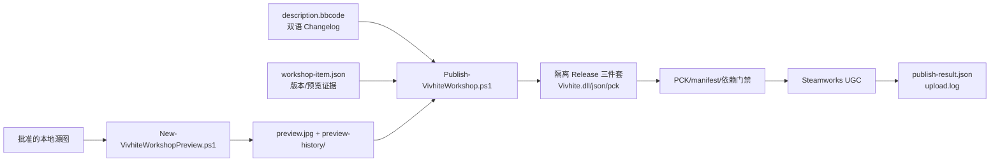

# Vivhite Steam Workshop 发布物料

本目录是 Vivhite 创意工坊发布的**受 Git 跟踪源材料与审计入口**。它不是游戏运行时的
`mods/Vivhite` 目录，也不应被当作临时构建目录；发布脚本会从这里读取描述、元数据和预览
图，在隔离目录生成可上传的三件套。

当前条目：<https://steamcommunity.com/sharedfiles/filedetails/?id=3793741497><br>
当前物料版本：`0.2.2` · App ID：`2868840` · 可见性：`public`<br>
当前实机证据范围：Slay the Spire 2 `v0.111.0`、Steam `public-beta`、Vulkan。


## 目录职责

| 路径 | 用途 | 是否应提交 | 维护原则 |
| --- | --- | --- | --- |
| [`description.bbcode`](description.bbcode) | Steam 页面中英双语描述和版本 Changelog | 是 | 每次版本必须同时更新中文、英文两段；正文和派生 change note 均受 8,000 UTF-8 字节门禁约束 |
| [`workshop-item.json`](workshop-item.json) | App/条目/依赖/版本及当前预览证据的唯一元数据源 | 是 | `version`、`preview.version`、预览哈希/尺寸/字节数必须一致；不要手改哈希冒充重建 |
| [`preview.jpg`](preview.jpg) | 当前 1024×1024 Steam 预览图 | 是 | 由批准的本地源图确定性生成；小于 1 MiB；替换前旧图必须进入历史目录 |
| [`preview-history/`](preview-history/) | 旧预览图及 provenance sidecar 的追加式审计链 | 是 | 只追加，不覆盖、不清理；文件名中的 SHA-256 必须与实际内容相同 |
| [`README.md`](README.md) | 本目录操作手册 | 是 | 脚本或物料契约改变时同步更新 |
| `.runtime/` | 隔离构建三件套、PCK 证据、上传器、preflight、回执和日志 | 否（ignored） | 只读审计或故障取证；不要手工删除/提交，也不要把其中产物当作源材料 |

### 发布物料关系



发布脚本读取 `workshop-item.json` 的 `preview_file`、`history_dir` 和版本，不从自身目录猜
路径。预览生成器只消费仓库中已经验收的白绮选人母源和转场源图，并记录其 SHA-256；它不是
AI 生图入口，也不会把运行时 atlas 当成整幅插画重绘。

## 物料契约（0.2.2 快照）

`workshop-item.json` 当前关键字段如下：

| 字段 | 当前值 | 说明 |
| --- | --- | --- |
| `app_id` | `2868840` | Slay the Spire 2 的 Steam App ID |
| `published_file_id` | `3793741497` | 更新现有条目；默认不会创建重复条目 |
| `dependency_id` | `3747602295` | RitsuLib Workshop 条目；发布时以依赖项方式附加/确认 |
| `version` | `0.2.2` | 与打包的 `Vivhite.json` 版本必须相同 |
| `preview.version` | `0.2.2` | 必须与顶层版本相同 |
| `preview.sha256` | `DC9A57B681C91F610AE4068BCCC18CC54B12C53552BEFACF69C5071BE34AA161` | 当前 `preview.jpg` 的完整 SHA-256 |
| `preview.bytes` | `170357` | 当前预览文件大小；尺寸固定为 `1024×1024` |

发布时上传器目录必须**恰好**包含以下三个文件，不能夹带目录、缓存或旧版本：

```text
workshop/.runtime/content/Vivhite/
├── Vivhite.dll
├── Vivhite.json
└── Vivhite.pck
```

打包 manifest 还必须声明 `id=Vivhite`、`min_game_version=0.111.0`、`has_dll=true`、
`has_pck=true`，并且恰好依赖 `STS2-RitsuLib` `0.5.14`。发布脚本在上传前会重新读取元数据，
所以仅修改旧的 preflight 或 `.runtime` 文件不能改变实际发布版本。

## 标准发布流程

所有命令从仓库根目录执行；默认入口会完成构建、预览重建、门禁和上传：

```powershell
powershell -NoProfile -ExecutionPolicy Bypass `
  -File .\tools\workshop\Publish-VivhiteWorkshop.ps1 `
  -PublishedFileId 3793741497 -Visibility public
```

脚本按以下顺序工作：

1. 严格读取 UTF-8 `workshop-item.json` 和 `description.bbcode`，检查 App ID、SemVer、双语当前版本、双语 Changelog（当前版本各 4 条）及必需兼容性术语。
2. 在 `workshop/.runtime/content/Vivhite/` 隔离构建 Release，不覆盖游戏已安装的 `mods/Vivhite`。
3. 对 PCK 执行最终内容门禁：挂载到空 Godot 项目，验证 localization、运行时贴图、VFX、导入目标和 PCK 不可变性。
4. 重新生成 1024×1024 预览；如旧图内容或版本改变，先按完整 SHA-256 归档旧图和 sidecar，再原子替换并更新 metadata。
5. 校验预览实际哈希、字节数、尺寸、历史文件名/sidecar 及两张批准源图的哈希。
6. 从同一份双语 Changelog 派生 `change-note-v<version>.txt`，作为 Steam `SubmitItemUpdate` 的真实 change note；不会使用固定的泛化文案。
7. 校验三件套、manifest、版本、RitsuLib 依赖，写入 `.runtime/preflight.json`。
8. 复用已登录的 Steam 客户端通过 Steamworks UGC 上传；只有回执 `status=published`、`upload_complete=true`、`dependency_complete=true` 才算成功。

### 参数和安全边界

| 参数 | 作用 | 注意 |
| --- | --- | --- |
| `-PublishedFileId <id>` | 指定要更新的条目 | 省略时读取 `workshop-item.json` |
| `-Visibility public\|friends\|private\|unlisted` | 本次上传可见性 | 省略时读取 metadata；发布前确认目标值 |
| `-PrepareOnly` | 运行构建/预览/全部本地门禁并写 preflight，然后停止 | 不启动 Steam 上传，也不修改远端 |
| `-SkipBuild` | 复用已有隔离三件套 | 仅适合已确认 `.runtime/content/Vivhite` 与当前源码同批；默认不要使用 |
| `-SkipPreview` | 跳过重绘步骤 | **不能**绕过版本、哈希、尺寸、源图和历史门禁；只适合完全一致的已验收预览 |

发布脚本不会读取或保存 Steam 密码、Steam Guard 验证码或登录令牌；不会启动需要人工 UAC/GUI
授权的流程。Steam 未运行、未登录、要求接受 Workshop 法律协议或上传器返回失败时，流程应当
失败关闭，保留 `.runtime/upload.log` 和回执供排查，不能仅凭进程退出码宣称已发布。

## 本地验收与证据

在提交或上传前可先运行纯本地测试：

```powershell
# Workshop metadata/description/preview/history 合同
py -3 -B -m unittest sts2-ascend.tests.test_workshop_materials -v

# Steam uploader 的 change-note 参数和 UTF-8 合同（不提交 Steam 更新）
py -3 -B -m unittest tools.workshop.tests.test_uploader_change_note -v

# 生成预览并更新 metadata；仅使用批准的本地源图
powershell -NoProfile -ExecutionPolicy Bypass `
  -File .\tools\workshop\New-VivhiteWorkshopPreview.ps1

# 构建 + PCK + 物料门禁，但不触碰 Steam
powershell -NoProfile -ExecutionPolicy Bypass `
  -File .\tools\workshop\Publish-VivhiteWorkshop.ps1 -PrepareOnly
```

完成后检查：

- `workshop-item.json` 的版本、预览 hash/尺寸/字节数与实际文件一致；
- `preview-history/` 中每个 `preview-v*-sha256-*.jpg` 都有匹配 `.jpg.json`，文件名 hash 与文件 hash 一致；
- `.runtime/preflight.json` 记录本次 Git HEAD、三件套哈希、预览证据和 change-note 哈希；
- 真正上传后 `.runtime/publish-result.json` 的条目 ID、版本、可见性、依赖和完成标记齐全；
- Steam 页面只读核对标题、版本、描述和预览图；远端未确认前不要把本地 preflight 称为已发布。

## 常见故障处理

### 描述门禁失败

检查文件是否为严格 UTF-8、是否超过 8,000 字节、中文/英文 `Version` 是否都等于 metadata
版本，以及每个 Changelog 是否仍有恰好 4 条当前版本 bullet。不要只删中文段落来“通过”检查，
两种语言必须保持同一发布事实。

### 预览哈希或历史冲突

这是保护证据的故意 fail-closed 行为。先保留现有 `preview.jpg`、sidecar 和 `.runtime` 日志，
确认没有并发发布或手工替换；再从批准源图重新运行预览生成器。不要手工改 `preview.sha256`、
重命名历史文件来掩盖不一致，也不要删除旧图。

### PCK/三件套门禁失败

查看脚本输出的证据目录和 `.runtime/preflight.json`，修复源码或构建环境后重跑完整入口。不要
把旧 `.runtime/content` 直接上传，也不要在游戏运行时覆盖 DLL；发布脚本的隔离输出就是为了避免
这两类混淆。

### Steam 上传失败

确认可信 Steam 客户端已登录且目标 App/条目属于当前账号；检查 `.runtime/upload.log` 和
`publish-result.json` 中的 `error`/`workshop_agreement_required`。若要求人工接受协议、UAC 或
GUI 操作，应停止并等待用户处理；无人值守时不自动点击、不自动重试，不创建重复条目。

## 每次版本更新清单

1. 确认代码与 `Vivhite/Vivhite.json` 版本边界，并记录本次变更证据。
2. 在 `description.bbcode` 的中英文区各增加同一版本 Changelog；保持必需的兼容性和已知限制说明。
3. 从已验收本地源图重新生成 `preview.jpg`，确认旧图已进入 `preview-history/` 并有 sidecar。
4. 运行两组 Workshop 测试和 `-PrepareOnly`；检查三件套/PCK/metadata/preflight。
5. 使用完整发布入口上传；以结构化回执和远端只读核对为最终证据。
6. 只提交本次相关的 tracked 材料、README 和发布记录；`.runtime/`、游戏安装目录、Steam 云文件和
   Brain 在线 `knowledge/` 不属于 Workshop 物料提交范围。

## 相关入口

- [主项目 README](../README.md)
- [发布脚本](../tools/workshop/Publish-VivhiteWorkshop.ps1)
- [预览生成脚本](../tools/workshop/New-VivhiteWorkshopPreview.ps1)
- [预览历史说明](preview-history/README.md)
- [Workshop 物料门禁记录](../docs/2026-09-01-workshop物料版本与预览门禁.md)
- [0.2.1 发布回执](../docs/2026-09-01-vivhite-0.2.1-workshop更新回执.md)
- [0.2.2 发布回执](../docs/2026-09-05-vivhite-0.2.2-workshop更新回执.md)

## English quick reference

`workshop/` contains tracked, credential-free source materials for the Vivhite Steam Workshop item.
The authoritative metadata is [`workshop-item.json`](workshop-item.json); the current bilingual page is
[`description.bbcode`](description.bbcode); the current 1024×1024 preview is [`preview.jpg`](preview.jpg);
and [`preview-history/`](preview-history/) is append-only evidence. `.runtime/` is ignored and holds only
ephemeral build, preflight, uploader, and receipt files.

Run the full pipeline from the repository root:

```powershell
powershell -NoProfile -ExecutionPolicy Bypass `
  -File .\tools\workshop\Publish-VivhiteWorkshop.ps1 `
  -PublishedFileId 3793741497 -Visibility public
```

The pipeline builds an isolated Release triplet, runs the mounted-PCK gate, deterministically regenerates
the preview from approved local sources, validates UTF-8 bilingual metadata and history hashes, derives
the Steam change note from the same Changelog, and uploads through the already logged-in Steam client.
Use `-PrepareOnly` for a no-Steam local preflight. `-SkipPreview` never bypasses stale/hash/history/source
checks. A publication is complete only when the structured receipt says `published`, upload and dependency
completion are true, and the remote item has been read-only verified. No password, Steam Guard token, UAC,
or unattended GUI authorization is read or stored.
