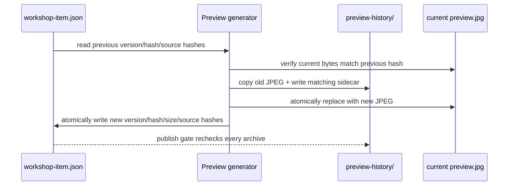

# Workshop preview history

This directory is the tracked, append-only audit trail for [`workshop/preview.jpg`](../preview.jpg).
It records the exact bytes that were replaced during a preview update, not a collection of approximate
thumbnails. The history is evidence for publication review and rollback analysis; it is not a runtime
asset directory and must not be cleaned merely to reduce repository size.

## Invariants

- Every archived image is named `preview-v<version>-sha256-<64 lowercase hex>.jpg`.
- The SHA-256 in the filename is the SHA-256 of that exact JPEG byte stream.
- Every image has an adjacent `<image>.json` UTF-8 sidecar with matching version and hash.
- Existing images and sidecars are never overwritten or pruned. A name collision with different bytes or
  provenance fails closed.
- `workshop/workshop-item.json` remains the authority for the **current** preview version and digest;
  history does not silently change current metadata.
- A history entry is created before the current image is atomically replaced. If a run fails, preserve
  the evidence and inspect the error instead of deleting a partial record.

The current archive contains the 0.2.0 preview:

```text
preview-v0.2.0-sha256-20bc597f5b63cd40560cce0358a2928a91666d068faa71fa272b84a9a071260c.jpg
preview-v0.2.0-sha256-20bc597f5b63cd40560cce0358a2928a91666d068faa71fa272b84a9a071260c.jpg.json
```

Its sidecar records `170354` bytes, the archive UTC timestamp, and the SHA-256 provenance of the
approved hero and transition source images used at that time.

## Archive lifecycle



The implementation is [`New-VivhiteWorkshopPreview.ps1`](../../tools/workshop/New-VivhiteWorkshopPreview.ps1).
It refuses to overwrite an output whose current bytes do not match metadata, computes the new JPEG hash,
and updates metadata only after the replacement succeeds. The publication entry point then revalidates
the entire directory, so `-SkipPreview` can skip drawing only when all recorded facts already match.

## Sidecar schema

Each sidecar currently uses `schema: 1` and contains:

| Field | Meaning |
| --- | --- |
| `artifact` | Always `workshop/preview.jpg`, the logical artifact that was archived |
| `version` | Metadata version associated with the archived image |
| `sha256` | Full uppercase SHA-256 of the archived JPEG |
| `bytes` | Archived file byte count |
| `archived_utc` | UTC time at which the archive was created |
| `hero_source_sha256` | Hash of the approved character-select hero source at archive time |
| `transition_source_sha256` | Hash of the approved character-select transition source at archive time |

The sidecar is deliberately provenance-rich: a matching image hash alone proves byte identity, while the
source hashes explain which approved local inputs produced the preview. Do not add credentials, temporary
Steam URLs, or ignored runtime paths to a sidecar.

## Read-only audit commands

From the repository root, these commands inspect history without changing it:

```powershell
$history = Join-Path (Get-Location) 'workshop\preview-history'
Get-ChildItem -LiteralPath $history -Filter 'preview-v*-sha256-*.jpg' -File |
  Sort-Object Name |
  ForEach-Object {
    $hash = (Get-FileHash -LiteralPath $_.FullName -Algorithm SHA256).Hash.ToLowerInvariant()
    $nameHash = [regex]::Match($_.Name, 'sha256-([0-9a-f]{64})\.jpg$').Groups[1].Value
    [pscustomobject]@{ File = $_.Name; Bytes = $_.Length; HashMatchesName = ($hash -eq $nameHash) }
  }
```

The authoritative publication gate performs stricter checks than this convenience listing: valid UTF-8
sidecars, matching version/hash fields, repository-local paths, current preview dimensions, and source
hashes. Run the full material test and `Publish-VivhiteWorkshop.ps1 -PrepareOnly` before treating an
archive as publishable evidence.

## Handling failures and restoration requests

1. Keep the image, sidecar, `.runtime` logs, and metadata untouched so the failed transaction remains
   auditable.
2. Check whether another publisher or a manual editor changed `preview.jpg`; an untracked current hash is
   intentionally rejected to prevent silent data loss.
3. Re-run the generator from the approved local source images after correcting the underlying version or
   source issue. Never repair a mismatch by editing only a filename, `sha256`, or `bytes` field.
4. If an old preview must be inspected, open/copy it to a temporary review location; do not replace the
   current artifact or rewrite metadata outside the controlled generator and publication gates.
5. If a historical entry is genuinely corrupt, preserve it and document the finding in a dated report.
   Deleting it would destroy evidence and can make future publication fail in a less diagnosable way.

The archived JPEGs are composite Workshop previews. They are not substitutes for the original transparent
character/VFX sources and must not be fed back into the AI-art or runtime-atlas pipeline.

## Version-update checklist

- [ ] Bump the release metadata and keep `preview.version` synchronized.
- [ ] Generate the new preview through `New-VivhiteWorkshopPreview.ps1`.
- [ ] Confirm the old image was archived with a complete lower-case SHA-256 filename and sidecar.
- [ ] Verify current image hash, byte count, dimensions, and approved source hashes.
- [ ] Run `py -3 -B -m unittest sts2-ascend.tests.test_workshop_materials -v`.
- [ ] Run the publication script with `-PrepareOnly` before any Steam mutation.
- [ ] Commit the new tracked image/history/metadata together; never commit `.runtime` artifacts.

For the complete publication contract, see [`workshop/README.md`](../README.md).
